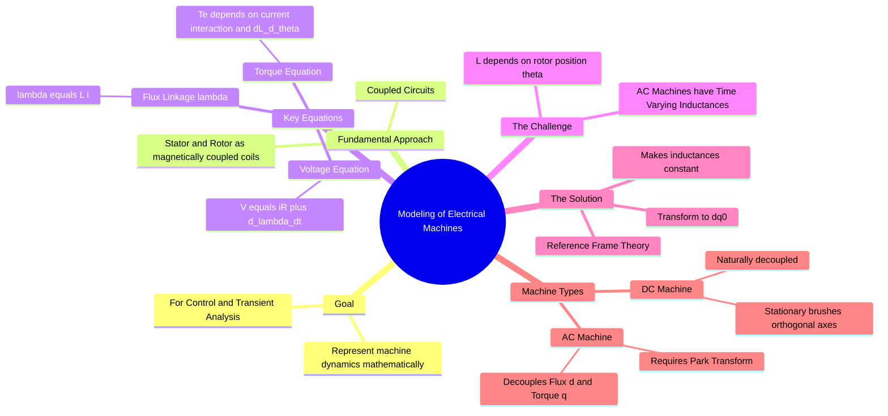

---
tags:
  - electrical-machines
  - mathematical-modeling
  - control-system
  - electric-drives
  - gate
created: 2026-07-23T21:07:24
aliases:
  - Dynamic Modeling of Machines
  - Generalized Machine Theory
  - Kron's Primitive Machine
subject: "[[Electrical Machines]]"
parent: "[[Electrical Machines]]"
modified: 2026-07-23T21:07:24
---
### Modeling of Electrical Machines
#electrical-machines/modeling #control-system

> **Modeling** involves developing a set of differential equations that describe the transient and steady-state behavior of an electrical machine. Unlike steady-state equivalent circuits (phasors), dynamic models account for instantaneous changes in voltage, current, speed, and torque, which is essential for designing **Electric Drives** and analyzing **System Stability**.

---
#### The Coupled Circuit Approach
#modeling/coupled-circuits

An electrical machine is viewed as a group of magnetically coupled circuits (windings) in relative motion.

**A. Voltage Equation (Electrical Subsystem):**
For any winding $k$:
$$v_k = r_k i_k + \frac{d\lambda_k}{dt}$$
Where $\lambda_k$ is the flux linkage. In matrix form for $n$ windings:
$$\boxed{\quad [V] = [R][I] + \frac{d}{dt}[\lambda] \quad}$$

**B. Flux Linkage Equation:**
Flux linkage depends on the inductances, which are functions of rotor position ($\theta_r$).
$$[\lambda] = [L(\theta_r)] [I]$$
Substituting this back:
$$[V] = [R][I] + [L(\theta_r)] \frac{d[I]}{dt} + \frac{d[L(\theta_r)]}{d\theta_r} \omega_r [I]$$

*   **Term 1:** Resistive drop ($IR$).
*   **Term 2:** **Transformer EMF** ($L \frac{di}{dt}$) – due to time-varying current.
*   **Term 3:** **Rotational (Speed) EMF** ($i \omega \frac{dL}{d\theta}$) – due to relative motion.

---
#### The Core Problem: Time-Varying Inductance
#modeling/challenges

In AC machines (Induction and Synchronous), the mutual inductance between stator and rotor windings changes continuously as the rotor spins ($\theta_r = \int \omega_r dt$).
*   This creates **Time-Varying Coefficients** in the differential equations.
*   Such equations are extremely difficult to solve or implement in control logic.
*   **Solution:** Use **[[Reference Frame Theory]]** (transformations like Clarke and Park) to move to a frame where inductances appear constant.

---
#### Kron's Primitive Machine
#modeling/primitive-machine

Gabriel Kron proposed a generalized model (Primitive Machine) consisting of a pair of quadrature coils ($d$ and $q$) on both the stator and rotor.
*   **DC Machine:** Naturally resembles the primitive machine because the commutator fixes the rotor flux axis (armature) at $90^\circ$ to the stator flux axis (field).
    *   $d$-axis: Field Winding.
    *   $q$-axis: Armature Winding.
    *   Ideally decoupled ($M_{dq} = 0$).

*   **AC Machine:** Does not look like this physically, but mathematically transformed ($abc \to dq$) to resemble the primitive machine for analysis.

---
#### Electromagnetic Torque ($T_e$)
#modeling/torque

Torque is generated to align the magnetic fields. Using the principle of **Co-energy** ($W_c$) in a linear magnetic system:
$$W_c = \frac{1}{2} [I]^T [L(\theta_r)] [I]$$
$$T_e = \frac{\partial W_c}{\partial \theta_r} = \frac{1}{2} [I]^T \frac{\partial [L(\theta_r)]}{\partial \theta_r} [I]$$

In the transformed **$dq$ reference frame**, the torque equation becomes algebraic and intuitive:
$$\boxed{\quad T_e = \frac{3}{2} \frac{P}{2} (\lambda_d i_q - \lambda_q i_d) \quad}$$
*   This looks like the DC motor torque equation ($T \propto \phi I_a$), verifying the success of the transformation.
*   $P$: Number of poles.

---
#### Mechanical Subsystem
#modeling/mechanical

The link between the electrical torque and rotor speed:
$$\boxed{\quad T_e = T_L + J \frac{d\omega_m}{dt} + B \omega_m \quad}$$
*   $T_L$: Load Torque.
*   $J$: Moment of Inertia.
*   $B$: Friction coefficient.
*   Note: $\omega_m$ is mechanical speed ($\omega_e = \frac{P}{2} \omega_m$).

---
#### Summary of State Variables

For a complete dynamic model, we track **State Variables** (outputs of integrators).
*   **DC Motor:** 3 States ($i_a, i_f, \omega$).
*   **Induction Motor:** 5 States ($i_{ds}, i_{qs}, i_{dr}, i_{qr}, \omega$).

---
### Related Concepts
#topic/related-concepts

> [[Reference Frame Theory]] (The mathematical fix for time-varying L)

[[DC Motor Modeling]] (Specific application)
[[Clarke Transformation]] ($abc \to \alpha\beta$)
[[Park Transformation]] ($\alpha\beta \to dq$)
[[Vector Control of Drives]] (Uses these models for high-performance control)
[[Electromechanical Energy Conversion]]
