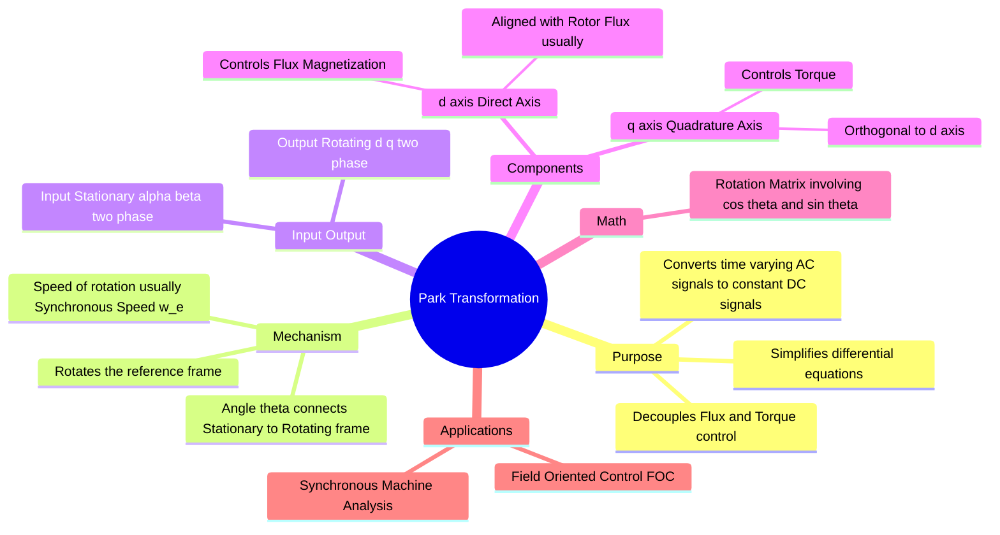

---
tags:
  - electrical-machines
  - electric-drives
  - control-system
  - power-electronics
  - gate
  - mathematics
created: 2026-07-23T21:06:59
aliases:
  - dq Transformation
  - Rotating Reference Frame Transformation
  - Park's Transformation
subject: "[[Electrical Machines]]"
parent: "[[Vector Control of Drives]]"
modified: 2026-07-23T21:06:59
---
### Park Transformation
#electric-drives/transformations #mathematics/linear-algebra

> The **Park Transformation** projects vectors from a stationary reference frame ($\alpha\beta$) onto a **rotating reference frame** ($dq$). By choosing the rotation speed to match the synchronous speed of the machine, sinusoidal AC quantities in the stationary frame appear as **constant DC quantities** in the rotating frame. This is the heart of [[Vector Control of Drives|Vector Control]] (FOC).

---
#### Geometric Concept
#transformations/geometry

We transition from the stationary $\alpha-\beta$ axes (fixed to the stator) to the moving $d-q$ axes (which rotate at angular velocity $\omega$).
*   **$\theta$ (Rotor Angle):** The angle between the stationary $\alpha$-axis and the rotating $d$-axis at any instant. $\theta = \int \omega \, dt$.
*   **$d$-axis (Direct):** Typically aligned with the rotor flux vector.
*   **$q$-axis (Quadrature):** Leads the $d$-axis by $90^\circ$ (electrical).

**Why do this?**
In the $abc$ or $\alpha\beta$ frame, currents vary sinusoidally with time. In the $dq$ frame rotating at synchronous speed, the frame rotates *with* the current vector. To an observer sitting on the $d-q$ frame, the current vector appears stationary (DC).
*   **DC values** are easier to control using PI controllers (which have zero steady-state error for DC inputs).

---
#### The Transformation Matrix ($\alpha\beta \to dq$)
#formulas/matrices

Assuming the input is already in the stationary two-phase form (from [[Clarke Transformation]]):

$$\boxed{\quad \begin{bmatrix} f_d \\ f_q \end{bmatrix} = \begin{bmatrix} \cos\theta & \sin\theta \\ -\sin\theta & \cos\theta \end{bmatrix} \begin{bmatrix} f_\alpha \\ f_\beta \end{bmatrix} \quad}$$

*   **$f_d$**: The component of the vector along the $d$-axis.
*   **$f_q$**: The component of the vector along the $q$-axis.
*   The **Zero Sequence ($f_0$)** component remains unchanged from the Clarke transform as it acts orthogonal to the plane of rotation.

> **Combined Transform ($abc \to dq0$):**
> Often derived by multiplying Park $\times$ Clarke matrices.
> $$f_{dq0} = [T_{Park}] [T_{Clarke}] f_{abc}$$

---
#### Inverse Park Transformation ($dq \to \alpha\beta$)
#transformations/inverse

To convert the control signals (DC) back to stationary AC signals for the inverter (Space Vector PWM), we use the inverse matrix. Since the rotation matrix is orthogonal, the inverse is just the transpose:

$$\boxed{\quad \begin{bmatrix} f_\alpha \\ f_\beta \end{bmatrix} = \begin{bmatrix} \cos\theta & -\sin\theta \\ \sin\theta & \cos\theta \end{bmatrix} \begin{bmatrix} f_d \\ f_q \end{bmatrix} \quad}$$

---
#### Physical Significance in Drives (Decoupling)
#electric-drives/control

In a DC motor, flux ($\phi$) and torque ($T$) are decoupled (Field current controls flux, Armature current controls torque). Park transformation achieves this for AC motors:

1.  **$i_d$ (Flux Component):** The current component aligned with the rotor flux. It allows control of the machine's **magnetization** (similar to Field Current $I_f$ in DC motor).
2.  **$i_q$ (Torque Component):** The current component orthogonal to the flux. It produces **Torque** (similar to Armature Current $I_a$ in DC motor).

$$T_e \propto \lambda_r i_q$$

By maintaining $i_d = 0$ (or a specific value) and controlling $i_q$, we get instantaneous torque response.

---
#### Speed Voltages
#electrical-machines/speed-voltage

A consequence of rotating the frame is the appearance of "Speed Voltage" or cross-coupling terms in the differential equations.
Differentiation in rotating frame: $\frac{d}{dt} \to \frac{d}{dt} + j\omega$.

*   **$d$-axis voltage eq:** $v_d = R i_d + L \frac{di_d}{dt} \mathbf{- \omega_e L i_q}$
*   **$q$-axis voltage eq:** $v_q = R i_q + L \frac{di_q}{dt} \mathbf{+ \omega_e L i_d}$

The bold terms are rotational EMFs linking the two axes.

---
### Related Concepts
#topic/related-concepts

> [[Clarke Transformation]] (The prerequisite step)

[[Rotation Matrix]]
[[Reference Frame Theory]]
[[Vector Control of Drives]] (Field Oriented Control)
[[Space Vector PWM (SVPWM)]]
[[Synchronous Machines]] (Park's equations were originally developed for Synchronous Machines)
[[Modeling of Electrical Machines]]
