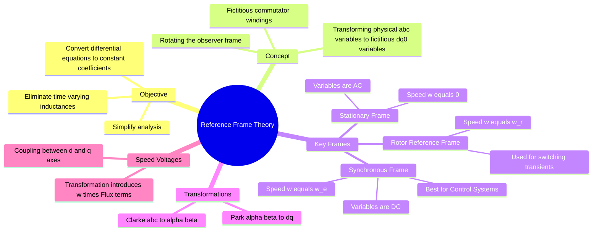

---
tags:
  - electrical-machines
  - control-system
  - mathematical-modeling
  - gate
  - electric-drives
created: 2026-07-23T21:09:11
aliases:
  - Generalized Theory of Electrical Machines
  - dq0 Transformation Theory
  - Arbitrary Reference Frame
subject: "[[Electrical Machines]]"
parent: "[[Modeling of Electrical Machines]]"
modified: 2026-07-23T21:09:11
---
### Reference Frame Theory
#electrical-machines/modeling #control-system

> **Reference Frame Theory** is a mathematical transformation technique used to simplify the analysis of AC machines (Induction and Synchronous). In physical $abc$ coordinates, the mutual inductances between stator and rotor windings vary with rotor position (time-dependent), making the differential equations difficult to solve. By transforming these variables to a specific **Reference Frame**, we can render the inductances constant, often converting AC quantities into **DC quantities**, which eases control and simulation.

---
#### The Core Problem: Time-Varying Inductance
#electrical-machines/inductance

In a 3-phase machine, the flux linkage $\lambda$ is related to current $i$ by inductance $L$.
$$[V] = [R][I] + \frac{d}{dt}([L(\theta_r)][I])$$
Since the rotor moves, the angle $\theta_r$ changes with time. Therefore, the inductance matrix $[L(\theta_r)]$ is **time-varying**.
*   **Consequence:** The system is described by linear differential equations with *time-varying coefficients*, which are computationally expensive and analytically complex to solve.

---
#### The Solution: Arbitrary Reference Frame
#transformations/arbitrary-frame

We define a fictitious reference frame rotating at an arbitrary speed $\omega$ (and angle $\theta$). We project the 3-phase stationary variables ($f_a, f_b, f_c$) onto this rotating frame to get $f_d, f_q, f_0$.

**The General Transformation:**
To transform a space vector from a stationary frame ($\vec{f}_{s}$) to a frame rotating at angle $\theta$:
$$\boxed{\quad \vec{f}_{dq} = \vec{f}_{s} \cdot e^{-j\theta} \quad}$$
where $\theta = \int \omega \, dt$.

---
#### Common Reference Frames (GATE High Yield)
#gate/concepts

The choice of the reference frame speed ($\omega_{frame}$) determines the nature of the resulting $d-q$ variables (Voltage, Current, Flux).

| Reference Frame | Speed ($\omega$) | Notation | Variables ($V, I$) behavior | Main Application |
| :--- | :--- | :--- | :--- | :--- |
| **Stationary** | $0$ | $\alpha - \beta$ (Clarke) | **AC** (Sinusoidal at $\omega_e$) | Line-commutated inverters, SVPWM, Stator transients. |
| **Rotor** | $\omega_r$ | $d^r - q^r$ | Stator vars are **AC** ($slip$ freq) Rotor vars are **DC** | Analysis of switching transients in rotor circuits. |
| **Synchronous** | $\omega_e$ | $d^e - q^e$ (Park) | **DC** (Constant in steady state) | **Vector Control (FOC)**, Small signal stability, Power System studies. |

> **Crucial Concept:** In the **Synchronous Reference Frame**, balanced sinusoidal 3-phase quantities appear as **constant DC values** in steady state. This allows the use of [[Proportional-Integral (PI) Controller|PI controllers]] (which have zero steady-state error for DC inputs) in drive systems.

---
#### Speed Voltage Terms (Rotational EMF)
#electrical-machines/speed-voltage

When transforming the voltage equations from a stationary to a rotating frame, the time derivative term $\frac{d\lambda}{dt}$ generates two parts:

1.  **Transformer EMF:** $\frac{d\lambda_{dq}}{dt}$ (Change in magnitude).
2.  **Speed EMF (Rotational Voltage):** $j\omega \lambda_{dq}$ (Change in direction due to frame rotation).

The voltage equations in the $dq$ frame generally look like:
$$\boxed{\quad v_d = R i_d + \frac{d\lambda_d}{dt} - \omega \lambda_q \quad}$$
$$\boxed{\quad v_q = R i_q + \frac{d\lambda_q}{dt} + \omega \lambda_d \quad}$$

*   **Coupling:** The term $-\omega \lambda_q$ in the $d$-axis equation and $+\omega \lambda_d$ in the $q$-axis equation represents the **cross-coupling** between the axes. In control design, these must often be decoupled.

---
#### Power Invariance

To ensure the power calculated in the $dq$ frame is the same as in the $abc$ frame, a factor is used (typically $\frac{3}{2}$ or $\sqrt{\frac{2}{3}}$).
Using the **Amplitude Invariant** convention (common in drives):
$$P_{abc} = \frac{3}{2} (v_d i_d + v_q i_q)$$

---
### Related Concepts
#topic/related-concepts

> [[Clarke Transformation]] (Stationary Frame)
> [[Park Transformation]] (Synchronous/Rotating Frame)

[[Vector Control of Drives]] (Direct application)
[[Modeling of Electrical Machines]]
[[Inductance of Single-phase and Three-phase Lines]]
[[Small Signal Stability]] (Relies on linearization in Synchronous Frame)
