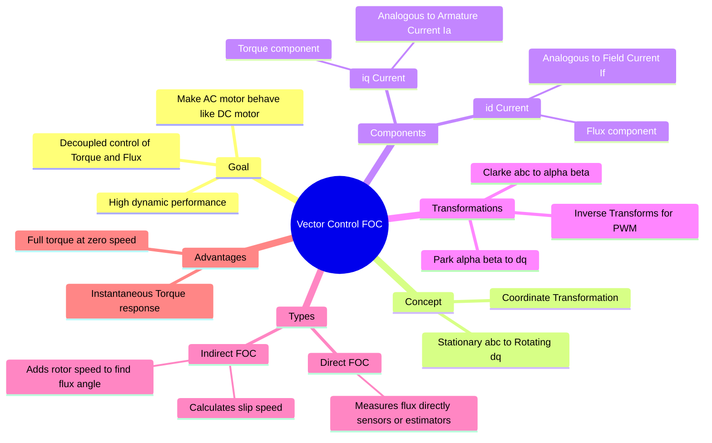

---
tags:
  - electric-drives
  - control-system
  - electrical-machines
  - power-electronics
  - gate
created: 2026-07-23T21:08:17
aliases:
  - FOC
  - Field Oriented Control
  - Decoupled Control
subject: "[[Electrical Machines]]"
parent:
  - Electric Drives
modified: 2026-07-23T21:08:17
---
### Vector Control of Drives (Field Oriented Control)
#electric-drives #control-system #foc

> **Vector Control** (or Field Oriented Control - FOC) is a variable-frequency drive (VFD) control method that allows an AC induction or synchronous motor to be controlled like a separately excited DC motor. It mathematically decomposes the stator current into two orthogonal components: one generating **magnetic flux** and the other generating **torque**, allowing independent (decoupled) control of both.

---
#### The DC Motor Analogy
#electric-drives/analogy

To understand Vector Control, consider the Separately Excited DC Motor:
*   **Flux ($\phi$):** Controlled by Field Current ($I_f$).
*   **Torque ($T_e$):** Controlled by Armature Current ($I_a$).
    $$T_e \propto \phi I_a$$
*   **Orthogonality:** The commutator ensures the armature flux is always $90^\circ$ to the field flux. Changing $I_a$ changes torque instantly without affecting the main flux. **This is "Decoupled Control".**

**The Problem with AC Motors:**
In an Induction Motor, the stator current ($I_s$) produces *both* flux and torque. They are naturally coupled and rotate at synchronous speed. Changing magnitude or frequency affects both simultaneously (e.g., in [[Speed Control of Induction Motors|V/f Induction Motor Speed Control]]).

**The FOC Solution:**
Use mathematical transformations to view the AC machine from a **Synchronous Reference Frame**. In this frame, the sinusoidal AC currents appear as constant DC quantities ($i_d$ and $i_q$) that can be controlled like $I_f$ and $I_a$.

---
#### Principle of Operation
#electric-drives/principle

Vector control involves three main steps happening in the digital controller:

1.  **Measurement & Transformation:**
    *   Measure 3-phase currents $i_a, i_b, i_c$.
    *   **[[Clarke Transformation]] ($abc \to \alpha\beta$):** Convert to 2-phase stationary frame.
    *   **[[Park Transformation]] ($\alpha\beta \to dq$):** Convert to 2-phase **rotating** frame using the rotor flux angle $\theta_e$.

2.  **Control Loop ([[Proportional-Integral (PI) Controller|PI Controllers]]):**
    *   The transformed currents $i_d$ and $i_q$ are compared to reference values $i_d^*$ (Flux ref) and $i_q^*$ (Torque ref).
    *   **$i_d$ (Direct Axis):** Controls **Rotor Flux** ($\lambda_r$). (Analogous to $I_f$).
    *   **$i_q$ (Quadrature Axis):** Controls **Electromagnetic Torque** ($T_e$). (Analogous to $I_a$).
    *   Torque Equation in FOC:
        $$\boxed{\quad T_e = \frac{3}{2} \frac{P}{2} \frac{L_m^2}{L_r} i_{ds} i_{qs} \quad}$$
        (If $i_{ds}$ is kept constant, $T_e \propto i_{qs}$, linearizing the torque control).

3.  **Inverse Transformation & PWM:**
    *   The PI controllers output voltage references $v_d^*$ and $v_q^*$.
    *   **Inverse Park ($\to \alpha\beta$):** Convert back to stationary frame.
    *   **[[Space Vector PWM (SVPWM)]]:** Generate gate pulses for the inverter to synthesize these voltages.

---
#### Indirect Field Oriented Control (IFOC)
#electric-drives/ifoc

The critical part of FOC is knowing the exact position ($\theta_e$) of the rotor flux vector to perform the Park transformation.

*   **Direct FOC:** Uses sensors (Hall effect, search coils) or flux estimators to measure flux directly. (Less common due to sensor reliability).
*   **Indirect FOC (Standard Industry Method):** estimates the flux angle $\theta_e$ by summing the rotor speed and the calculated slip frequency.
    $$\theta_e = \int (\omega_r + \omega_{slip}) dt$$
    *   $\omega_r$: Measured rotor speed.
    *   $\omega_{slip}$: Calculated based on $i_q$ and motor parameters ($R_r, L_r$).
    *   **Dependency:** IFOC relies heavily on accurate knowledge of the **Rotor Time Constant ($\tau_r = L_r/R_r$)**. If $R_r$ changes (due to heat), the decoupling degrades (detuning).

---
#### Comparison with Scalar Control (V/f)
#electric-drives/comparison

| Feature | Scalar Control (V/f) | Vector Control (FOC) |
| :--- | :--- | :--- |
| **Variables** | Magnitude & Freq only | Magnitude, Freq & **Phase** (Vector) |
| **Dynamic Response** | Sluggish (Oscillates) | **Fast & Precise** (DC-like) |
| **Torque Control** | Poor at low speeds | **Full torque at zero speed** |
| **Complexity** | Simple, Low cost | Complex, Requires DSP/FPGA |
| **Sensor** | Open loop (mostly) | Requires Encoder (or sensorless obs) |

---
### Related Concepts
#topic/related-concepts

> [[Reference Frame Theory]] (The mathematical foundation)

[[Clarke Transformation]]
[[Park Transformation]]
[[Space Vector PWM (SVPWM)]]
[[Speed Control of Induction Motors]]
[[DC Motor Modeling]]
[[Proportional-Integral (PI) Controller]]
