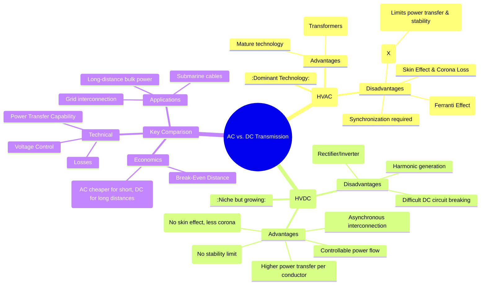

---
tags:
  - power-system
  - power-system/fundamentals
  - hvdc
  - hvac
  - transmission
created: 2025-10-11
aliases:
  - AC vs DC Transmission
  - HVDC vs HVAC
  - High Voltage Transmission Comparison
subject: "[[Power System]]"
parent:
  - Power System Fundamentals
modified: 2026-07-23T21:14:39
---
### AC and DC Transmission Systems Comparison
#hvac #hvdc #transmission-systems

> While High Voltage AC (HVAC) is the backbone of modern power grids due to the ease of voltage transformation with transformers, High Voltage DC (HVDC) offers significant technical and economic advantages for specific applications, primarily long-distance bulk power transmission and asynchronous grid interconnection.

---
#### High Voltage Alternating Current (HVAC) Transmission
#ac-transmission

This is the conventional and most widely used method for transmitting electrical power.

##### Advantages
1.  **Voltage Transformation**: AC voltages can be easily and efficiently stepped up or down using transformers, which are highly reliable and relatively inexpensive. This is the primary reason for the widespread adoption of AC systems.
2.  **Mature Technology**: HVAC technology is well-established, and the equipment (like [[Types of Circuit Breakers|circuit breakers]], [[Transformers]]) is widely available.
3.  **Easy Interruption**: AC current naturally passes through zero twice per cycle, making arc extinction in circuit breakers relatively easy.

##### Disadvantages
1.  **Line Reactance ($X_L$)**: The [[Inductance of Single-phase and Three-phase Lines|inductance of the transmission line]] limits the power transfer capability and can cause significant voltage drops. The power transfer is governed by:
    $$ P_{AC} = \frac{V_s V_r}{X_L} \sin \delta $$
    where $\delta$ is the power angle. This introduces a **stability limit** on the maximum power that can be transmitted.
2.  **Charging Current ($I_c$)**: The capacitance of long lines draws a continuous charging current ($I_c = j\omega C V$), which leads to phenomena like the **[[Ferranti Effect]]** (receiving end voltage being higher than sending end voltage on no-load or light load).
3.  **Skin Effect**: AC current tends to flow on the surface of the conductor, increasing the effective resistance and thus the $I^2R$ losses.
4.  **Corona Loss**: Corona losses are more significant in AC systems compared to DC systems for the same effective voltage.
5.  **Synchronization**: All interconnected AC systems must operate at the same frequency and phase in a synchronized manner, which adds complexity to grid operation.

---
#### High Voltage Direct Current (HVDC) Transmission
#dc-transmission

HVDC technology is a key solution for long-distance power transmission and other specialized applications.

##### Advantages
1.  **No Reactance Limitation**: A DC line has no inductance or capacitance effects in steady state. Therefore, there is no stability limit based on distance. The power transfer is limited only by the thermal rating of the conductors.
    $$ P_{DC} = \frac{V_s (V_s - V_r)}{R} $$
2.  **Greater Power Transfer Capability**: For the same insulation level (determined by peak voltage), a DC line can carry more power than an AC line. An AC line's insulation must withstand the peak voltage $V_{peak} = \sqrt{2}V_{rms}$, while for DC, $V_{DC} = V_{peak}$. This means $V_{DC} \approx \sqrt{2}V_{AC,rms}$ for the same insulation.
3.  **Lower Transmission Losses**: There are no losses due to skin effect or reactive power flow. Corona losses are also lower.
4.  **Asynchronous Interconnection**: An HVDC link can connect two AC grids that are not synchronized (i.e., have different frequencies or phase angles). This is called an asynchronous tie.
5.  **Controllable Power Flow**: The direction and magnitude of power flow can be controlled rapidly and precisely by controlling the converter stations.
6.  **Fewer Conductors**: A bipolar HVDC line requires only two conductors, whereas a three-phase AC line requires three, leading to cheaper lines and smaller towers.

##### Disadvantages
1.  **Expensive Converter Stations**: HVDC requires expensive electronic converters (rectifiers at the sending end and inverters at the receiving end) to convert AC to DC and back. This high terminal cost is the main drawback.
2.  **Harmonic Generation**: The converters generate harmonics on both the AC and DC sides, which require large, expensive filters to mitigate.
3.  **Difficult DC Circuit Breaking**: DC current does not have a natural zero crossing, which makes interrupting fault currents very difficult and requires expensive, specialized DC circuit breakers.

---
#### Economic Comparison and Break-Even Distance
#break-even-distance

The choice between HVAC and HVDC is primarily economic and depends on the transmission distance.
-   **HVAC**: Low terminal cost (substations) but high line cost per km.
-   **HVDC**: High terminal cost (converter stations) but low line cost per km.

This leads to the concept of the **Break-Even Distance**. Below this distance, HVAC is cheaper. Above this distance, HVDC becomes the more economical choice.
-   For **overhead lines**, the break-even distance is typically **600–800 km**.
-   For **underground/submarine cables**, the break-even distance is much shorter, around **50–80 km**. This is because the high capacitance of cables makes long-distance AC transmission impractical due to excessive charging currents.
	![[Break Even Distance.png]](Conceptual graph showing cost vs. distance for AC and DC lines)

#### Summary of Comparison

| Feature                    | HVAC (AC Transmission)                                     | HVDC (DC Transmission)                                       |
| -------------------------- | ---------------------------------------------------------- | ------------------------------------------------------------ |
| **Terminal Cost**          | Low (Transformers are cheap)                               | High (Converters are expensive)                              |
| **Line Cost**              | High (3 conductors, larger towers)                         | Low (2 conductors, smaller towers)                           |
| **Controlling Element**    | Reactance ($X_L$)                                          | Resistance ($R$)                                             |
| **Stability Limit**        | Yes, power transfer is limited by distance and angle $\delta$ | No, limited only by thermal capacity of the line           |
| **Losses**                 | Higher (Skin effect, Corona, Reactive power)               | Lower (No skin effect, less Corona)                          |
| **Voltage Control**        | Complex (Ferranti effect, voltage drops)                   | Simple                                                       |
| **Interconnection**        | Requires strict synchronization                            | Can connect asynchronous systems                             |
| **Circuit Breaking**       | Easy (natural current zero)                                | Difficult and expensive                                      |
| **Typical Use**            | National grids, short/medium distances                     | Long-distance bulk power, submarine cables, grid connections |

---
### Related Concepts
#power-system/related-concepts

> [[Structure of a Power System]]

[[Power Flow through a Transmission Line]]
[[Power System Stability]]
[[Ferranti Effect]]
[[Corona and its Effects]]
[[Power Electronics]] (Core technology for HVDC converters)