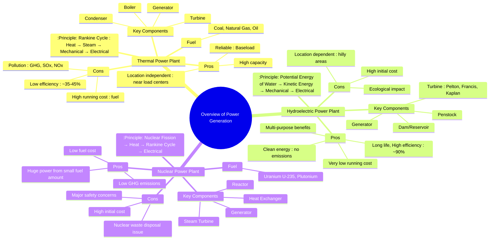

---
tags:
  - power-system
  - power-system/fundamentals
  - power-generation
  - thermal-power
  - hydro-power
  - nuclear-power
created: 2025-10-11
aliases:
  - Power Generation Methods
  - Conventional Power Generation
subject: "[[Power System]]"
parent:
  - Power System Fundamentals
modified: 2026-07-23T21:14:55
---
### Overview of Power Generation (Thermal, Hydro, Nuclear)
#power-generation #thermal #hydro #nuclear

> Power generation is the first stage in the delivery of electricity to consumers. It involves converting a primary energy source into electrical energy. For large-scale generation, the fundamental principle usually involves rotating a turbine coupled to a synchronous generator (alternator). The primary difference between conventional power plants lies in the method used to produce this rotation.

---
#### 1. Thermal Power Plant (Steam Power Plant)
#thermal-power-plant

A thermal power plant converts heat energy into electric power. Most thermal stations are steam-powered and operate on the **Rankine cycle**.

- **Principle**: A fossil fuel (like coal) is pulverized and burned in a boiler to produce high-pressure, high-temperature steam. This steam expands in a turbine, causing it to rotate at high speed. The turbine is coupled to a generator, producing electricity. The exhaust steam is cooled in a condenser (using a large amount of water), converted back to water, and pumped back to the boiler to repeat the cycle.
- **Energy Conversion**: Chemical Energy (Fuel) → Heat Energy (Steam) → Mechanical Energy (Turbine) → Electrical Energy (Generator).
- **Key Characteristics**:
    - **Fuel**: Primarily coal, but also natural gas and oil.
    - **Cost**: Lower initial cost compared to hydro/nuclear, but a **high running cost** due to continuous fuel requirement.
    - **Efficiency**: Relatively low, typically in the range of $35\%$ to $45\%$.
    - **Location**: Can be located near load centers to reduce transmission losses, provided fuel transport and a large water source for cooling are available.
    - **Use**: Due to their reliability, they are typically used as **baseload power plants**.
    - **Environmental Impact**: Major source of greenhouse gases (CO₂), pollutants causing acid rain (SOx, NOx), and particulate matter (ash).

#### 2. Hydroelectric Power Plant
#hydro-power-plant

A hydroelectric power plant uses the potential energy of water stored at a height to generate electricity.

- **Principle**: Water is stored in a large reservoir behind a dam, creating a pressure head. This water flows through a large pipe called a **penstock** and strikes the blades of a hydraulic turbine. The force of the water rotates the turbine, which in turn drives the generator.
- **Energy Conversion**: Potential Energy (Water) → Kinetic Energy (Flowing Water) → Mechanical Energy (Turbine) → Electrical Energy (Generator).
- **Key Characteristics**:
    - **Fuel**: Water, which is free.
    - **Cost**: Very **high initial cost** due to dam construction, but extremely **low running cost**.
    - **Efficiency**: Very high, around $85\%$ to $90\%$.
    - **Location**: Highly dependent on geography; requires a large catchment area in a hilly region.
    - **Use**: Extremely valuable for grid stability. They have a quick start/stop capability, making them ideal as **peak load power plants**.
    - **Advantages**: Clean energy (no fuel combustion or emissions), long plant life (>100 years), and multi-purpose benefits like irrigation, flood control, and recreation.

#### 3. Nuclear Power Plant
#nuclear-power-plant

A nuclear power plant is essentially a type of thermal power plant where the heat source is a nuclear reactor.

- **Principle**: The plant uses the heat generated from a controlled **nuclear fission** chain reaction. In the reactor core, atoms of a heavy element (e.g., Uranium-235) are split, releasing a tremendous amount of energy as heat. This heat is used to generate steam in a heat exchanger. The rest of the process is similar to a conventional thermal plant: steam drives a turbine-generator set.
- **Energy Conversion**: Nuclear Energy (Fission) → Heat Energy (Steam) → Mechanical Energy (Turbine) → Electrical Energy (Generator).
- **Key Characteristics**:
    - **Fuel**: Fissionable materials like Uranium ($^{235}\text{U}$) or Plutonium ($^{239}\text{Pu}$). A small amount of fuel can produce a massive amount of energy.
    - **Cost**: Very **high initial cost** due to complex safety systems, and high decommissioning costs. The fuel cost per unit of energy produced is low.
    - **Location**: Independent of fuel source geography but requires a large, reliable source of cooling water. Sited away from densely populated areas.
    - **Use**: Due to high capacity and slow response to load changes, they are exclusively used as **baseload power plants**.
    - **Environmental Impact**: Produces almost no greenhouse gases during operation. However, the safe, long-term disposal of **radioactive waste** is a major technical and environmental challenge. Public safety is the highest concern.

#### Comparison of Power Plants

| Feature                 | Thermal Power Plant          | Hydroelectric Power Plant        | Nuclear Power Plant                |
| ----------------------- | ---------------------------- | -------------------------------- | ---------------------------------- |
| **Primary Energy**      | Coal, Gas, Oil               | Potential Energy of Water        | Nuclear Fission (e.g., Uranium)    |
| **Initial Cost**        | Medium                       | Very High                        | Very High                          |
| **Running Cost**        | High (Fuel Cost)             | Very Low                         | Low (but high waste management cost) |
| **Typical Efficiency**  | Low (~35-45%)                | Very High (~85-90%)              | Medium (~30-40%)                   |
| **Location Factor**     | Near fuel/water source       | Hilly areas with large rivers    | Near water source, away from cities|
| **Primary Use**         | Baseload                     | Peak Load                        | Baseload                           |
| **Environmental Impact**| High Air Pollution, GHG      | Clean, but ecological disruption | Clean air, but radioactive waste   |

---
### Related Concepts
#power-system/related-concepts

> [[Structure of a Power System]]

[[Economic Load Dispatch (ELD) neglecting losses]]
[[Sequence Impedances and Networks of Synchronous Machines]]
[[Swing Equation]]