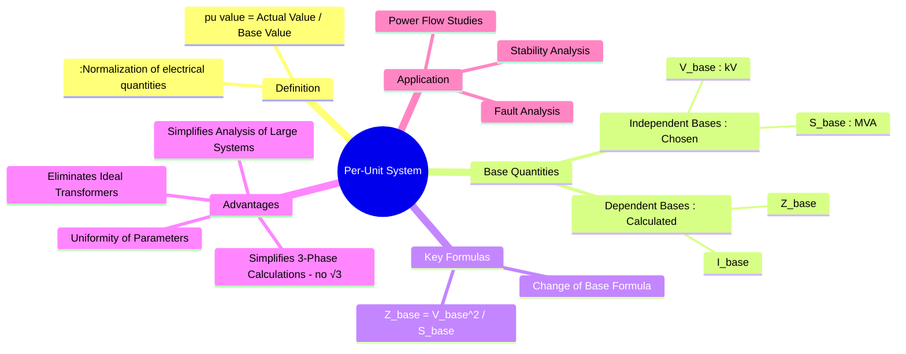

---
tags:
  - power-system
  - power-system/fundamentals
  - per-unit
  - power-system-analysis
  - normalization
created: 2025-10-11
aliases:
  - Per Unit System
  - pu system
  - Per-Unit System and its Advantages
subject: "[[Power System]]"
parent:
  - Power System Fundamentals
trends:
  - "[[trends - Per-Unit System]]"
error:
  - "[[error - Per-Unit System]]"
modified: 2026-07-16
---
### Per-Unit System and its Advantages
#per-unit-system #normalization #power-system-analysis

> ==The **per-unit (pu)** system is a method of expressing quantities in an electrical system as fractions of a defined base or reference value.== By normalizing voltages, currents, impedances, and power, the analysis of complex power systems, especially those with multiple voltage levels, is significantly simplified.

---
#### Definition
#per-unit/definition

The per-unit value of any quantity is the ratio of its actual value to its base value.

$$\boxed{\quad \text{Per-Unit Value} = \frac{\text{Actual Value}}{\text{Base Value}} \quad}$$

For example, $Z_{pu} = \frac{Z_{actual}}{Z_{base}}$.

==The **percent value** is simply the per-unit value multiplied by 100.==

> [!mistake] Own Base vs. System Base
> **Own base** refers to the per-unit value computed relative to a single piece of equipment's nameplate ratings ($S_{\text{rated}}$, $V_{\text{rated}}$), rather than the unified global system network base.

---
#### Selection of Base Quantities
#base-quantities

In a power system, four quantities are interrelated: Power ($S$), Voltage ($V$), Current ($I$), and Impedance ($Z$). We only need to select **two** independent base quantities. The other two are then derived.
The standard practice is to select:
1.  **System-wide Base Power ($S_{base}$)**, typically in MVA.
2.  **Base Voltage ($V_{base}$)** for a specific section of the network, typically in kV.

From these, the base current and base impedance can be derived. For a **three-phase system**:

-   **Base Current ($I_{base}$)**:
    $$ I_{base} = \frac{S_{base, 3\phi}}{\sqrt{3} \times V_{base, LL}} $$
    where $S_{base, 3\phi}$ is the three-phase base power and $V_{base, LL}$ is the line-to-line base voltage.

> [!pyq]- PYQ : GATE EE 2014
> ![[ee_2014(2)#^q25]]

-   **Base Impedance ($Z_{base}$)**:
    $$ Z_{base} = \frac{V_{base, LN}}{I_{base}} = \frac{V_{base, LL}/\sqrt{3}}{S_{base, 3\phi}/(\sqrt{3} V_{base, LL})} $$
    $$\boxed{\quad Z_{base} = \frac{(V_{base, LL})^2}{S_{base, 3\phi}} \quad}$$

---
#### Transformers in the Per-Unit System
#per-unit/transformers

One of the most significant advantages of the pu system is its handling of transformers.
If the base voltages on the primary ($V_{base1}$) and secondary ($V_{base2}$) sides of a transformer are chosen in the same ratio as its turns ratio ($N_1/N_2$), then the transformer's per-unit impedance is the **same** whether referred to the primary or the secondary.

$$\text{If } \frac{V_{base1}}{V_{base2}} = \frac{N_1}{N_2}, \text{ then } Z_{pu,1} = Z_{pu,2}$$

> [!note] Equivalent Circuit Impact
> This eliminates the need for an ideal transformer in the per-phase equivalent circuit, simplifying the network model to a simple, decoupled series impedance element.

> [!abstract] Per-Unit Line Reactance
> 
> > [!pyq]- PYQ : GATE EE 2010
> > ![[ee_2010#^q44]]
> 
> To convert a line reactance ($X$) to per-unit ($X_{\text{pu}}$) across a transformer boundary, you cannot use the generator's base voltage directly. You must first scale the base voltage to the line's zone using the transformer turns ratio.
> 
> 1. **Zone Voltage Translation:**
>    $$V_{\text{base, line}} = V_{\text{base, G1}} \times \left( \frac{V_{\text{nominal, line}}}{V_{\text{nominal, G1}}} \right)$$
> 
> 2. **Base Impedance:**
>    $$Z_{\text{base, line}} = \frac{(V_{\text{base, line}})^2}{S_{\text{base}}}$$
> 
> 3. **Per-Unitization:**
>    $$X_{\text{pu}} = \frac{X_{\text{actual}}}{Z_{\text{base, line}}}$$

---
#### Change of Base Formula
#per-unit/change-of-base

Manufacturer data sheet specs often supply equipment impedance in per-unit on its own nameplate rating. To systematically execute a fault or power-flow analysis, all arbitrary components must scale to a common system-wide base.

The translation from an **old (nameplate)** base system to a **new (system)** base system uses the following scaling:

$$\begin{align}
Z_{pu, new} &= Z_{actual} / Z_{base, new} \\
 &= (Z_{pu, old} \times Z_{base, old}) / Z_{base, new} \\
 &= Z_{pu, old} \times \frac{(V_{base, old})^2/S_{base, old}}{(V_{base, new})^2/S_{base, new}}
\end{align}$$

$$\boxed{\quad Z_{pu, new} = Z_{pu, old} \left( \frac{V_{base, old}}{V_{base, new}} \right)^2 \left( \frac{S_{base, new}}{S_{base, old}} \right) \quad}$$
This formula is extremely important for solving numerical problems in power systems.

> [!pyq]- PYQ : GATE EE 2011
> ![[ee_2011#^q52-53]]
> ![[ee_2011#^q52]]

---
#### Advantages of the Per-Unit System
#per-unit/advantages

1. **Elimination of [[Ideal Transformer#Impedance Reflection|Ideal Transformer]]**: As explained above, the per-unit system removes the need to refer impedances from one side of a transformer to the other, simplifying the equivalent circuit of the power system.
2. **Simplified Calculations**: The factors of $\sqrt{3}$ and $3$ are eliminated from the per-phase analysis of balanced three-phase systems.
3. **Uniformity of Parameters**: The per-unit impedances of machines and transformers of similar type and design fall within a narrow range of values, regardless of their absolute rating. This is useful for checking data and making approximations for preliminary studies. For instance, the [[Armature Reaction and Synchronous Reactance#Synchronous Reactance ($X_s$) and Impedance ($Z_s$)|synchronous reactance]] of a synchronous machine is typically around 1.0 to 1.5 pu.
4. **Suitability for Computers**: The normalization of values makes the system well-suited for digital computer analysis of large-scale power systems.
5. **Manufacturer's Data**: Manufacturers typically specify the impedance of equipment in per-unit or percent based on its own nameplate ratings. The [[#change of base formula]] allows for easy integration of this data into a system-wide study.

---
### Related Concepts
#power-system/related-concepts

> [[Single Line Diagram Representation]] (The starting point for a pu analysis)

[[Reactance and Impedance Diagrams]] (The circuit diagrams where pu values are used)
[[Bus Admittance Matrix (Y-bus) Formulation]] (Constructed using per-unit admittances)
[[Fault Calculations|Fault Analysis]] (Heavily relies on per-unit reactance diagrams)
[[Modeling of Transformers]]
