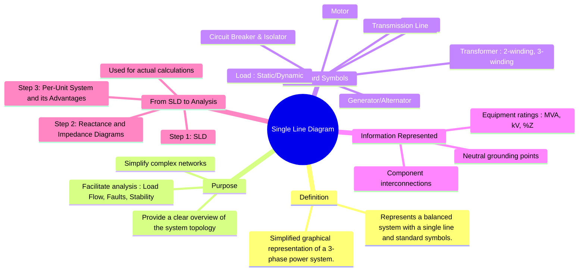

---
tags:
  - power-system
  - power-system/fundamentals
  - sld
  - power-system-analysis
  - power-system-representation
created: 2025-10-11
aliases:
  - SLD
  - One-Line Diagram
subject: "[[Power System]]"
parent:
  - Power System Fundamentals
modified: 2026-07-16
---
### Single Line Diagram Representation
#single-line-diagram #power-system-representation

> ==A **Single Line Diagram (SLD)** or **One-Line Diagram** is a simplified schematic that represents a complex three-phase power system using a single line and standardized symbols.== Since power systems are typically balanced, analyzing one phase is sufficient to understand the entire system, and the SLD provides a concise and clear way to visualize the network's topology and key parameters.

---
#### Purpose of a Single Line Diagram
#sld-purpose

The primary purpose of an SLD is to simplify the representation of a power system for analysis. Instead of drawing all three phases, which would be cluttered and redundant for a balanced system, a single line represents all three conductors.

-   **Clarity**: It provides a clear overview of the system's layout and connections.
-   **Conciseness**: It conveys the most important information about component ratings and connections without unnecessary detail.
-   **Foundation for Analysis**: It is the starting point for all major power system studies, including:
    -   [[Power Flow Studies (Load Flow Analysis)]]
    -   [[Fault Calculations|Fault Analysis]]
    -   [[Classification of Power System Stability|Power System Stability]] studies.

---
#### Standard Symbols Used in SLDs
#sld-symbols

Standard symbols are used to represent various components of the power system. Consistency in these symbols allows engineers to read and understand diagrams universally.

| Component                 | Symbol                                     | Description                                                                                             |
| ------------------------- | ------------------------------------------ | ------------------------------------------------------------------------------------------------------- |
| **Synchronous Machine**   |  | Represents a generator (G) or a motor (M).                                                              |
| **Two-Winding Transformer** |  | Represents a transformer with primary and secondary windings. Connection type (Y, Δ) is often shown.    |
| **Busbar**                |  | A thick straight line representing a node where multiple components are connected.                      |
| **Transmission Line**     |  | A simple line connecting two buses, representing an overhead line or underground cable.                 |
| **Circuit Breaker (CB)**  |  | A square symbol on the line, representing an automatic switch for protection.                             |
| **Isolator (Switch)**     |  | A break in the line, representing a switch used to disconnect a circuit under no-load conditions.        |
| **Load**                  |  | An arrow pointing away from the bus, indicating power consumption. Can be static or a motor load.      |
| **Ground Connection**     |  | Indicates a connection to the earth, often through an impedance.                                        |

---
#### From SLD to Analytical Diagrams
#sld/analytical-diagram 

An SLD is a visual tool, not a circuit diagram for direct calculation. For analysis, it is converted into an **impedance diagram** or a **reactance diagram**.

> [!related]
> [[Reactance and Impedance Diagrams]]

1.  **Impedance Diagram**: ==This is the per-phase equivalent circuit of the system shown in the SLD. It includes the series impedances (resistance and reactance) of all components and may include shunt admittances of transmission lines.==
2.  **Reactance Diagram**: This is a further simplification of the impedance diagram. ==For fault analysis, it is a common and valid assumption to neglect all resistances, static loads, and shunt admittances, as the reactance of the system is the dominant factor limiting fault currents.==
    - Assumption: For most power system components, reactance $X$ is much greater than resistance $R$ ($X \gg R$).

> [!example] Example Transformation
> **A simple power system's SLD**
> `Generator` — `Transformer T1` — `Transmission Line` — `Transformer T2` — `Load`
> 
> **Would be converted to a per-phase reactance diagram**
> `Generator Reactance` — `T1 Reactance` — `Line Reactance` — `T2 Reactance` — `Load Reactance` (if dynamic, like a motor).

This transformation is almost always done in the **[[Per-Unit System|per-unit system]]**, which normalizes all quantities to a common base, simplifying calculations across different voltage levels.

> [!mistake]- Important
> ![[gate-2020-ee-q29.png]]
> 
> **Left Transformer**: Primary is left and Secondary is right
> **Right Transformer**: ==Primary is right and Secondary is left==
> 
> ==Because the SLD gives turn ratios with respect to the direction of power flow, not necessarily left-to-right primary → secondary direction.==
> 
> > [!pyq]- PYQ : GATE EE 2020
> > ![[ee_2020#^q29]]
^clarity

---
### Related Concepts
#power-system/related-concepts

> [[Structure of a Power System]] (The system that an SLD represents)

[[Per-Unit System]] (The mathematical framework used with SLDs for analysis)
[[Reactance and Impedance Diagrams]] (The analytical circuits derived from an SLD)
[[Bus Admittance Matrix (Y-bus) Formulation]] (A matrix representation built from the system's SLD)
[[Fault Calculations|Fault Analysis]] (A primary application requiring the use of SLDs and reactance diagrams)