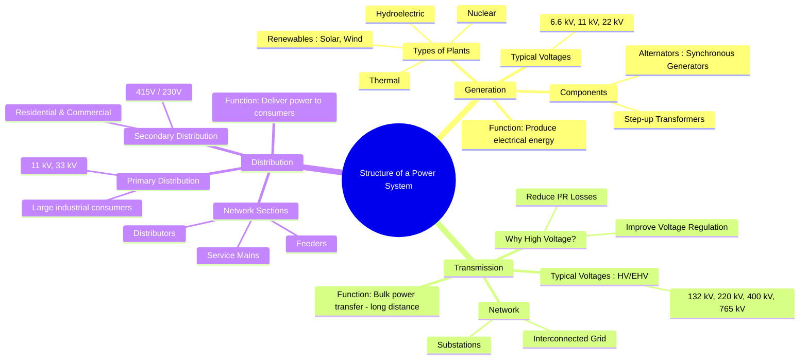

---
tags:
  - power-system
  - power-system/fundamentals
  - generation
  - transmission
  - distribution
  - electrical-engineering
created: 2025-10-11
aliases:
  - Power System Structure
  - Generation Transmission Distribution
  - GTD System
subject: "[[Power System]]"
parent:
  - Power System Fundamentals
modified: 2026-07-23T21:15:55
---
### Structure of a Power System (Generation, Transmission, Distribution)
#power-system-structure #generation #transmission #distribution

> An electric power system is a complex interconnected network designed to generate, transport, and deliver electrical energy from power plants to end consumers. It is broadly divided into three main stages: **Generation**, **Transmission**, and **Distribution**. Each stage operates at different voltage levels optimized for its specific function, primarily efficiency and safety.

---
#### 1. Generation System
#generation-station #power-plant

The generation system is where electrical power is produced by converting other forms of energy (like thermal, hydro, nuclear, solar) into electrical energy.
- **Key Components**: The core component is the **alternator** (synchronous generator), which is mechanically coupled to a turbine. A **step-up transformer** is used at the generating station to increase the voltage.
- **Operating Voltages**: Power is typically generated at relatively low voltages, such as $6.6 \text{ kV, } 11 \text{ kV, or } 22 \text{ kV}$, as generating at higher voltages poses insulation challenges for the alternator windings.

#### 2. Transmission System
#transmission-lines #power-grid

The transmission system is responsible for moving large amounts of power from the generating stations to major load centers over long distances.
- **Operating Voltages**: To transmit power efficiently, the voltage from the generation stage is stepped up to very high levels (High Voltage - HV, Extra High Voltage - EHV, or Ultra High Voltage - UHV), such as $132 \text{ kV, } 220 \text{ kV, } 400 \text{ kV, or } 765 \text{ kV}$.
- **Need for High Voltage**: For a given power $P$, the transmission line current $I_L$ is inversely proportional to the transmission voltage $V_L$.
    - Power Transmitted: $P = \sqrt{3} V_L I_L \cos\phi$
    - Power Loss in lines: $P_{loss} = 3 I_L^2 R$
    From these, we can derive the relationship between power loss and voltage:
    $$ I_L = \frac{P}{\sqrt{3} V_L \cos\phi} $$
    $$ P_{loss} = 3 \left( \frac{P}{\sqrt{3} V_L \cos\phi} \right)^2 R = \frac{P^2 R}{(V_L \cos\phi)^2} $$
    $$\boxed{\quad P_{loss} \propto \frac{1}{V_L^2} \quad}$$
    Therefore, doubling the transmission voltage reduces the power loss to one-fourth.
- **Network**: The transmission network forms the backbone of the national or regional **grid**, which is an interconnected system linking multiple generating stations and load centers to improve reliability and economics.

#### 3. Distribution System
#distribution-network #power-delivery

The distribution system is the final stage of the power system, responsible for delivering power from the transmission system to individual consumers. It is the most extensive part of the power system.
- **Substations**: At distribution substations, the high transmission voltage is stepped down to lower levels suitable for local distribution.
- The distribution network is divided into two main parts:
    1.  **Primary Distribution**: Operates at voltages higher than general utilization, such as $11 \text{ kV or } 33 \text{ kV}$. It supplies power to large industrial consumers directly or to distribution transformers located near consumer premises.
    2.  **Secondary Distribution**: This part delivers power at the voltages that consumers use. For example:
        - $415 \text{ V}$ (three-phase, 4-wire system) for commercial and small industrial consumers.
        - $230 \text{ V}$ (single-phase, 2-wire system, derived from the three-phase system) for residential and domestic consumers.
- **Components**: The network consists of **feeders**, **distributors**, and **service mains** to carry power to the consumer's meter.

#### Overall Structure and Voltage Levels
A simplified single-line representation of the power system structure highlights the change in voltage levels:
**Generation (11 kV)** → **Step-up Tx** → **Transmission (220/400 kV)** → **Step-down Tx** → **Sub-transmission (66/132 kV)** → **Step-down Tx** → **Primary Distribution (11/33 kV)** → **Distribution Tx** → **Secondary Distribution (415/230 V)** → **Consumers**

---
### Related Concepts
#power-system/related-concepts

> [[Single Line Diagram Representation]] (The standard method for representing this complex structure)

[[Per-Unit System]] (A key technique for analyzing the entire power system)
[[AC and DC Transmission Systems Comparison]] (Discusses the technology choice for the transmission stage)
[[Overview of Power Generation (Thermal, Hydro, Nuclear)]] (Details the first stage of the system)
[[Modeling of Short Transmission Lines]] (Begins the analysis of the transmission stage)
[[Bus Admittance Matrix (Y-bus) Formulation]] (A foundational concept for analyzing the interconnected network)