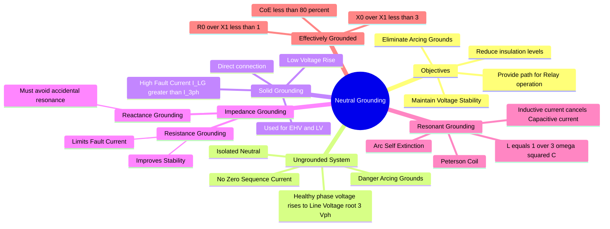

---
tags:
  - power-system
  - protection
  - grounding
  - gate
  - electrical-safety
created: 2026-07-23T21:34:48
aliases:
  - System Grounding
  - Neutral Earthing
  - Peterson Coil
  - Arcing Grounds
subject: "[[Power System]]"
parent: Fundamentals of Protection
modified: 2026-07-23T21:34:48
---
### Neutral Grounding
#power-system/grounding #protection

> **Neutral Grounding** (or System Grounding) is the process of connecting the neutral point of a 3-phase system (Generator, Transformer) to the earth, either directly or through an impedance. Its primary purpose is to control voltage with respect to earth and provide a path for the flow of fault current to ensure protective relays operate.

---
#### Ungrounded System (Isolated Neutral)
#grounding/ungrounded #arcing-grounds

In an ungrounded system, the neutral is not connected to earth. However, there is always distributed capacitance ($C_{ph}$) between each phase and the ground.

**Behavior under Fault (Single Line to Ground - LG):**
*   **Healthy Phases:** If Phase A is grounded, the potential of Phase B and C with respect to ground rises from phase voltage ($V_{ph}$) to **Line Voltage ($V_{LL} = \sqrt{3}V_{ph}$)**.
*   **Insulation:** Equipment must be insulated for full line voltage.
*   **Capacitive Current:** The fault current flows through the line-to-ground capacitances of the healthy phases.
    $$I_f = 3 I_{Cph} = 3 \frac{V_{ph}}{X_C}$$
*   **Arcing Grounds:** This is the major disadvantage. Due to the capacitive nature of the fault current, the arc at the fault location strikes and restrikes repeatedly (oscillation between $L$ and $C$). This causes transient overvoltages up to **3.5 to 4 times** normal voltage, leading to insulation failure of the entire system.

---
#### Solid Grounding (Effective Grounding)
#grounding/solid

The neutral is connected directly to the ground wire with zero impedance.

*   **Voltage Rise:** The neutral is held at earth potential. The voltage of healthy phases remains close to $V_{ph}$ during an LG fault.
*   **Insulation:** Reduced insulation level (graded insulation) can be used, saving cost (Crucial for HV and EHV systems $> 33kV$).
*   **Fault Current:** The LG fault current is extremely high.
    *   Often $I_{LG} > I_{3\phi}$ because $X_0$ is usually lower than $X_1$.
*   **Application:** Used in low voltage systems ($< 600V$) and High Voltage systems ($> 33kV$).

---
#### Resistance Grounding
#grounding/resistance

A resistor $R$ is placed between the neutral and earth.

*   **Purpose:** To limit the magnitude of the earth fault current ($I_{LG}$) to a safe value while still allowing sufficient current for relays to detect the fault.
*   **Stability:** The resistive component dissipates energy, damping transients and improving transient stability.
*   **Application:** Medium voltage systems ($3.3kV$ to $33kV$).

---
#### Reactance Grounding
#grounding/reactance

An inductor $X$ is placed between the neutral and earth.
*   **Condition:** To avoid high transient voltages, the ratio of Zero Sequence Reactance to Positive Sequence Reactance must be kept high:
    $$\frac{X_0}{X_1} > 3$$
    (If $X_0/X_1 < 3$, it is essentially solid/effective grounding).

---
#### Resonant Grounding (Peterson Coil)
#grounding/peterson-coil

This is a specific type of reactance grounding where the inductor is **tuned** to resonate with the system's line-to-ground capacitance.

**Concept:**
*   An LG fault causes a leading capacitive current ($I_C$) to flow from the healthy phases.
*   The inductor in the neutral provides a lagging inductive current ($I_L$).
*   If tuned correctly, $I_L$ cancels $I_C$.

**Tuning Condition:**
For complete neutralization of fault current:
$$|I_L| = |I_{C(total)}|$$
$$\frac{V_{ph}}{\omega L} = 3 \frac{V_{ph}}{X_{C_{ph}}} = 3 V_{ph} (\omega C)$$

$$\boxed{\quad L = \frac{1}{3\omega^2 C} \quad}$$

*   **Result:** The current at the fault location becomes zero (or very small resistive component). The arc is self-extinguishing.
*   **Application:** Long transmission lines where avoiding outages due to transient lightning strikes is critical.

---
#### Coefficient of Earthing (CoE)
#grounding/parameters

The Coefficient of Earthing defines the effectiveness of the grounding system regarding voltage rise.

$$\boxed{\quad \text{CoE} = \frac{\text{Highest RMS voltage of healthy phase to earth during fault}}{\text{RMS Line-to-Line voltage (normal)}} \times 100\% \quad}$$

*   **Effectively Grounded System:** CoE $\le 80\%$.
    *   This implies the healthy phase voltage does not rise beyond $0.8 \times V_{LL} \approx 1.4 V_{ph}$.
    *   Conditions: $X_0/X_1 \le 3$ and $R_0/X_1 \le 1$.
*   **Non-Effectively Grounded:** CoE $> 80\%$ (typically $100\%$, i.e., rises to full line voltage).

---
### Related Concepts
#topic/related-concepts

> [[Analysis of Single Line-to-Ground (LG) Fault]]

[[Concept of Symmetrical Components]]
[[Sequence Impedances and Networks of Transformers]]
[[Sequence Impedances and Networks of Synchronous Machines]]
[[Types of Circuit Breakers|Circuit Breaker Types]]
[[Insulation Coordination]]
