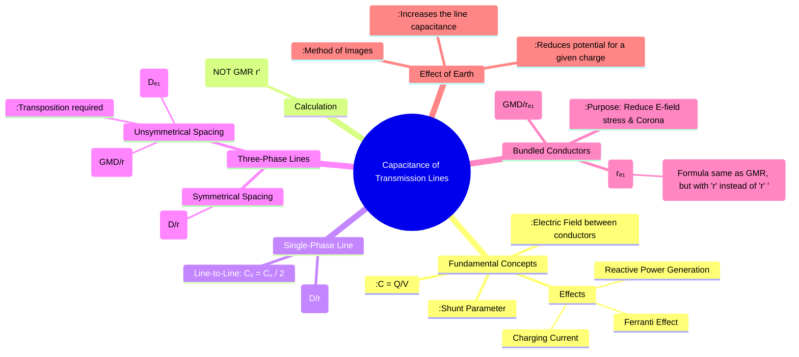

---
tags:
  - power-system
  - transmission-lines
  - line-parameters
  - capacitance
  - electric-fields
  - charging-current
created: 2025-10-11
aliases:
  - Line Capacitance
  - Shunt Capacitance
  - Transmission Line Capacitance
subject: "[[Power System]]"
parent:
  - Transmission Line Parameters and Performance
modified: 2026-07-23T21:16:16
---
### Capacitance of Single-phase and Three-phase Lines
#transmission-line-capacitance #shunt-parameter #charging-current

> The capacitance of a transmission line is a shunt parameter that arises because the potential difference between conductors creates an electric field in the surrounding dielectric medium (air). The conductors act like the plates of a capacitor. This capacitance is uniformly distributed along the line and is responsible for drawing a **charging current**, even when the line is open-circuited. It significantly influences voltage regulation, leading to the **[[Ferranti Effect]]**.

---
#### Fundamental Concepts
#capacitance-basics

Capacitance ($C$) is defined as the charge ($Q$) stored per unit of potential difference ($V$).
$$ C = \frac{Q}{V} \quad (\text{Farad, F}) $$
For transmission lines, capacitance is calculated as a per-unit-length value (F/m).

**Crucial Point for GATE**: Unlike in inductance calculations where we use the Geometric Mean Radius ($GMR = D_s = r' = 0.7788r$), for capacitance calculations, we use the **actual physical outside radius ($r$)** of the conductor.

---
#### Capacitance of a Single-Phase Two-Wire Line
#single-phase-capacitance

Consider two conductors of radius $r$, separated by a distance $D$.
-   The **line-to-line capacitance** (between the two conductors) is:
    $$ C_{ab} = \frac{\pi \epsilon_0}{\ln(D/r)} \text{ F/m} $$
-   The **line-to-neutral capacitance** (capacitance of one conductor to the neutral plane) is more commonly used in per-phase analysis.
    $$\boxed{\quad C_n = C_{an} = C_{bn} = \frac{2\pi\epsilon_0}{\ln(D/r)} \text{ F/m} \quad}$$
    Note that $C_n = 2C_{ab}$. Here, $\epsilon_0 = 8.854 \times 10^{-12}$ F/m is the permittivity of free space.

---
#### Capacitance of a Three-Phase Line
#three-phase-capacitance

1.  **Symmetrical Spacing**
    If the three conductors are at the vertices of an equilateral triangle of side $D$, the per-phase capacitance to neutral ($C_n$) is:
    $$\boxed{\quad C_n = \frac{2\pi\epsilon_0}{\ln(D/r)} \text{ F/m} \quad}$$

2.  **Unsymmetrical Spacing and Transposition**
    To ensure balanced capacitance for all phases, unsymmetrically spaced lines are **transposed**. The average per-phase capacitance is found by using the **Geometric Mean Distance (GMD)**.
    -   **Geometric Mean Distance (GMD)**, $D_{eq}$:
        $$ D_{eq} = GMD = \sqrt{D_{ab} D_{bc} D_{ca}} $$
    -   The average per-phase capacitance to neutral is:
        $$\boxed{\quad C_n = \frac{2\pi\epsilon_0}{\ln(GMD/r)} = \frac{2\pi\epsilon_0}{\ln(D_{eq}/r)} \text{ F/m} \quad}$$

---
#### Capacitance of Bundled Conductors
#bundled-conductor-capacitance

Bundling conductors increases the effective radius of the phase, which reduces the electric field strength at the surface and helps control corona. For capacitance calculations, we use an **equivalent radius ($r_{eq}$ or $r_b$)** of the bundle.

-   **Equivalent Radius ($r_{eq}$)**: The formula is analogous to the GMR formula for inductance, but using the physical radius $r$ instead of $D_s$.
    -   **2-conductor bundle** (spacing $d$): $r_{eq} = \sqrt{r \cdot d}$
    -   **3-conductor bundle** (equilateral spacing $d$): $r_{eq} = \sqrt{r \cdot d^2}$
    -   **4-conductor bundle** (square spacing $d$): $r_{eq} = \sqrt{r \cdot d^3 \sqrt{2}}$

-   **Capacitance Formula for a 3-Phase Line with Bundling**:
    $$\boxed{\quad C_n = \frac{2\pi\epsilon_0}{\ln(GMD/r_{eq})} \text{ F/m} \quad}$$

---
#### Effect of Earth on Capacitance
#earth-effect-capacitance

The presence of the ground, which acts as an equipotential plane, modifies the electric field of the overhead conductors. This effect can be analyzed using the **method of images**.
-   **Method of Images**: The effect of the earth is modeled by assuming an identical "image" conductor for each overhead conductor, placed at the same distance below the ground surface and holding an opposite charge.
-   **Result**: The presence of the grounded earth plane **reduces the potential difference** between the conductor and the neutral plane for a given charge Q. Since $C=Q/V$, a lower V results in a **higher capacitance**.
-   The capacitance of a single conductor at height $h$ above ground is:
    $$ C_n = \frac{2\pi\epsilon_0}{\ln(2h/r)} \text{ F/m}$$
For most practical calculations involving multi-conductor lines, the effect of earth is small and often neglected unless high accuracy is required.

---
### Related Concepts
#power-system/related-concepts

> [[Inductance of Single-phase and Three-phase Lines]] (The dual series parameter)

[[Concept of GMD and GMR]]
[[Effect of Earth on Capacitance]]
[[Ferranti Effect]] (Caused by line capacitance and charging current)
[[Surge Impedance and Surge Impedance Loading (SIL)]] ($Z_c = \sqrt{L/C}$)
[[Corona and its Effects]] (Mitigated by bundling, which affects capacitance)