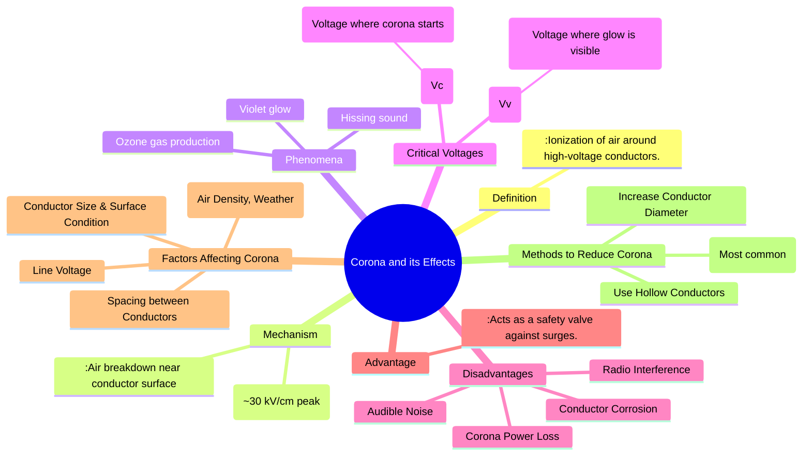

---
tags:
  - power-system
  - transmission-lines
  - high-voltage
  - corona
  - power-loss
created: 2025-10-11
aliases:
  - Corona Discharge
  - Corona Effect
subject: "[[Power System]]"
parent:
  - Performance of Transmission Lines
modified: 2026-07-23T21:17:50
---
### Corona and its Effects
#corona #high-voltage-phenomenon #power-loss

> **Corona** is an electrical discharge phenomenon that occurs in high-voltage systems when the electric field strength (or potential gradient) at the surface of a conductor exceeds the dielectric strength of the surrounding air. It is characterized by a faint violet glow, a hissing sound, and the production of ozone gas. While it has a minor beneficial effect on surges, its disadvantages, particularly power loss, are a major concern in EHV transmission.

---
#### Mechanism of Corona Formation
#corona-mechanism

When a high AC voltage is applied to a conductor, it establishes a strong electric field in the surrounding air. If the field gradient at the conductor's surface becomes sufficiently high, it can accelerate free electrons present in the air to a velocity where they dislodge other electrons from air molecules upon collision. This cumulative process, known as an electron avalanche, causes the air in the immediate vicinity of the conductor to become ionized and conductive, resulting in the corona discharge.

The dielectric strength of air at Standard Temperature and Pressure (STP) is approximately **30 kV/cm (peak)** or **21.2 kV/cm (rms)**. Corona forms when the surface potential gradient exceeds this value.

#### Critical Voltages
#critical-voltage
1.  **Critical Disruptive Voltage ($V_c$)**: This is the minimum phase-to-neutral voltage at which corona starts. It is given by Peek's formula:
    $$\boxed{\quad V_c = m_0 g_0 \delta r \ln\left(\frac{D}{r}\right) \quad (\text{kV/phase, rms})}$$
    where:
    -   $m_0$: Conductor surface irregularity factor (1 for smooth, < 1 for rough/stranded).
    -   $g_0$: Dielectric strength of air at STP ($21.2 \text{ kV/cm, rms}$).
    -   $\delta$: Air density correction factor ($\delta = \frac{3.92b}{273+t}$ where b is pressure in cm Hg, t is temp in °C).
    -   $r$: Conductor radius (cm).
    -   $D$: Spacing between conductors (cm).

2.  **Visual Critical Voltage ($V_v$)**: The voltage at which the corona glow is visible. It is higher than $V_c$.

#### Corona Power Loss
#corona-loss
The energy consumed during the ionization process results in a continuous power loss. This loss is significant in bad weather conditions. Peterson's formula is commonly used to estimate this loss:
$$\boxed{\quad P_{loss} = \frac{242}{\delta} (f+25) \sqrt{\frac{r}{D}} (V_p - V_c)^2 \times 10^{-5} \quad (\text{kW/km/phase})}$$
-   $f$: Supply frequency (Hz).
-   $V_p$: Operating phase-to-neutral voltage (kV, rms).
-   $V_c$: Critical disruptive voltage (kV, rms).
Note that the power loss is proportional to $(V_p - V_c)^2$ and is zero if the operating voltage is below the critical disruptive voltage.

#### Factors Affecting Corona
1.  **Line Voltage**: Corona loss increases significantly once the operating voltage exceeds $V_c$.
2.  **Atmospheric Conditions**:
    -   **Air Density ($\delta$)**: Lower air density (e.g., at high altitudes or high temperatures) reduces $\delta$ and $V_c$, thus increasing corona.
    -   **Weather**: In foul weather (rain, snow), water droplets on the conductor reduce the surface irregularity factor ($m_0$) and drastically increase corona loss.
3.  **Conductor Size and Surface**:
    -   Larger conductor radius ($r$) increases $V_c$, reducing corona.
    -   Rough or stranded conductors have a lower $V_c$ than smooth conductors.
4.  **Spacing Between Conductors ($D$)**: Increasing the spacing $D$ increases $V_c$, which helps reduce corona.

#### Disadvantages and Advantages
##### Disadvantages
-   **Power Loss**: Reduces the overall [[Transmission Efficiency]].
-   **Audible Noise**: A continuous hissing or cracking noise is generated, which is a concern for lines passing through residential areas.
-   **Radio Interference**: The non-sinusoidal corona current generates electromagnetic interference (EMI), which can disrupt radio and communication signals.
-   **Corrosion**: The production of ozone ($O_3$) can chemically degrade and corrode the conductor and associated hardware over time.

##### Advantage
-   The ionized air around the conductor forms a virtual conductive sheath, effectively increasing the conductor's diameter. This reduces the steepness of voltage surges caused by lightning or switching, acting as a form of natural "safety valve".

#### Methods to Reduce Corona
The primary strategy to reduce corona is to lower the electric field gradient at the conductor's surface. This is achieved by:
1.  **Using Bundled Conductors**: This is the most effective and universally adopted method for EHV lines. By using two or more sub-conductors per phase, the effective radius of the phase is significantly increased, which raises the critical disruptive voltage $V_c$.
2.  **Increasing Conductor Size**: Using conductors with a large diameter (e.g., hollow conductors or larger ACSR conductors) increases $r$ and hence $V_c$.
3.  **Increasing Conductor Spacing**: Increasing $D$ also raises $V_c$, but this is limited by the increased cost and size of transmission towers.

---
### Related Concepts
#power-system/related-concepts

> [[Inductance of Composite and Bundled Conductors]] (Bundling is the key solution for corona)

[[Capacitance of Single-phase and Three-phase Lines]]
[[Transmission Efficiency]]
[[High Voltage Engineering]]