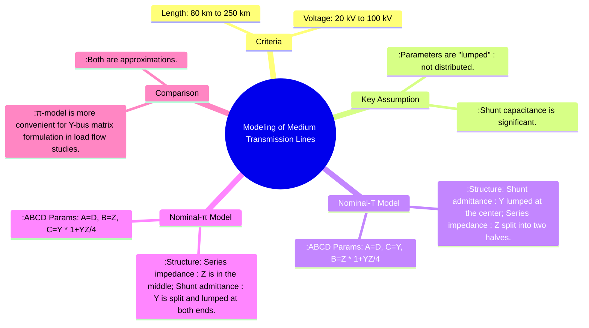

---
tags:
  - power-system
  - transmission-lines
  - line-modeling
  - medium-lines
  - power-system-analysis
created: 2025-10-11
aliases:
  - Medium Line Model
  - Nominal-T Model
  - Nominal-π Model
  - Modeling of Medium Transmission Lines (Nominal T and π models)
subject: "[[Power System]]"
parent:
  - Performance of Transmission Lines
formula:
  - "ABCD Parameters (Nominal T Model TL) : $$\\begin{bmatrix} V_s \\\\ I_s \\end{bmatrix} = \\begin{bmatrix} (1 + \\frac{YZ}{2}) & Z(1 + \\frac{YZ}{4}) \\\\ Y & (1 + \\frac{YZ}{2}) \\end{bmatrix} \\begin{bmatrix} V_r \\\\ I_r \\end{bmatrix}$$"
  - "ABCD Parameters (Nominal PI Model TL) : $$\\begin{bmatrix} V_s \\\\ I_s \\end{bmatrix} = \\begin{bmatrix} (1 + \\frac{YZ}{2}) & Z \\\\ Y(1 + \\frac{YZ}{4}) & (1 + \\frac{YZ}{2}) \\end{bmatrix} \\begin{bmatrix} V_r \\\\ I_r \\end{bmatrix}$$"
modified: 2026-07-23T21:18:30
---
### Modeling of Medium Transmission Lines (Nominal T and π models)
#medium-line-model #nominal-t #nominal-pi

> A transmission line is classified as a **medium line** when its length is between approximately 80 km and 250 km. In this range, the shunt capacitance of the line becomes significant and must be included in the model. However, the parameters can still be considered as **lumped** rather than distributed, leading to two common approximations: the **[[#Nominal-T model]]** and the **[[#Nominal-π model]]**.

---
#### Nominal-T Model
#nominal-t-model

In the Nominal-T model, the total series impedance of the line ($Z = R + jX_L$) is split into two equal halves, and the total shunt admittance ($Y = j\omega C$) is lumped at the midpoint of the line.

![[NominalTModel.jpg]]

- **Equations**:
    Let $V_1$ be the voltage at the midpoint.
    $$\begin{align}
    V_1 &= V_r + I_r \frac{Z}{2} \\
    I_s &= I_r + V_1 Y \\
    V_s &= V_1 + I_s \frac{Z}{2}
    \end{align}$$

- **ABCD Parameters**:
    By solving the above equations, the ABCD parameters for the T-model are found to be:
    $$\boxed{\quad \begin{bmatrix} V_s \\ I_s \end{bmatrix} = \begin{bmatrix} (1 + \frac{YZ}{2}) & Z(1 + \frac{YZ}{4}) \\ Y & (1 + \frac{YZ}{2}) \end{bmatrix} \begin{bmatrix} V_r \\ I_r \end{bmatrix} \quad}$$
    - $A = D = 1 + \frac{YZ}{2}$
    - $B = Z(1 + \frac{YZ}{4})$
    - $C = Y$
    The network is symmetrical ($A=D$) and reciprocal ($AD-BC=1$).

#### Nominal-π Model
#nominal-pi-model

In the Nominal-π model, the total shunt admittance of the line ($Y$) is divided into two equal halves, with one half placed at the sending end and the other at the receiving end. The total series impedance ($Z$) is placed in between.

![[NominalPiModel.jpg]]

- **Equations**:
    Let $I_L$ be the current through the series impedance.
    $$\begin{align}
    I_L &= I_r + V_r \frac{Y}{2} \\
    V_s &= V_r + I_L Z \\
    I_s &= I_L + V_s \frac{Y}{2}
    \end{align}$$

- **ABCD Parameters**:
    Solving these equations yields the ABCD parameters for the π-model:
    $$\boxed{\quad \begin{bmatrix} V_s \\ I_s \end{bmatrix} = \begin{bmatrix} (1 + \frac{YZ}{2}) & Z \\ Y(1 + \frac{YZ}{4}) & (1 + \frac{YZ}{2}) \end{bmatrix} \begin{bmatrix} V_r \\ I_r \end{bmatrix} \quad}$$
    - $A = D = 1 + \frac{YZ}{2}$
    - $B = Z$
    - $C = Y(1 + \frac{YZ}{4})$
    This network is also symmetrical ($A=D$) and reciprocal ($AD-BC=1$).

#### Comparison of T and π Models
- Both models are approximations of a distributed parameter line.
- The **Nominal-π model is more commonly used** in power system analysis. Its structure is more convenient for developing the **[[Bus Admittance Matrix (Y-bus) Formulation|Y-bus matrix]]** for [[Power Flow Studies (Load Flow Analysis)|load flow studies]], as the shunt admittances at each end can be directly added to the diagonal elements of the Y-bus matrix corresponding to the connecting buses.
- The π-model also more accurately represents the charging current phenomenon at light loads.

---
### Related Concepts
#power-system/related-concepts

> [[Modeling of Short Transmission Lines]]

[[Modeling of Long Transmission Lines]]
[[ABCD Parameters (Generalized Circuit Constants)]]
[[Capacitance of Single-phase and Three-phase Lines]]
[[Ferranti Effect]]
[[Bus Admittance Matrix (Y-bus) Formulation]]