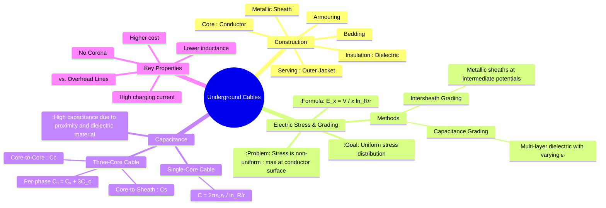

---
tags:
  - power-system
  - transmission-lines
  - cables
  - high-voltage
  - insulation-grading
created: 2025-10-11
aliases:
  - Underground Cables
  - Power Cables
  - Cable Grading
subject: "[[Power System]]"
parent:
  - Performance of Transmission Lines
modified: 2026-07-23T11:42:27
---
### Underground Cables (Construction, Grading, Capacitance)
#underground-cables #power-cables #cable-grading

> Underground cables are used for power transmission and distribution in locations where overhead lines are impractical, such as densely populated urban areas, underwater crossings, or for aesthetic reasons. They have significantly different electrical characteristics compared to overhead lines, primarily much higher capacitance and lower inductance.

---
#### 1. Construction of Cables
#cable-construction

|                                         |                                    |
| --------------------------------------- | ---------------------------------- |
| ![[underground cable construction.png]] | ![[labeled underground cable.png]] |
|                                         |                                    |

A typical high-voltage cable has a layered construction to provide electrical insulation, mechanical strength, and environmental protection.
1.  **Core (Conductor)**: One or more conductors made of stranded tinned copper or aluminum to carry the current.
2.  **Insulation (Dielectric)**: The most critical part. It must withstand high voltages. Materials include impregnated paper, varnished cambric, or modern polymers like Cross-Linked Polyethylene (XLPE).
3.  **Metallic Sheath**: A layer of lead or aluminum surrounding the insulation. Its functions are to protect the insulation from moisture and chemicals, and to provide a path for fault and charging currents.
4.  **Bedding**: A fibrous material (like jute or hessian tape) that protects the metallic sheath from corrosion and mechanical injury from the armouring.
5.  **Armouring**: A layer of galvanized steel wires or tapes to provide high mechanical strength against crushing, impact, and other damage.
6.  **Serving**: An outer jacket of a fibrous material or PVC to protect the armouring from atmospheric conditions.

---
#### 2. Electric Stress and Grading of Cables
#electric-stress #cable-grading

In a single-core cable, the electric field (or stress) is not uniform across the insulation. It is maximum at the conductor surface and minimum at the metallic sheath.
The electric stress $E$ at a radial distance $x$ from the center is:
$$\boxed{\quad E(x) = \frac{V}{x \ln(R/r)} \quad}$$
where:
-   $V$ is the phase-to-neutral voltage.
-   $r$ is the conductor radius.
-   $R$ is the radius of the insulation (up to the sheath).

The maximum stress occurs at $x=r$: $E_{max} = \frac{V}{r \ln(R/r)}$.
To use the dielectric material more efficiently and prevent breakdown, the stress distribution must be made more uniform. This is achieved by **grading**.

1. **Capacitance Grading**: The dielectric is composed of multiple layers of different materials with varying permittivities ($\epsilon_r$). The material with the highest permittivity is placed closest to the conductor. The goal is to maintain a constant product $\epsilon_r \cdot x$ across the insulation, which equalizes the stress.
2. **Intersheath Grading**: One or more thin metallic "intersheaths" are inserted within the insulation and held at specific intermediate potentials. This effectively divides the single capacitor into several capacitors in series, distributing the voltage drop more evenly across the layers. This method is more effective but makes the cable construction complex and expensive.

> [!important] Lumped Resistance Modeling of Underground Power Cables (Universal)
> 
> > [!pyq]- PYQ : 2021
> > ![[ee_2021#^q15]]
> 
> **Conductor resistance** of an underground power cable is modeled as a **lumped series resistance**:
> $$R = \rho \frac{l}{A}$$
> **Core-to-sheath (earth) resistance** represents **insulation leakage** and is modeled as a **shunt resistance to earth**.
>
> In a **lumped-element model**, the **exact position of the shunt leakage resistance** relative to the series conductor resistance **does not affect terminal behavior**.
>
> For **multiple cable sections joined together**:
> - Series conductor resistances **add directly**:
> $$R_{\text{total}} = \sum_i R_i$$
> - Core-to-sheath resistances form **parallel leakage paths**:
> $$\frac{1}{R_{cs,\text{eq}}} = \sum_i \frac{1}{R_{cs,i}}$$
>
> Cable **orientation, bends, or routing** do **not** affect conductor resistance directly; they influence **inductance, capacitance, and thermal conditions** only.
>
> This lumped representation is valid for **power-frequency analysis** unless **distributed line modeling** is explicitly required.

---
#### 3. Capacitance of Cables
#cable-capacitance

Due to the close proximity of conductors and the high permittivity of the insulation material ($\epsilon_r$ for XLPE is ~2.3, for paper is ~3.5-4), underground cables have a very high capacitance per unit length.

##### Capacitance of a Single-Core Cable
The capacitance between the core and the earthed metallic sheath acts like a [[Capacitance and Calculation of Capacitance|coaxial capacitor]].
$$\boxed{\quad C = \frac{2\pi\epsilon_0\epsilon_r}{\ln(R/r)} \quad (\text{F/m})}$$

##### Capacitance of a Three-Core Cable
In a 3-core cable, two types of capacitance exist:
1. **Core-to-Sheath Capacitance ($C_s$)**: Capacitance between each conductor and the metallic sheath.
2. **Core-to-Core Capacitance ($C_c$)**: Capacitance between any two conductors.

These capacitances form a delta-connected network of $C_c$ between the phases and a star-connected network of $C_s$ to the sheath (neutral). To find the per-phase capacitance to neutral ($C_n$) for balanced analysis, we convert the delta-formed $C_c$ into an equivalent star network. The capacitance in each branch of the equivalent star is $3C_c$.
This star is in parallel with the original star of $C_s$. Therefore, the total per-phase capacitance to neutral is:
$$\boxed{\quad C_n = C_s + 3C_c \quad}$$

The high capacitance of cables leads to:
- A very high charging current, which limits the maximum length of AC cables.
- A very low **[[Surge Impedance and Surge Impedance Loading (SIL)|Surge Impedance]]** ($Z_c = \sqrt{L/C}$), typically 40-60 $\Omega$.

---
### Related Concepts
#power-system/related-concepts

> [[Capacitance of Single-phase and Three-phase Lines]] (For comparison with overhead lines)

[[Surge Impedance and Surge Impedance Loading (SIL)]]
[[Ferranti Effect]] (Very pronounced in cables due to high capacitance)
[[Corona and its Effects]] (Absent in underground cables due to solid insulation)
[[AC and DC Transmission Systems Comparison]] (HVDC is highly suitable for long-distance cable transmission)
[[High Voltage Engineering]]