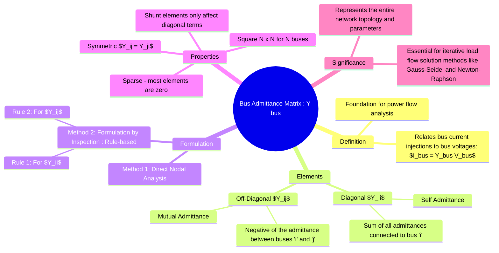

---
tags:
  - power-systems
  - load-flow
  - y-bus
  - network-modeling
created: 2025-10-12
aliases:
  - Y-bus Matrix
  - Bus Admittance Matrix
  - Ybus
  - "Example : Y-bus Matrix"
subject: "[[Power System]]"
parent: "[[Power Flow Studies (Load Flow Analysis)]]"
modified: 2026-07-16
---
### Bus Admittance Matrix (Y-bus) Formulation
#power-systems/load-flow #network-matrix #y-bus

> ==The **Bus Admittance Matrix**, denoted as $Y_{bus}$, is a fundamental tool in power system analysis. It is an $N \times N$ matrix for an $N$-bus system that relates the vector of injected bus currents ($I_{bus}$) to the vector of bus voltages ($V_{bus}$).== It systematically represents the network's topology and admittances (the reciprocal of impedances), forming the basis for all power flow studies.

The fundamental relationship is given by Ohm's law in matrix form:
$$\boxed{\quad [I_{bus}] = [Y_{bus}] [V_{bus}] \quad}$$
In expanded form for an N-bus system:
$$
\begin{bmatrix} I_1 \\ I_2 \\ \vdots \\ I_N \end{bmatrix} = \begin{bmatrix} Y_{11} & Y_{12} & \cdots & Y_{1N} \\ Y_{21} & Y_{22} & \cdots & Y_{2N} \\ \vdots & \vdots & \ddots & \vdots \\ Y_{N1} & Y_{N2} & \cdots & Y_{NN} \end{bmatrix} \begin{bmatrix} V_1 \\ V_2 \\ \vdots \\ V_N \end{bmatrix}
$$
where:
* $I_k$ is the current injected into bus 'k'.
* $V_k$ is the voltage at bus 'k' with respect to the reference node (ground).
* $Y_{ij}$ are the elements of the bus admittance matrix.

---
#### Formulation of Y-bus Matrix
#y-bus/formulation

The elements of the Y-bus matrix can be determined directly from [[Nodal Analysis]]. The current injected into any bus '$i$' is:
$$I_i = \sum_{j=1, j \neq i}^{N} (V_i - V_j)y_{ij} + (V_i - V_0)y_{i0}$$
where $V_0 = 0$ is the reference voltage, $y_{ij}$ is the admittance of the line between buses 'i' and 'j', and $y_{i0}$ is the shunt admittance at bus 'i'.

Rearranging the equation to group voltage terms:
$$I_i = V_i \left( \sum_{j=0, j \neq i}^{N} y_{ij} \right) - \sum_{j=1, j \neq i}^{N} V_j y_{ij}$$

By comparing this with the matrix equation $I_i = \sum_{j=1}^{N} Y_{ij}V_j$, we can define the elements of the Y-bus matrix.

---
#### Formulation by Inspection (Rule-Based Method)
#y-bus/inspection-rules

For <u>networks without mutual coupling between lines</u>, the Y-bus matrix can be formed easily using two simple rules:

1.  **Diagonal Elements ($Y_{ii}$ - Self Admittance):**
    The diagonal element $Y_{ii}$ is the sum of all admittances connected directly to bus 'i' (including transmission lines and shunt elements).
    $$\boxed{\quad Y_{ii} = \sum_{j=0, j \neq i}^{N} y_{ij} \quad}$$

2.  **Off-Diagonal Elements ($Y_{ij}$ - Mutual Admittance):**
    The off-diagonal element $Y_{ij}$ is the negative of the sum of all admittances connected directly between bus 'i' and bus 'j'.
    $$\boxed{\quad Y_{ij} = Y_{ji} = -y_{ij} \quad (i \neq j) \quad}$$

> [!pyq]- PYQ : GATE EE 2019
> ![[ee_2019#^q21]]

> [!examtip] Y-bus with off-nominal transformer taps (exam rule)
> For a line of admittance $Y$ between buses $i$ and $j$,
> with tap ratios $t_i$ at bus $i$ and $t_j$ at bus $j$:
>
> $$Y_{ii} = \frac{Y}{t_i^2}, \qquad Y_{jj} = \frac{Y}{t_j^2}$$
>
> $$Y_{ij} = Y_{ji} = -\frac{Y}{t_i t_j}$$
> 
> > [!memory] Memory aid
> > self → divide by own tap²
> > mutual → divide by product of taps

> [!warning]- Y-bus : sign conventions (quick reference)
>
> **What changes?** Only the *algebraic sign* of every element — physics unchanged.
>
> **Convention A — (Standard / most textbooks & exams)**  
> Assumption: currents **injected into** bus $i$ are positive.  
> Matrix form: $I = Y V$  
> $$Y_{ii} = +\sum_{k} y_{ik}\quad\text{(diagonal positive)}$$
> $$Y_{ij} = -y_{ij}\quad\text{(off-diagonal negative, }i\ne j\text{)}$$
>
> **Convention B — (Leaving-current sign)**  
> Assumption: currents **leaving** bus $i$ are taken positive.  
> Matrix form: $I = -Y_{\text{std}} V$ — equivalently the given matrix is the negative of the standard one.  
> $$Y_{ii} = -\sum_{k} y_{ik}\quad\text{(diagonal negative)}$$
> $$Y_{ij} = +y_{ij}\quad\text{(off-diagonal positive, }i\ne j\text{)}$$
>
> **Fast exam checks**
> - If you are *forming* Y-bus yourself, assume **Convention A** (positive diag, negative off-diag).  
> - If a Y-bus is *given*, accept its signs — the given matrix defines the convention.  
> - Quick algebraic test: compute $Y_{\text{sh},i}=Y_{ii}+\sum_{j\ne i}Y_{ij}$. Nonzero value indicates net shunt at bus $i$; the sign shows if it’s inductive or capacitive under the matrix’s convention.
>
> **One-line memory aid:** “Injected → $+$ diag, $-$ off; Leaving → signs flipped.”

---
#### Properties of the Y-bus Matrix
#y-bus/properties

*   **Square and Symmetric**: It is an N x N square matrix. It is symmetric ($Y_{ij} = Y_{ji}$) because the admittance between two buses, $y_{ij}$, is the same in both directions.
*   **Sparsity**: In a practical power system, a bus is only connected to a few neighboring buses. Therefore, most of the off-diagonal elements are zero. This sparsity is highly advantageous as it reduces memory requirements and computational time for load flow solutions.
*   **Shunt Elements**: The presence of shunt admittances at a bus (e.g., line charging capacitance, capacitors, or reactors) only affects the corresponding diagonal element ($Y_{ii}$). They do not change the off-diagonal elements.

> [!tip]- Finding Shunt Admittance from $Y_{bus}$
> For any bus $i$, the net shunt admittance is obtained as
> $$Y_{\text{sh},i} = Y_{ii} + \sum_{j \ne i} Y_{ij}$$
> - If $Y_{\text{sh},i} = 0$, then **no shunt element** is connected at bus $i$.
> - If $Y_{\text{sh},i} \ne 0$, then a **shunt admittance is present** at bus $i$.
> 
> This method detects the **electrical presence of shunt elements** using only the $Y$-bus matrix.

---
#### Example
#y-bus/example

Consider the 3-bus system shown below, where values are admittances in p.u.

Applying the inspection rules:

*   **Diagonal Elements**:
    *   $Y_{11} = y_{10} + y_{12} + y_{13} = j0.05 + (1-j4) + (0.5-j2) = 1.5 - j5.95$
    *   $Y_{22} = y_{20} + y_{12} + y_{23} = j0.04 + (1-j4) + (2-j5) = 3 - j8.96$
    *   $Y_{33} = y_{30} + y_{13} + y_{23} = j0.06 + (0.5-j2) + (2-j5) = 2.5 - j6.94$

*   **Off-Diagonal Elements**:
    *   $Y_{12} = Y_{21} = -y_{12} = -(1-j4) = -1 + j4$
    *   $Y_{13} = Y_{31} = -y_{13} = -(0.5-j2) = -0.5 + j2$
    *   $Y_{23} = Y_{32} = -y_{23} = -(2-j5) = -2 + j5$

The resulting Y-bus matrix is:
$$
Y_{bus} = \begin{bmatrix}
1.5 - j5.95 & -1 + j4 & -0.5 + j2 \\
-1 + j4 & 3 - j8.96 & -2 + j5 \\
-0.5 + j2 & -2 + j5 & 2.5 - j6.94
\end{bmatrix}
$$

---
### Related Concepts
#power-systems/related-concepts

> [[Power Flow Studies (Load Flow Analysis)]]

[[Kron Reduction]] (to reduce matrix size if node/bus $(I_{node/bus}=0)$ is present)
[[Bus Classification (Slack, PQ, PV)]]
[[Power Flow Equations]]
[[Gauss-Seidel Method for Load Flow]]
[[Newton-Raphson Method for Load Flow]]
[[Per-Unit System]]
