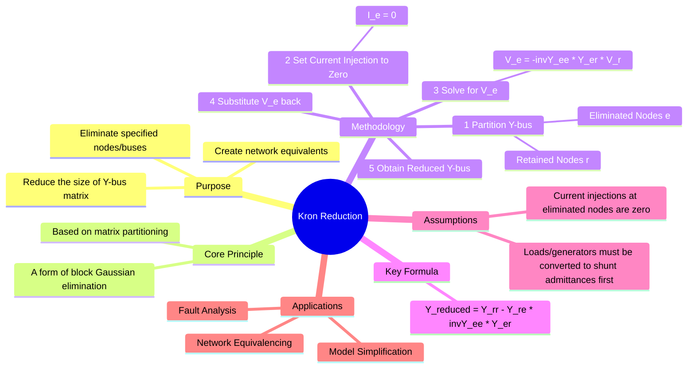

---
tags:
  - power-system
  - network-analysis
  - gate
  - matrix-methods
created: 2026-07-23T21:20:10
aliases:
  - Kron's Reduction
  - Node Elimination
  - Bus Elimination
subject: "[[Power System]]"
parent: "[[Bus Admittance Matrix (Y-bus) Formulation]]"
modified: 2026-07-23T21:20:10
---
### Kron Reduction
#power-system/network-analysis #matrix-reduction #y-bus

> Kron Reduction is a matrix-based method used to eliminate selected nodes or buses from a network model, thereby reducing the size of the system's admittance matrix (Y-bus). It is a powerful technique for creating network equivalents and simplifying complex systems for analysis, especially when the internal details of a sub-network are not required.

> [!warning]- Kron Reduction – Which Buses Are Eliminated?
> Kron reduction is applied to **buses (nodes)** that have **zero current injection**.
> 
> - A bus **connected only through impedances** to other buses (no generator, no load, no current source) is a **passive / junction bus** and **can be eliminated** using Kron reduction.
> - **Load buses** and **generator buses** are **not eliminated**, because they have **non-zero current injection**.
> 
> **Key condition:**  
> $$ I_k = 0 \quad \text{for any bus } k \text{ to be reduced} $$
> 
> Hence, buses that exist only to represent network connectivity (T-points, intermediate nodes) are reduced, while buses with power injection or absorption are retained.

---

#### The Matrix Partitioning Method
#kron-reduction/method #matrix-partition

The fundamental relationship in a power system network is given by the nodal admittance equation:
$$I = Y_{bus} V$$
To eliminate a set of nodes, we first partition the nodes into two groups:
-   **r**: The set of nodes to be **retained**.
-   **e**: The set of nodes to be **eliminated**.

The nodal equation can then be written in a partitioned matrix form:
$$
\begin{bmatrix} I_r \\ I_e \end{bmatrix} = \begin{bmatrix} Y_{rr} & Y_{re} \\ Y_{er} & Y_{ee} \end{bmatrix} \begin{bmatrix} V_r \\ V_e \end{bmatrix}
$$
Where:
-   $I_r, V_r$: Vectors of currents and voltages for the retained nodes.
-   $I_e, V_e$: Vectors of currents and voltages for the nodes to be eliminated.
-   $Y_{rr}, Y_{re}, Y_{er}, Y_{ee}$: Sub-matrices of the original $Y_{bus}$ corresponding to the partitioned sets.

#### Derivation of the Reduced Y-bus
#kron-reduction/derivation

The core assumption of Kron Reduction is that there are **no current injections** at the nodes to be eliminated. These are typically buses with no connected generators or loads (i.e., switching stations or simple junctions). This assumption means:
$$I_e = 0$$

Expanding the partitioned matrix equation gives two sets of equations:
1.  $I_r = Y_{rr}V_r + Y_{re}V_e$
2.  $I_e = Y_{er}V_r + Y_{ee}V_e$

Applying the assumption $I_e=0$ to the second equation:
$$0 = Y_{er}V_r + Y_{ee}V_e$$
Assuming the submatrix $Y_{ee}$ is non-singular, we can solve for the voltages of the eliminated nodes, $V_e$, in terms of the retained node voltages, $V_r$:
$$Y_{ee}V_e = -Y_{er}V_r$$
$$V_e = -(Y_{ee})^{-1} Y_{er} V_r$$
Now, substitute this expression for $V_e$ back into the first equation:
$$\begin{align}
I_r &= Y_{rr}V_r + Y_{re} \left( -(Y_{ee})^{-1} Y_{er} V_r \right) \\
I_r &= \left( Y_{rr} - Y_{re} (Y_{ee})^{-1} Y_{er} \right) V_r
\end{align}$$
This final equation is in the form $I_r = Y_{reduced} V_r$, where the term in the parenthesis is the new, smaller admittance matrix that relates only the retained nodes.

The formula for the Kron-reduced admittance matrix is:
$$\boxed{\quad Y_{reduced} = Y_{rr} - Y_{re} (Y_{ee})^{-1} Y_{er} \quad}$$

#### Important Considerations
#kron-reduction/considerations

1.  **Zero Current Injection**: If a node to be eliminated has a load or generator, it must first be converted into an equivalent shunt admittance (using its rated voltage and power) and added to the corresponding diagonal element of $Y_{bus}$ before performing the reduction.
2.  **Sparsity**: The original $Y_{bus}$ is typically a very sparse matrix. However, the reduced matrix $Y_{reduced}$ is almost always a full (dense) matrix. This means that eliminating a node creates new mutual admittances between all pairs of retained nodes that were connected to the eliminated node.
3.  **Invertibility**: The submatrix $Y_{ee}$ corresponding to the nodes being eliminated must be invertible. This condition is almost always met in a physically connected power network.

#### Applications
#kron-reduction/applications

-   **Network Equivalencing**: Used extensively to model large external systems as a smaller equivalent circuit connected to the boundary buses of the primary study area.
-   **Fault Analysis**: To simplify a pre-fault network by eliminating all buses except the faulted bus and generator buses, making fault current calculations easier.
-   **Model Simplification**: Reducing the computational complexity of power flow and stability studies by decreasing the number of variables and equations.

---
### Related Concepts
#topic/related-concepts

> [[Bus Admittance Matrix (Y-bus) Formulation]]

[[Block Matrices]]
[[Fault Analysis]]
[[Power Flow Studies (Load Flow Analysis)]]
[[Gaussian Elimination Method|Gaussian Elimination]]
[[Network Equivalents]]
[[Matrix Operations|Matrix Algebra]]
[[Per-Unit System]]
