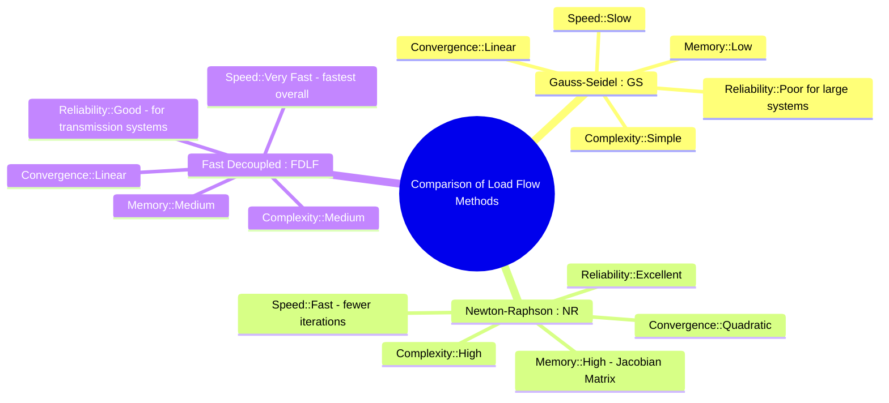

---
tags:
  - power-systems
  - load-flow
  - comparison
  - numerical-methods
created: 2025-10-12
aliases:
  - Load Flow Method Comparison
  - Comparison of Power Flow Methods
subject: "[[Power System]]"
parent: "[[Power Flow Studies (Load Flow Analysis)]]"
modified: 2026-07-23T21:20:42
---
### Comparison of Load Flow Methods
#power-systems/load-flow #comparison

> Choosing the right load flow method involves a trade-off between speed, memory usage, complexity, and reliability. The three primary methods—Gauss-Seidel (GS), Newton-Raphson (NR), and Fast Decoupled Load Flow (FDLF)—each have distinct characteristics that make them suitable for different applications.

---
#### Detailed Comparison Table
#load-flow-methods/comparison-table

| Criterion                  | Gauss-Seidel (GS)                               | Newton-Raphson (NR)                                 | Fast Decoupled Load Flow (FDLF)                                |
| -------------------------- | ----------------------------------------------- | --------------------------------------------------- | -------------------------------------------------------------- |
| **Convergence Rate**       | **Linear**                                      | **Quadratic** (very fast)                           | **Linear**                                                     |
| **Number of Iterations**   | High (increases with system size)               | Low (typically 3-5, independent of system size)     | Medium (more than NR, less than GS)                            |
| **Time per Iteration**     | Very low                                        | High (Jacobian calculation and inversion)           | Very low (uses constant matrices)                              |
| **Overall Speed**          | **Slow**                                        | **Fast**                                            | **Very Fast** (fastest in practice)                            |
| **Memory Requirement**     | **Low** (only needs Y-bus)                      | **High** (requires storage for the Jacobian matrix) | **Medium** (stores constant B' and B'' matrices)               |
| **Programming Complexity** | Simple                                          | Complex                                             | Medium                                                         |
| **Reliability/Robustness** | **Poor**; may fail to converge on stressed systems | **Excellent**; very reliable and robust             | **Good**, but convergence can be poor for low X/R ratio systems |
| **Basis of Method**        | Sequential iterative substitution               | Taylor series expansion (Jacobian matrix)           | Simplified/decoupled Jacobian matrix                           |

---
#### Summary of Each Method

##### Gauss-Seidel (GS)
#gauss-seidel/summary
The GS method is the simplest to understand and implement. Its low memory requirement is an advantage, but its slow, linear convergence and poor performance on large or heavily loaded systems make it impractical for modern power system analysis. It is now primarily used for educational purposes.

##### Newton-Raphson (NR)
#newton-raphson/summary
The NR method is the industry standard for high-accuracy, offline power flow studies. Its key strength is its powerful **quadratic convergence**, which ensures a solution in very few iterations, regardless of system size. This reliability comes at the cost of high computational effort per iteration (forming and inverting the Jacobian) and significant memory usage.

##### Fast Decoupled Load Flow (FDLF)
#fdlf/summary
The FDLF is a brilliant engineering compromise derived from the NR method. By exploiting the physical P-δ and Q-|V| decoupling in transmission systems, it achieves tremendous speed. It avoids recalculating the Jacobian by using two constant matrices (B' and B''). While it takes more iterations than NR, each iteration is drastically faster, making it the quickest method overall for suitable systems. It is the method of choice for applications requiring many repeated load flows, like contingency analysis.

---
#### Application Guide

*   **Gauss-Seidel:** Best for academic exercises and solving problems on very small systems by hand.
*   **Newton-Raphson:** The default choice for accurate, general-purpose, and robust offline analysis of any power system.
*   **Fast Decoupled:** Ideal for real-time analysis, contingency studies, and state estimation in transmission systems where speed is more critical than the highest possible accuracy.

---
#### Final Overview

$$
\begin{array}{|l|c|c|c|}
\hline
\textbf{Attribute} & \textbf{Gauss-Seidel} & \textbf{Newton-Raphson} & \textbf{Fast Decoupled} \\
\hline
\textbf{Speed} & \text{Slow} & \text{Fast} & \textbf{Fastest} \\
\textbf{Accuracy} & \text{Good} & \textbf{Excellent} & \text{Good} \\
\textbf{Reliability} & \text{Poor} & \textbf{Excellent} & \text{Good} \\
\textbf{Memory} & \textbf{Low} & \text{High} & \text{Medium} \\
\hline
\end{array}
$$

---
### Related Concepts
#power-systems/related-concepts

> [[Gauss-Seidel Method for Load Flow]]

[[Newton-Raphson Method for Load Flow]]
[[Fast Decoupled Load Flow (FDLF)]]
[[Power Flow Studies (Load Flow Analysis)]]
[[Power Flow Equations]]