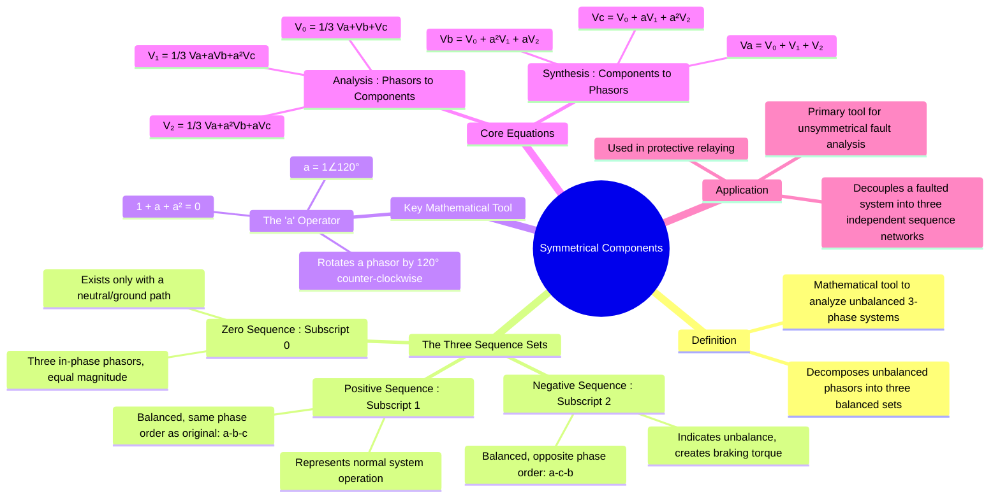

---
tags:
  - power-systems
  - fault-analysis
  - symmetrical-components
  - unbalanced-systems
created: 2025-10-12
aliases:
  - Symmetrical Components
  - Sequence Components
  - Positive Sequence
  - Negative Sequence
  - Zero Sequence
  - Concept of Symmetrical Components (Positive, Negative, Zero Sequence)
subject: "[[Power System]]"
parent:
  - Fault Analysis
formula:
  - "012 to ABC (Reconstruction) : $$\\begin{bmatrix} V_a \\\\ V_b \\\\ V_c \\end{bmatrix} = \\begin{bmatrix} 1 & 1 & 1 \\\\ 1 & a^2 & a \\\\ 1 & a & a^2 \\end{bmatrix} \\begin{bmatrix} V_{a0} \\\\ V_{a1} \\\\ V_{a2} \\end{bmatrix}$$"
  - "ABC to 012 (Decomposition) : $$\\begin{bmatrix} V_{a0} \\\\ V_{a1} \\\\ V_{a2} \\end{bmatrix} = \\frac{1}{3} \\begin{bmatrix} 1 & 1 & 1 \\\\ 1 & a & a^2 \\\\ 1 & a^2 & a \\end{bmatrix} \\begin{bmatrix} V_a \\\\ V_b \\\\ V_c \\end{bmatrix}$$"
  - "'a' Operator : $a = 1 \\angle 120^\\circ = e^{j2\\pi/3} = -0.5 + j0.866$"
modified: 2026-07-23T21:21:23
---
### Concept of Symmetrical Components
#power-systems/fault-analysis #symmetrical-components

> **Symmetrical Components**, a method developed by C.L. Fortescue, is a powerful mathematical technique used to simplify the analysis of unbalanced three-phase power systems. ==The theorem states that any set of unbalanced three-phase phasors (voltages or currents) can be resolved into three balanced sets of phasors, known as the **positive, negative, and zero sequence components**.==

This transformation is invaluable for analyzing [[Unsymmetrical Faults]] (e.g., [[Analysis of Single Line-to-Ground (LG) Fault|single line-to-ground)]], as it allows a complex, coupled three-phase network to be modeled as three independent, decoupled **[[Sequence Impedances and Networks of Transmission Lines|sequence networks]]**.

---
#### The 'a' Operator
#operator-a

The analysis relies on the phasor operator 'a', which represents a rotation of 120°.
$$\boxed{\quad a = 1 \angle 120^\circ = e^{j2\pi/3} = -0.5 + j0.866 \quad}$$
Properties:
* $a^2 = 1 \angle 240^\circ = -0.5 - j0.866$
* $a^3 = 1 \angle 360^\circ = 1$
* $1 + a + a^2 = 0$

> [!memory]
> The operator $\alpha$ and the operator $a$ are **exactly the same thing**.

---
#### Symmetrical Components Transformation Matrix, $[A]$
#symmetrical-components-transformation-matrix #fortescue-transformation-matrix 

The matrix $[A]$ is the transformation matrix used to convert electrical quantities from the sequence domain back into the physical three-phase domain.

$$[A] = \begin{bmatrix} 1 & 1 & 1 \\ 1 & a^2 & a \\ 1 & a & a^2 \end{bmatrix}$$

==The operator $\alpha$ and the operator $a$ are **exactly the same thing**.==

##### Inverse Transformation Matrix $[A]^{-1}$
#inverse-transformation-matrix 

To transform physical phase components into sequence components, the inverse matrix is used:
$$[V_{012}] = [A]^{-1} [V_{abc}]$$

Where:
$$[A]^{-1} = \frac{1}{3} \begin{bmatrix} 1 & 1 & 1 \\ 1 & a & a^2 \\ 1 & a^2 & a \end{bmatrix}$$

---
#### The Three Sequence Components
#sequence-components

##### 1. Positive Sequence Components (Subscript 1)
#positive-sequence-components 

* **Description:** Consists of three phasors of equal magnitude, displaced from each other by 120°, and having the **same phase sequence** as the original system (e.g., a-b-c).
* **Significance:** Represents the balanced component of the power system. In a perfectly balanced, healthy system, only positive sequence components exist.
* **Relations:** $V_{a1}$, $V_{b1} = a^2 V_{a1}$, $V_{c1} = a V_{a1}$.

##### 2. Negative Sequence Components (Subscript 2)
#negative-sequence-components 

* **Description:** Consists of three phasors of equal magnitude, displaced by 120°, but having the **opposite phase sequence** to the original system (e.g., a-c-b).
* **Significance:** ==These components only appear during [[Analysis of Unbalanced Systems (Introduction)#Consequences of Unbalance|unbalanced conditions]]. They produce a magnetic field rotating in the opposite direction to the rotor in synchronous and induction machines, causing [[braking torque]] and overheating.==
> [!info] Rotor Frequency of Negative Sequence Currents
>
> > [!pyq]- PYQ : 2013
> > ![[ee_2013#^q45]]
>
> While positive sequence fields rotate at $+N_s$, negative sequence fields rotate in the opposite direction at $-N_s$. The rotor continues to rotate forward at $N_r = N_s(1-s)$.
> 
> The relative speed between the negative sequence field and the rotor is:
> $$N_{rel} = |-N_s - N_r| = N_s + N_s(1-s) = N_s(2-s)$$
> 
> Therefore, the effective slip for negative sequence components is $(2-s)$, making the frequency of the induced negative sequence rotor current:
> $$f_{r2} = (2-s)f$$
> 
> **Significance:** Because normal operating slip ($s$) is very small, the negative sequence rotor frequency is approximately $2f$ (e.g., ~100 Hz for a 50 Hz supply). This [[Wave Propagation in Good Conductors#Skin Effect and Skin Depth ($ delta$)|high frequency drastically increases rotor impedance due to the skin effect]], which explains the severe overheating mentioned above.
> 
> > [!refer]
> > [[Frequency of Rotor Current and EMF]]
^rotor-frequency-of-negative-sequence-currents

* **Relations:** $V_{a2}$, $V_{b2} = a V_{a2}$, $V_{c2} = a^2 V_{a2}$.

##### 3. Zero Sequence Components (Subscript 0)
#zero-sequence-components 

* **Description:** Consists of three phasors of equal magnitude and **zero phase displacement** (they are in phase with each other).
* **Significance:** ==These components only appear for faults that involve a ground or neutral connection.== The sum of the zero sequence currents ($I_{a0}+I_{b0}+I_{c0} = 3I_{a0}$) flows through the neutral/ground path. In a 3-wire system with no neutral connection, the zero sequence current must be zero.
* **Relations:** $V_{a0} = V_{b0} = V_{c0}$.

---
#### Analysis and Synthesis Equations
#symmetrical-components/equations

##### Analysis (Decomposition)
These equations are used to calculate the sequence components from the unbalanced phase phasors ($V_a, V_b, V_c$).
$$\boxed{
\begin{align}
V_{a0} &= \frac{1}{3}(V_a + V_b + V_c) \\
V_{a1} &= \frac{1}{3}(V_a + aV_b + a^2V_c) \\
V_{a2} &= \frac{1}{3}(V_a + a^2V_b + aV_c)
\end{align}
}$$
In matrix form: $\begin{bmatrix} V_{a0} \\ V_{a1} \\ V_{a2} \end{bmatrix} = \frac{1}{3} \begin{bmatrix} 1 & 1 & 1 \\ 1 & a & a^2 \\ 1 & a^2 & a \end{bmatrix} \begin{bmatrix} V_a \\ V_b \\ V_c \end{bmatrix}$.

##### Synthesis (Reconstruction)
These equations are used to reconstruct the original phase phasors from the sequence components.
$$\boxed{
\begin{align}
V_a &= V_{a0} + V_{a1} + V_{a2} \\
V_b &= V_{a0} + a^2V_{a1} + aV_{a2} \\
V_c &= V_{a0} + aV_{a1} + a^2V_{a2}
\end{align}
}$$
In matrix form: $\begin{bmatrix} V_a \\ V_b \\ V_c \end{bmatrix} = \begin{bmatrix} 1 & 1 & 1 \\ 1 & a^2 & a \\ 1 & a & a^2 \end{bmatrix} \begin{bmatrix} V_{a0} \\ V_{a1} \\ V_{a2} \end{bmatrix}$.

---
### Related Concepts
#power-systems/related-concepts

> [[Fault Analysis]]

[[Sequence Impedances and Networks of Synchronous Machines]]
[[Sequence Impedances and Networks of Transformers]]
[[Sequence Impedances and Networks of Transmission Lines]]
[[Analysis of Single Line-to-Ground (LG) Fault]]
[[Analysis of Line-to-Line (LL) Fault]]
[[Analysis of Double Line-to-Ground (LLG) Fault]]