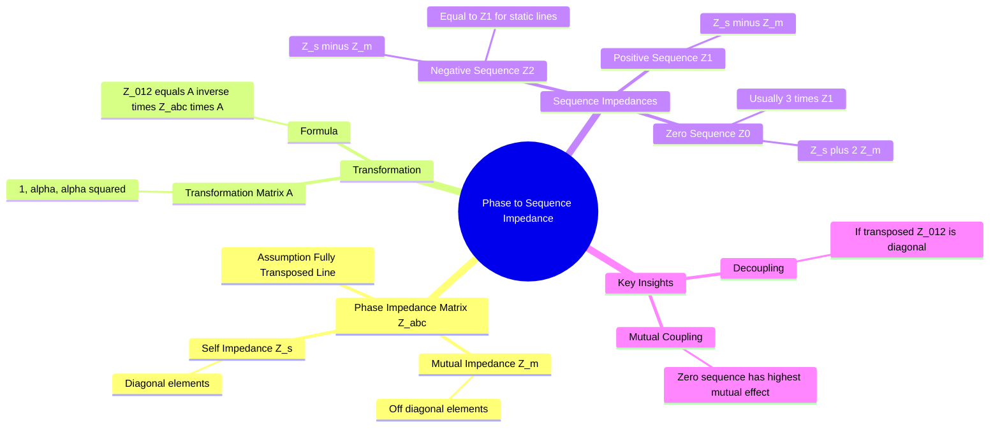

---
tags:
  - power-system
  - transmission
  - fault-analysis
  - symmetrical-components
  - gate
created: 2026-07-23T21:21:29
aliases:
  - Z_abc to Z_012
  - Sequence Impedance of Transmission Line
  - Z1 Z2 Z0 Derivation
subject: "[[Power System]]"
parent: "[[Sequence Impedances and Networks of Transmission Lines]]"
formula:
  - "Phase Impedance Matrix (fully transposed transmission lines) : $$[Z_{abc}] = \\begin{bmatrix} Z_s & Z_m & Z_m \\\\ Z_m & Z_s & Z_m \\\\ Z_m & Z_m & Z_s \\end{bmatrix}$$"
  - "Sequence Impedance Matrix (fully transposed transmission lines) : $$[Z_{012}] = [A]^{-1} [Z_{abc}] [A] = \\begin{bmatrix} Z_0 & 0 & 0 \\\\ 0 & Z_1 & 0 \\\\ 0 & 0 & Z_2 \\end{bmatrix}$$"
modified: 2026-07-23T21:21:29
---
### Phase Impedance Matrix to Sequence Impedances
#power-system/symmetrical-components #transmission

> Transmission lines are physically coupled. A current in phase A induces a voltage in phase B. This coupling is represented by the **Phase Impedance Matrix ($Z_{abc}$)**. To perform fault analysis, we transform this coupled matrix into the **Sequence Impedance Matrix ($Z_{012}$)**, which is ideally diagonal (decoupled) for a fully transposed line.

###### Mind Map

---

#### The Phase Impedance Matrix ($Z_{abc}$)
#transmission/impedance

For a 3-phase transmission line, the voltage drop equation is $[V_{abc}] = [Z_{abc}] [I_{abc}]$.
Assuming the line is **Fully Transposed**:
1.  **Self Impedance ($Z_s$):** The impedance of each conductor is identical ($Z_{aa} = Z_{bb} = Z_{cc} = Z_s$).
2.  **Mutual Impedance ($Z_m$):** The mutual coupling between any pair of phases is identical ($Z_{ab} = Z_{bc} = Z_{ca} = Z_m$).

The matrix form is:

$$[Z_{abc}] = \begin{bmatrix} Z_s & Z_m & Z_m \\ Z_m & Z_s & Z_m \\ Z_m & Z_m & Z_s \end{bmatrix}$$
^phase-impedance-matrix

---
#### The Transformation to Sequence Domain
#symmetrical-components/transformation

We relate phase quantities to sequence quantities using the transformation matrix $A$:
*   $[V_{abc}] = [A] [V_{012}]$
*   $[I_{abc}] = [A] [I_{012}]$

Where $A = \begin{bmatrix} 1 & 1 & 1 \\ 1 & \alpha^2 & \alpha \\ 1 & \alpha & \alpha^2 \end{bmatrix}$ and $\alpha = 1 \angle 120^\circ$.

> [!prerequisite]
> [[Concept of Symmetrical Components#The 'a' Operator|The 'a' Operator]] ($a$ or $\alpha$)
> [[Concept of Symmetrical Components#Symmetrical Components Transformation Matrix, $[A]$|Symmetrical Components Transformation Matrix]] ($[A]$)

Substituting into the voltage equation:
$$[A][V_{012}] = [Z_{abc}] [A][I_{012}]$$
$$[V_{012}] = \underbrace{[A]^{-1} [Z_{abc}] [A]}_{[Z_{012}]} [I_{012}]$$

The Sequence Impedance Matrix is defined as:

$$\boxed{\quad [Z_{012}] = [A]^{-1} [Z_{abc}] [A] \quad}$$
^sequence-impedance-matrix

---
#### Derivation of Sequence Impedances
#derivation 

Performing the matrix multiplication for a transposed line yields a **Diagonal Matrix** (meaning the sequences are decoupled; current in positive sequence does not induce voltage in zero sequence).

$$[Z_{012}] = \begin{bmatrix} Z_0 & 0 & 0 \\ 0 & Z_1 & 0 \\ 0 & 0 & Z_2 \end{bmatrix}$$
^sequence-impedance-matrix2

The individual elements are calculated as:

**A. Positive Sequence Impedance ($Z_1$):**
$$Z_1 = Z_s + (\alpha^2 + \alpha) Z_m = Z_s - Z_m$$

$$\boxed{\quad Z_1 = Z_s - Z_m \quad}$$
^positive-sequence-impedance

**B. Negative Sequence Impedance ($Z_2$):**
For static components like transmission lines, the impedance does not depend on phase sequence (A-B-C vs A-C-B).

$$\boxed{\quad Z_2 = Z_1 = Z_s - Z_m \quad}$$
^negative-sequence-impedance

**C. Zero Sequence Impedance ($Z_0$):**
$$Z_0 = Z_s + (1 + 1) Z_m = Z_s + 2Z_m$$

$$\boxed{\quad Z_0 = Z_s + 2Z_m \quad}$$
^zero-sequence-impedance

> [!memory] Note
> ==The derivation $Z_1 = Z_s - Z_m$ and $Z_0 = Z_s + 2Z_m$ is **specific to fully transposed transmission lines**.==  
> Synchronous machines and transformers do **not** admit a similar phase-impedance-matrix derivation; their sequence impedances are defined by physical behavior and connections.

---
#### Physical Interpretation and Relations
#transmission/properties

1.  **Relation between $Z_1$ and $Z_0$:**
    Substituting $Z_s = Z_1 + Z_m$ into the $Z_0$ equation:
    $$Z_0 = (Z_1 + Z_m) + 2Z_m$$

$$\boxed{\quad Z_0 = Z_1 + 3Z_m \implies Z_0 \gg Z_1 \quad}$$
^relation-between-z1-z2

* Since $Z_m$ (mutual impedance) is positive, **$Z_0$ is always greater than $Z_1$**.
* Typically, for overhead lines: $Z_0 \approx 2.5 \text{ to } 3 \times Z_1$.

> [!pyq]-
> ![[ee_2018#^q20]]

2.  **Effect of Ground:**
    Zero sequence currents ($I_a + I_b + I_c = 3I_0$) return through the ground and/or ground wires. The self-impedance $Z_s$ effectively increases due to the earth resistance, and $Z_m$ is high. This confirms why $Z_0$ is large.

3.  **Untransposed Lines:**
    If the line is *not* transposed, $Z_{abc}$ is not symmetric in the way defined above. The resulting $[Z_{012}]$ will **not be diagonal**. It will contain off-diagonal terms (e.g., $Z_{10}, Z_{21}$), meaning positive sequence current *will* induce negative and zero sequence voltages. This makes analysis complex (requires full matrix methods).

---
### Related Concepts
#topic/related-concepts

> [[Concept of Symmetrical Components|Concept of Symmetrical Components (Positive, Negative, Zero Sequence)]]

[[Sequence Impedances and Networks of Transmission Lines]]
[[Inductance of Single-phase and Three-phase Lines]] (Calculations for $Z_s$ and $Z_m$)
[[Analysis of Unsymmetrical Faults]]
[[Parallel Sources in Fault Analysis]]