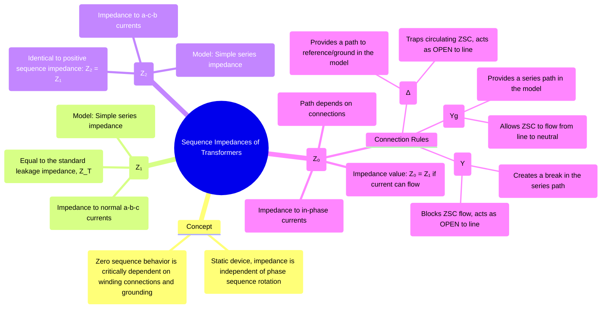

---
tags:
  - power-systems
  - fault-analysis
  - symmetrical-components
  - transformers
  - sequence-networks
created: 2025-10-12
aliases:
  - Sequence Networks of Transformers
  - Transformer Sequence Impedances
subject: "[[Power System]]"
parent:
  - Fault Analysis
modified: 2026-07-23T21:21:57
---
### Sequence Impedances and Networks of Transformers
#power-systems/fault-analysis #transformers #sequence-networks

> A transformer is a static, linear device. Unlike a synchronous machine, its impedance does not depend on the direction of phase rotation. Therefore, its positive and negative sequence impedances are identical. However, the transformer's behavior to zero sequence currents depends critically on its winding connections (Star or Delta) and neutral grounding. This makes the zero sequence network model the most complex aspect of transformer fault analysis.

> [!tip] The Zero-Sequence Switch Rule (GATE Shortcut)
> Think of the transformer zero-sequence model as a line with two series switches (for the lines) and two shunt switches (to ground).
> * **Star Grounded (Yg):** Closes the **Series** switch. (Current can pass through to the line).
> * **Delta ($\Delta$):** Closes the **Shunt** switch to ground. (Current circulates inside, bypassing the line).
> * **Star Ungrounded (Y):** Leaves all switches **Open**. (Blocks everything).
> 
> *Example: A $Yg - \Delta$ transformer will have the primary series switch closed, and the secondary shunt switch closed, perfectly routing zero-sequence current from the primary line directly to ground.*

---
#### 1. Positive Sequence Network
#positive-sequence-network

This network represents the transformer under normal, balanced operating conditions.
*   **Impedance ($Z_1$):** The positive sequence impedance is simply the transformer's equivalent leakage impedance ($Z_T$), as found from [[Transformer Tests#Short Circuit (SC) Test|short-circuit tests]].
    $$\boxed{\quad Z_1 = Z_T = R_{eq} + jX_{eq} \quad}$$
*   **Network Model:** The model is a simple series impedance connecting the primary and secondary sides of the network. For Y-Δ transformers, a phase shift is introduced, but this is often ignored in basic fault current magnitude calculations.

---
#### 2. Negative Sequence Network
#negative-sequence-network

This network represents the transformer's response to negative sequence currents.
*   **Impedance ($Z_2$):** Since the transformer's impedance is independent of phase sequence, the negative sequence impedance is identical to the positive sequence impedance.
    $$\boxed{\quad Z_2 = Z_1 = Z_T \quad}$$
*   **Network Model:** The negative sequence network is identical in structure to the positive sequence network (a simple series impedance).

---
#### 3. Zero Sequence Network
#zero-sequence-network

The zero sequence model is determined by the path available for the three in-phase zero sequence currents ($I_{a0}, I_{b0}, I_{c0}$). The value of the impedance, $Z_0$, is the same as $Z_1$ *if* a path for current flow exists. The topology of the network is governed by two rules:

**Rule 1: Path to Neutral/Ground**
*   **Grounded Star (Yg):** Provides a path for zero sequence currents to flow from the line terminals to the neutral. This is modeled as a series connection to the rest of the network. The neutral grounding impedance ($Z_n$) is modeled as $3Z_n$ in series.
*   **Ungrounded Star (Y):** No path exists for currents to flow to ground. This is modeled as an **open circuit** at that terminal.

**Rule 2: Path in Delta Winding (Δ)**
*   Zero sequence currents can circulate **inside the closed loop** of a delta winding. This provides a low impedance path.
*   However, these circulating currents are trapped and **cannot flow out** into the connected transmission line.
*   Therefore, a delta winding **blocks the flow** of zero sequence current from one side of the transformer to the other (acting as an open circuit in series), but it simultaneously provides a **path to the reference/ground** in the equivalent circuit.

---
#### Zero Sequence Equivalent Circuits for Common Connections
#transformer-zero-sequence-models

The following diagrams show how the primary (P) and secondary (S) sides are connected in the zero sequence network for various transformer configurations. The transformer's own impedance is $Z_0$.

| Winding Connection | Zero Sequence Network Model                                                                                               | Description                                                                                                                              |
| :----------------: | :-----------------------------------------------------------------------------------------------------------------------: | ---------------------------------------------------------------------------------------------------------------------------------------- |
|      **Yg-Yg**       | The primary and secondary circuits are connected in series through the transformer impedance $Z_0$.                           | A continuous path for zero sequence current exists through both windings.                                                                |
|       **Yg-Δ**       | The primary side is connected to the network through $Z_0$ and then to the reference bus. The secondary side is left open.    | Current flows into the primary neutral. The delta traps the induced current, preventing it from flowing into the secondary line.         |
|        **Δ-Δ**       | Both primary and secondary sides are open circuits, but connected to the reference bus through their respective windings. | Zero sequence current cannot enter or leave the transformer bank.                                                                        |
|        **Y-Δ**       | An open circuit exists on both the primary and secondary sides.                                                         | The ungrounded Y on the primary blocks current flow.                                                                                    |
|      **Yg-Y**        | An open circuit exists between the primary and secondary sides.                                                          | The ungrounded Y on the secondary blocks current flow, so no current can flow even if the primary neutral is grounded.                 |

---
### Related Concepts
#power-systems/related-concepts

> [[Fault Analysis]]

[[Concept of Symmetrical Components]]
[[Sequence Impedances and Networks of Synchronous Machines]]
[[Sequence Impedances and Networks of Transmission Lines]]
[[Analysis of Single Line-to-Ground (LG) Fault]]
[[Per-Unit System]]
