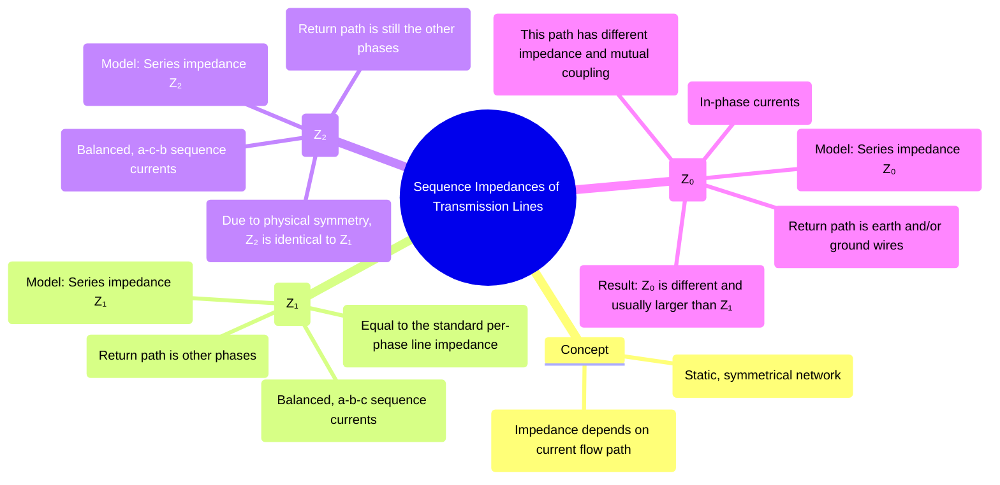

---
tags:
  - power-systems
  - fault-analysis
  - symmetrical-components
  - transmission-lines
  - sequence-networks
created: 2025-10-12
aliases:
  - Sequence Networks of Transmission Lines
  - Transmission Line Sequence Impedances
subject: "[[Power System]]"
parent:
  - Fault Analysis
modified: 2026-07-23T21:22:19
---
### Sequence Impedances and Networks of Transmission Lines
#power-systems/fault-analysis #transmission-lines #sequence-networks

> A transmission line is a static and (usually) perfectly symmetrical network, especially when transposed. This symmetry means its impedance characteristics for positive and negative sequence currents are identical. The significant difference arises in the zero sequence network, where the return path for the current is fundamentally different from the balanced case.

---
**Sequence Impedances Matrix**
#sequence-impedances-matrix 

![[Phase Impedance Matrix to Sequence Impedances (Transmission Line)#^phase-impedance-matrix]]
![[Phase Impedance Matrix to Sequence Impedances (Transmission Line)#^sequence-impedance-matrix]]
![[Phase Impedance Matrix to Sequence Impedances (Transmission Line)#^sequence-impedance-matrix2]]

---
#### 1. Positive Sequence Network
#positive-sequence-network

==This network represents the transmission line under normal, balanced, three-phase operation.==

* **Impedance ($Z_1$):** The positive sequence impedance is simply the normal per-phase series impedance of the line. For fault calculations, the shunt capacitance of the line is usually neglected as its impedance is very high and it has little effect on fault current magnitudes.
    $$\boxed{\quad Z_1 = R_{line} + jX_L \quad}$$
* **Network Model:** The model is a simple series impedance $Z_1$ connecting the two buses at the ends of the line.

> [!pyq]-
> *(this question is based more on [[Per-Unit System#Change of Base Formula|per-unit system]])*
> 
> ---
> ![[ee_2011#^q52-53]]
> ![[ee_2011#^q52]]

---
#### 2. Negative Sequence Network
#negative-sequence-network

This network represents the line's response to negative sequence currents.

*   **Impedance ($Z_2$):** Since a transmission line is a static, non-rotating, and physically symmetric circuit, its impedance is independent of the phase sequence of the currents flowing through it. Therefore, the impedance offered to negative sequence currents is exactly the same as that for positive sequence currents.
    $$\boxed{\quad Z_2 = Z_1 \quad}$$
*   **Network Model:** The negative sequence network is identical in structure and value to the positive sequence network, consisting of a series impedance $Z_2$.

---
#### 3. Zero Sequence Network
#zero-sequence-network

This network's characteristics are fundamentally different from the other two.

* **Zero Sequence ($Z_0$):** These are in-phase currents ($I_{a0} = I_{b0} = I_{c0}$). They cannot sum to zero, so they **must** return through the earth or overhead ground wires. 
    * Because they share this common return path, the mutual coupling is entirely different.
    * As derived in [[Phase Impedance Matrix to Sequence Impedances (Transmission Line)#Physical Interpretation and Relations]], this makes $Z_0$ significantly larger than $Z_1$. 

![[Phase Impedance Matrix to Sequence Impedances (Transmission Line)#^relation-between-z1-z2]]

> [!pyq]-
> ![[ee_2018#^q20]]

> [!derivation]- Derivation: Sequence Impedance Matrix Decoupling
> For a fully transposed transmission line, the **Phase Impedance Matrix** is symmetrically coupled:
> ![[Phase Impedance Matrix to Sequence Impedances (Transmission Line)#^phase-impedance-matrix]]
> 
> Applying the Fortescue similarity transformation $[Z_{012}] = [A]^{-1}[Z_{abc}][A]$ completely decouples the system into a diagonal matrix:
> $$[Z_{012}] = \begin{bmatrix} Z_s + 2Z_m & 0 & 0 \\ 0 & Z_s - Z_m & 0 \\ 0 & 0 & Z_s - Z_m \end{bmatrix} = \begin{bmatrix} Z_0 & 0 & 0 \\ 0 & Z_1 & 0 \\ 0 & 0 & Z_2 \end{bmatrix} \text{}$$
> 
> **Key Linkages:**
> - Positive Sequence: ![[Phase Impedance Matrix to Sequence Impedances (Transmission Line)#^positive-sequence-impedance]]
> - Zero Sequence: ![[Phase Impedance Matrix to Sequence Impedances (Transmission Line)#^negative-sequence-impedance]]
> 
> > [!related]- Reference
> > ![[Phase Impedance Matrix to Sequence Impedances (Transmission Line)#Derivation of Sequence Impedances]]

* **Network Model:** The structure of the network is still a simple series impedance, but its value is the calculated zero sequence impedance, $Z_0$.

> [!mistake]- Return Path of Sequence Currents (Physical Meaning)
> For **positive- and negative-sequence currents**, the three phase currents are 120° apart and satisfy  
> $$I_{a1}+I_{b1}+I_{c1}=0,\qquad I_{a2}+I_{b2}+I_{c2}=0$$
> Hence, the **instantaneous sum of phase currents is zero**. By KCL, no external return path (neutral or earth) is required; the **three phase conductors themselves form a closed circuit**. This physical fact is commonly described by saying that the current in one phase *returns through the other two phases*.
>
> For **zero-sequence currents**, the three phase currents are equal in magnitude and in phase:  
> $$I_{a0}=I_{b0}=I_{c0}$$
> so that  
> $$I_a+I_b+I_c=3I_{a0}\neq 0$$
> Therefore, zero-sequence currents **cannot return through the phase conductors** and can flow only if a **common external return path** exists, such as the neutral, earth, or overhead ground (shield) wires.

---
### Related Concepts
#power-systems/related-concepts

> [[Fault Analysis]]

[[Phase Impedance Matrix to Sequence Impedances (Transmission Line)]]
[[Concept of Symmetrical Components]]
[[Sequence Impedances and Networks of Synchronous Machines]]
[[Sequence Impedances and Networks of Transformers]]
[[Analysis of Single Line-to-Ground (LG) Fault]]
[[Per-Unit System]]
