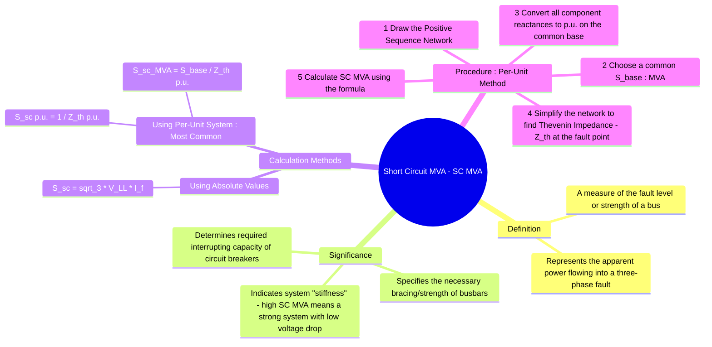

---
tags:
  - power-systems
  - fault-analysis
  - short-circuit-MVA
  - fault-level
  - equipment-rating
created: 2025-10-12
aliases:
  - Fault Level MVA
  - Symmetrical Fault Level
  - "Example : Short Circuit MVA"
subject: "[[Power System]]"
parent:
  - Fault Analysis
formula:
  - "Short Circuit MVA (using absolute values) : $$S_{sc} \\text{ (MVA)} = \\frac{\\sqrt{3} \\times V_{LL} \\text{ (kV)} \\times I_f \\text{ (kA)}}{1000}$$"
  - "Short Circuit MVA (using per unit values) : $$S_{sc (MVA)} = \\frac{S_{base}}{Z_{th(pu)}}$$"
modified: 2026-07-23T21:22:39
---
### Short Circuit MVA
#power-systems/fault-analysis #short-circuit-mva #fault-level

> <u>The **Short Circuit MVA (SC MVA)**, also known as the **fault level**, is a key metric in power system analysis that quantifies the severity of a symmetrical three-phase fault at a specific point in the network.</u> ==It represents the amount of [[AC Power Analysis#Apparent Power, S|apparent power]] that would flow into a bolted three-phase short circuit.== A higher SC MVA indicates a "stronger" or "stiffer" system with lower impedance.

---

#### Significance of Short Circuit MVA
#short-circuit-mva/significance

Calculating the fault level is a critical step in power system design and protection for several reasons:

1.  **Circuit Breaker Rating:** The primary purpose is to determine the required **interrupting capacity** of circuit breakers. A breaker must be able to safely interrupt the maximum fault current, and its rating is specified in MVA or kA.
2.  **Equipment Bracing:** Busbars, insulators, and other substation equipment must be mechanically braced to withstand the immense electromagnetic forces generated during a short circuit. The SC MVA determines these force levels.
3.  **Protective Relaying:** Relay settings are coordinated based on the magnitude of expected fault currents to ensure selective and rapid fault clearing.
4.  **System Strength Indicator:** A bus with a high fault level experiences less voltage dip during disturbances, such as the starting of large motors.

---
#### Calculation Using Absolute Values
#short-circuit-mva/formula

If the pre-fault line-to-line voltage ($V_{LL}$) and the symmetrical three-phase fault current ($I_f$) are known, the SC MVA can be calculated directly.

$$\boxed{\quad S_{sc} \text{ (MVA)} = \frac{\sqrt{3} \times V_{LL} \text{ (kV)} \times I_f \text{ (kA)}}{1000} \quad}$$
While straightforward, this method is cumbersome in large networks with multiple voltage levels.

---
#### Calculation Using the Per-Unit System
#short-circuit-mva/per-unit-method

The per-unit (p.u.) method is the standard and most efficient way to calculate fault levels in a complex network. The process relies on finding the Thevenin equivalent impedance of the system at the point of fault.

The SC MVA is inversely proportional to the per-unit Thevenin impedance ($Z_{th(pu)}$) seen from the fault location.

$$\boxed{\quad S_{sc (pu)} = \frac{1}{Z_{th(pu)}} \quad}$$
To convert this per-unit value back to MVA, it is multiplied by the chosen base MVA ($S_{base}$).

$$\boxed{\quad S_{sc (MVA)} = S_{sc (pu)} \times S_{base} = \frac{S_{base}}{Z_{th(pu)}} \quad}$$

> [!pyq]- PYQ : 2019, 2011
> ![[ee_2019#^q22]]
> 
> ---
> ![[ee_2011#^q52-53]]
> ![[ee_2011#^q52]]

---
##### Step-by-Step Procedure
#short-circuit-mva/step-by-step 

1.  **Draw the Per-Phase Diagram:** Create a single-line diagram showing all generators, transformers, and lines, representing them by their positive sequence reactances.
2.  **Choose a Base MVA:** Select a convenient system-wide MVA base, such as 100 MVA or the rating of the largest component.
3.  **Convert Reactances to Per-Unit:** Convert the reactance of every component to a per-unit value based on the common $S_{base}$. The formula for conversion is:
    $$ X_{pu, new} = X_{pu, old} \times \left( \frac{S_{base, new}}{S_{base, old}} \right) \times \left( \frac{V_{base, old}}{V_{base, new}} \right)^2 $$
4.  **Find Thevenin Impedance ($Z_{th}$):** Simplify the reactance diagram to find the single equivalent impedance looking into the network from the fault point. All voltage sources are treated as short circuits.
5.  **Calculate SC MVA:** Apply the per-unit formula $S_{sc} = S_{base} / Z_{th(pu)}$.

---
#### Example
#short-circuit-mva/example

A generator (20 MVA, $X''=0.15$ p.u.) is connected to a bus through a transformer (25 MVA, $X=0.10$ p.u.). Find the fault level (SC MVA) on the high side of the transformer. Use a 100 MVA base.

1.  **Base MVA:** $S_{base} = 100$ MVA.

2.  **Convert Reactances:**
    *   Generator: $X_{G, new} = 0.15 \times \left( \frac{100}{20} \right) = 0.75$ p.u.
    *   Transformer: $X_{T, new} = 0.10 \times \left( \frac{100}{25} \right) = 0.40$ p.u.

3.  **Find Thevenin Impedance:** The components are in series from the fault point.
    $$ Z_{th(pu)} = X_{G, new} + X_{T, new} = 0.75 + 0.40 = 1.15 \text{ p.u.} $$

4.  **Calculate SC MVA:**
    $$ S_{sc (MVA)} = \frac{S_{base}}{Z_{th(pu)}} = \frac{100}{1.15} \approx 86.96 \text{ MVA} $$

---
### Related Concepts
#power-systems/related-concepts

> [[Analysis of Symmetrical Faults]]

[[Current Limiting Reactors]]
[[Per-Unit System]]
[[Sequence Impedances and Networks of Synchronous Machines]]
[[Sub-transient Reactance]] & [[Transient Reactance]]
