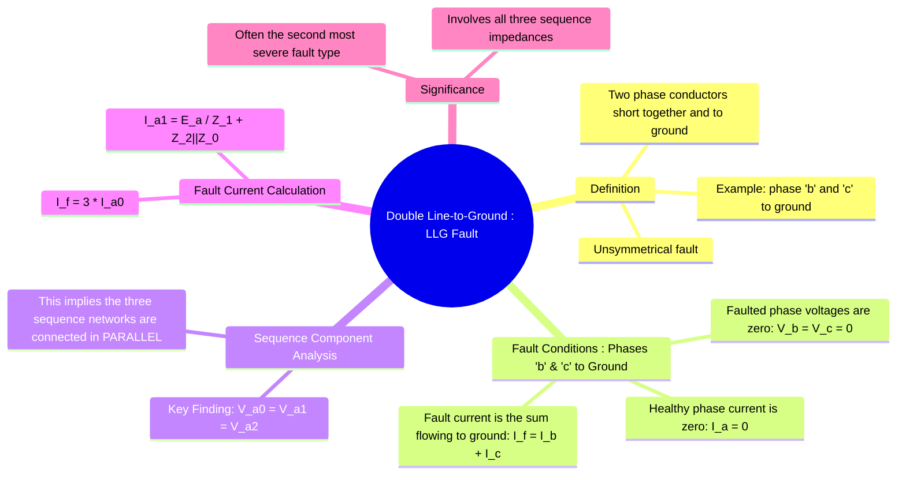

---
tags:
  - power-systems
  - fault-analysis
  - unsymmetrical-faults
  - llg-fault
  - symmetrical-components
created: 2025-10-12
aliases:
  - LLG Fault
  - Double Line-to-Ground Fault
subject: "[[Power System]]"
parent:
  - Fault Analysis
formula:
  - 'Boundary Conditions (solid LLG Fault involving phase "b" & "c") : $$V_b = 0$$ and $$V_c = 0$$ | $$I_a=0$$ | $$I_f=I_b+I_c$$'
  - 'Sequence Voltage (solid LLG Fault involving phase "b" & "c") : $$V_{a0} = V_{a1} = V_{a2}$$'
  - 'Positive Sequence Current (solid LLG Fault involving phase "b" & "c") : $$I_{a1} = \frac{E_a}{Z_1 + \frac{Z_2 Z_0}{Z_2 + Z_0}}$$'
  - 'Fault Current (solid LLG Fault involving phase "b" & "c") : $$I_f = -3I_{a1} \left( \frac{Z_2}{Z_2 + Z_0} \right)$$'
  - 'Fault Current (LLG Fault involving phase "b" & "c") with fault impedance : $$I_f = -3I_{a1} \left( \frac{Z_2}{Z_2 + Z_0 + 3Z_f}\right)$$'
trends:
  - "[[trends - Fault Analysis]]"
modified: 2026-07-23T21:22:59
---
### Analysis of Double Line-to-Ground (LLG) Fault
#power-systems/fault-analysis #unsymmetrical-faults #llg-fault

> The **Double Line-to-Ground (LLG) fault** is an unsymmetrical fault where two phase conductors are short-circuited together and simultaneously connected to ground. It is less common than an LG fault but is generally more severe. Its analysis is a classic application of [[Concept of Symmetrical Components|symmetrical components]], demonstrating the interconnection of all three sequence networks.

---

#### Fault Conditions at the Fault Point
#llg-fault/boundary-conditions

Consider a solid (fault impedance $Z_f = 0$) LLG fault involving phases 'b' and 'c' at a point F. The boundary conditions in the phase domain are:

1.  The current in the healthy phase 'a' is zero: $I_a = 0$.
2.  The voltages of the two faulted phases are zero, as they are connected to ground: $V_b = 0$ and $V_c = 0$.
3.  The total fault current ($I_f$) is the sum of the currents from the faulted phases flowing to ground: $I_f = I_b + I_c$.

---
#### Sequence Component Analysis
#symmetrical-components/analysis

We convert the phase-domain boundary conditions into the sequence domain using the voltage synthesis equations:
$$\begin{align}
V_b &= V_{a0} + a^2V_{a1} + aV_{a2} = 0 \\
V_c &= V_{a0} + aV_{a1} + a^2V_{a2} = 0
\end{align}$$
Solving these two simultaneous equations (by adding them, and then by subtracting them) yields the key result for an LLG fault:
$$\boxed{\quad V_{a0} = V_{a1} = V_{a2} \quad}$$
This equality of the sequence voltages at the fault point dictates that the three sequence networks must be connected in **parallel**.

---
#### Interconnection of Sequence Networks
#sequence-networks/connection

The condition $V_{a0} = V_{a1} = V_{a2}$ is satisfied by connecting the positive, negative, and zero sequence Thevenin equivalent networks in parallel. The pre-fault voltage source $E_a$ (in the positive sequence network) drives a current $I_{a1}$ that splits between the three parallel branches.

The total impedance seen by the voltage source is the series impedance of the positive sequence network ($Z_1$) plus the parallel combination of the negative and zero sequence networks.
$$ Z_{total} = Z_1 + (Z_2 \parallel Z_0) = Z_1 + \frac{Z_2 Z_0}{Z_2 + Z_0} $$
The positive sequence current is therefore:
$$\boxed{\quad I_{a1} = \frac{E_a}{Z_1 + \frac{Z_2 Z_0}{Z_2 + Z_0}} \quad}$$

---
#### Fault Current Calculation
#fault-current-calculation

The total fault current flowing to ground is $I_f = I_b + I_c$. From the definition of zero sequence current, $I_{a0} = \frac{1}{3}(I_a + I_b + I_c)$. Since $I_a = 0$, this simplifies to:
$$ I_f = 3I_{a0} $$
To find $I_{a0}$, we use the current divider rule on the parallel network connection. The total current entering the parallel branches is $I_{a1}$.
$$ I_{a0} = -I_{a1} \left( \frac{Z_2}{Z_2 + Z_0} \right) $$
(The negative sign appears because $I_{a1} + I_{a2} + I_{a0} = 0$, so $I_{a2}+I_{a0} = -I_{a1}$).

Substituting this into the fault current equation gives:
$$\boxed{\quad I_f = -3I_{a1} \left( \frac{Z_2}{Z_2 + Z_0} \right) \quad}$$
This gives the total fault current flowing to ground.

> [!tip] The $3Z_f$ Rule for Ground Faults
> Why does $Z_f$ become $3Z_f$ in the sequence network?
> 
> The fault impedance $Z_f$ is located in the physical ground path. The total current flowing through it is $I_f = 3I_{a0}$. Therefore, the voltage drop across the fault is $V_f = (3I_{a0})Z_f$. 
> 
> When mapping this to the zero-sequence network (which only sees $I_{a0}$), we must represent this drop as $I_{a0}(3Z_f)$. 
> * **Rule:** Any physical impedance in the neutral or ground path is **multiplied by 3** when moved into the zero-sequence network.

---
### Related Concepts
#power-systems/related-concepts

> [[Fault Analysis]]

[[Concept of Symmetrical Components]]
[[Analysis of Single Line-to-Ground (LG) Fault]]
[[Analysis of Line-to-Line (LL) Fault]]
[[Neutral Grounding]]
[[Sequence Impedances and Networks of Transformers]]
[[Parallel Sources in Fault Analysis]]