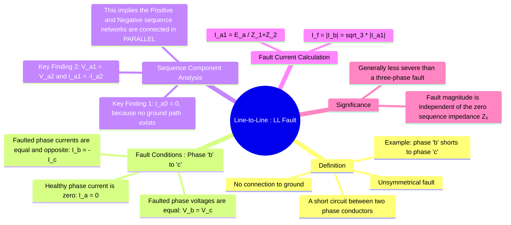

---
tags:
  - power-systems
  - fault-analysis
  - unsymmetrical-faults
  - ll-fault
  - symmetrical-components
created: 2025-10-12
aliases:
  - LL Fault
  - Line-to-Line Fault
subject: "[[Power System]]"
parent:
  - Fault Analysis
formula:
  - 'Boundary Conditions (solid LL Fault between phase "b" & "c") : $$V_b=V_c$$ | $$I_b = - I_c$$ | $$I_a=0$$ | $$I_f = |I_b|$$ or $$I_f = |I_c|$$'
  - 'Sequence Current (solid LL Fault between phase "b" & "c") : $$I_{a0}=0$$ and $$I_{a1} = -I_{a2}$$'
  - 'Sequence Voltage (solid LL Fault between phase "b" & "c") : $$V_{a1} = V_{a2}$$'
  - 'Positive Sequence Current (solid LL Fault between phase "b" & "c") : $$I_{a1} = \frac{E_a}{Z_1 + Z_2}$$'
  - ' Fault Current (solid LL Fault between phase "b" & "c") : $$I_f = |I_b| = \sqrt{3}|I_{a1}| = \frac{\sqrt{3}|E_a|}{|Z_1 + Z_2|}$$'
  - ' Fault Current (LL Fault between phase "b" & "c" with fault impedance) : $$I_f = |I_b| = \sqrt{3}|I_{a1}| = \frac{\sqrt{3}|E_a|}{|Z_1 + Z_2 + Z_f|}$$'
  - 'Positive Sequence Current (LL Fault between phase "b" & "c" with fault impedance) : $$I_{a1} = \frac{E_a}{Z_1 + Z_2 + Z_f}$$'
trends:
  - "[[trends - Fault Analysis]]"
modified: 2026-07-23T21:23:15
---
### Analysis of Line-to-Line (LL) Fault
#power-systems/fault-analysis #unsymmetrical-faults #ll-fault

> The **Line-to-Line (LL) fault** is an unsymmetrical fault caused by a short circuit between two phase conductors, clear of ground. It is the second most common type of fault after the LG fault. As the system becomes unbalanced, [[Concept of Symmetrical Components|symmetrical components]] must be used for its analysis.

---

#### Fault Conditions at the Fault Point
#ll-fault/boundary-conditions

Let's assume a fault occurs between phase 'b' and phase 'c' at a point F, with a fault impedance of $Z_f=0$. The boundary conditions are:

1.  The current in the healthy phase 'a' is zero: $I_a = 0$.
2.  The currents flowing into the fault from phases 'b' and 'c' are equal and opposite (Kirchhoff's Current Law): $I_b + I_c = 0$, which means $I_b = -I_c$.
3.  The voltages of the two faulted phases are equal: $V_b = V_c$.
4.  The fault current $I_f$ is taken as the magnitude of the current in either faulted phase, e.g., $I_f = |I_b|$.

---
#### Sequence Component Analysis
#symmetrical-components/analysis

The phase-domain boundary conditions are converted into the sequence domain.

1.  **Sequence Currents:**
    *   Zero Sequence: $I_{a0} = \frac{1}{3}(I_a + I_b + I_c) = \frac{1}{3}(0 + I_b - I_b) = 0$. This is expected, as there is no path to ground for zero sequence currents.
    *   Positive Sequence: $I_{a1} = \frac{1}{3}(I_a + aI_b + a^2I_c) = \frac{1}{3}(0 + aI_b - a^2I_b) = \frac{I_b}{3}(a - a^2)$.
    *   Negative Sequence: $I_{a2} = \frac{1}{3}(I_a + a^2I_b + aI_c) = \frac{1}{3}(0 + a^2I_b - aI_b) = \frac{I_b}{3}(a^2 - a)$.
    *   Comparing the expressions for $I_{a1}$ and $I_{a2}$, we find a key relationship:
        $$\boxed{\quad I_{a1} = -I_{a2} \quad}$$

2.  **Sequence Voltages:**
    *   Using the condition $V_b = V_c$:
        $$V_{a0} + a^2V_{a1} + aV_{a2} = V_{a0} + aV_{a1} + a^2V_{a2}$$
        $$(a^2 - a)V_{a1} = (a^2 - a)V_{a2}$$
    *   This simplifies to another key relationship:
        $$\boxed{\quad V_{a1} = V_{a2} \quad}$$

---
#### Interconnection of Sequence Networks
#sequence-networks/connection

The derived sequence component conditions dictate how the sequence networks are interconnected:
*   $I_{a0} = 0$: The **zero sequence network is an open circuit** and does not participate.
*   $V_{a1} = V_{a2}$ and $I_{a1} = -I_{a2}$: These are the exact conditions for connecting the **positive and negative sequence networks in parallel**.

The voltage source $E_a$ in the positive sequence network drives a current $I_{a1}$ which splits, with $-I_{a2}$ flowing through the negative sequence network.

![[LL Fault Interconnection of Sequence Networks.png]]

From the parallel circuit, we can write the voltage equation:
$$ E_a - I_{a1}Z_1 = V_{a1} = V_{a2} = -I_{a2}Z_2 = I_{a1}Z_2 $$
$$ E_a = I_{a1}Z_1 + I_{a1}Z_2 $$
Solving for the positive sequence current $I_{a1}$:
$$\boxed{\quad I_{a1} = \frac{E_a}{Z_1 + Z_2} \quad}$$

---
#### Fault Current Calculation
#fault-current-calculation

The fault current is the magnitude of $I_b$. We use the synthesis equation for $I_b$:
$$ I_b = I_{a0} + a^2I_{a1} + aI_{a2} $$
Substituting $I_{a0} = 0$ and $I_{a2} = -I_{a1}$:
$$ I_b = a^2I_{a1} - aI_{a1} = I_{a1}(a^2 - a) $$
Since $a^2 - a = -j\sqrt{3}$, the fault current is:
$$ I_f = I_b = -j\sqrt{3} \times I_{a1} $$
The magnitude of the fault current is therefore:
$$\boxed{\quad I_f = |I_b| = \sqrt{3}|I_{a1}| = \frac{\sqrt{3}|E_a|}{|Z_1 + Z_2|} \quad}$$
*   **Effect of Fault Impedance ($Z_f$):** If the fault has an impedance $Z_f$, it appears in series with the parallel combination of the networks. The denominator of the $I_{a1}$ expression becomes $Z_1 + Z_2 + Z_f$.

> [!pyq]-
> ![[ee_2018#^q28]]

> [!success]- Always-True Rule: Source Suppression vs Grounding
> While forming Thevenin impedance, **source suppression replaces only the source element** (voltage source → short, current source → open).  
> **Physical grounding of the source is NOT carried into $Z_1$ or $Z_2$**.  
> 
> Grounding is considered **only in the zero-sequence network**, and **only when $I_0 \neq 0$**.  
> Therefore, any apparent “ground” seen after source suppression is merely a **reference node**, not neutral or earth grounding.

---
### Related Concepts
#power-systems/related-concepts

> [[Fault Analysis]]

[[Concept of Symmetrical Components]]
[[Analysis of Single Line-to-Ground (LG) Fault]]
[[Analysis of Double Line-to-Ground (LLG) Fault]]
[[Neutral Grounding]]
[[Sequence Impedances and Networks of Synchronous Machines]]
[[Thevenin's Theorem]]
[[Parallel Sources in Fault Analysis]]