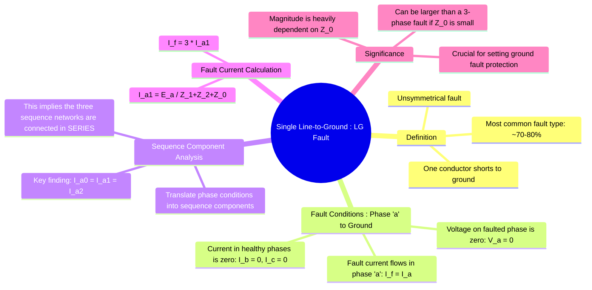

---
tags:
  - power-systems
  - fault-analysis
  - unsymmetrical-faults
  - lg-fault
  - symmetrical-components
created: 2025-10-12
aliases:
  - LG Fault
  - Line-to-Ground Fault
  - SLG Fault
subject: "[[Power System]]"
parent:
  - Fault Analysis
formula:
  - 'Boundary Conditions (solid LG Fault at phase "a") : $$V_a=0$$ | $$I_b=0$$ and $$I_c=0$$ | $$I_f=I_a$$'
  - 'Sequence Component (solid LG Fault at phase "a") : $$I_{a0} = I_{a1} = I_{a2} = \frac{I_a}{3}$$'
  - 'Sequence Current (solid LG Fault at phase "a") : $$I_{a1} = \frac{E_a}{Z_1 + Z_2 + Z_0}$$'
  - 'Fault Current (solid LG Fault at phase "a") : $$I_f = I_a = \frac{3E_a}{Z_1 + Z_2 + Z_0}$$'
  - 'Fault Current (LG Fault at phase "a" with fault impedance) : $$I_f = \frac{3E_a}{Z_1 + Z_2 + Z_0 + 3Z_f}$$'
trends:
  - "[[trends - Fault Analysis]]"
modified: 2026-07-23T21:23:30
---
### Analysis of Single Line-to-Ground (LG) Fault
#power-systems/fault-analysis #unsymmetrical-faults #lg-fault

> The **Single Line-to-Ground (LG) fault** is the most frequent type of fault in a power system, accounting for 70-80% of all occurrences. ==It is an **unsymmetrical fault**, meaning the system becomes unbalanced.== Therefore, its analysis requires the use of [[Concept of Symmetrical Components|symmetrical components]] to decouple the system into three independent sequence networks.

---

#### Fault Conditions at the Fault Point
#lg-fault/boundary-conditions

Consider a solid (fault impedance $Z_f = 0$) LG fault on phase 'a' at a point F in the network. The boundary conditions in the phase domain are:

1.  The voltage of the faulted phase at the fault point is zero: $V_a = 0$.
2.  The currents in the healthy phases (b and c) are zero: $I_b = 0$ and $I_c = 0$.
3.  The fault current ($I_f$) is the current flowing in phase 'a': $I_f = I_a$.

---
#### Sequence Component Analysis
#symmetrical-components/analysis

> [!prerequisite]-
> [[Concept of Symmetrical Components#The 'a' Operator|The 'a' Operator]] ($a$ or $\alpha$)
> [[Concept of Symmetrical Components#Symmetrical Components Transformation Matrix, $[A]$|Symmetrical Components Transformation Matrix]] ($[A]$)

We translate the phase-domain boundary conditions into the sequence domain using the current analysis equations:

$$\begin{align}
I_{a0} &= \frac{1}{3}(I_a + I_b + I_c) = \frac{1}{3}(I_a + 0 + 0) = \frac{1}{3}I_a \\
I_{a1} &= \frac{1}{3}(I_a + aI_b + a^2I_c) = \frac{1}{3}(I_a + 0 + 0) = \frac{1}{3}I_a \\
I_{a2} &= \frac{1}{3}(I_a + a^2I_b + aI_c) = \frac{1}{3}(I_a + 0 + 0) = \frac{1}{3}I_a
\end{align}$$

This leads to the most important conclusion for an LG fault:
$$\boxed{\quad I_{a0} = I_{a1} = I_{a2} = \frac{I_a}{3} \quad}$$
The equality of the three sequence currents implies that, for analysis, the **three sequence networks must be connected in series**.

---
#### Interconnection of Sequence Networks
#sequence-networks/connection

==The condition $I_{a0} = I_{a1} = I_{a2}$ is satisfied by connecting the positive, negative, and zero sequence Thevenin equivalent networks in series, driven by the pre-fault voltage source $E_a$ (which only exists in the positive sequence network).==

From the series connection, the total voltage around the loop is zero: $V_{a1} + V_{a2} + V_{a0} = 0$.
Substituting the network equations:
$$\begin{align}
(E_a - I_{a1}Z_1) + (-I_{a2}Z_2) + (-I_{a0}Z_0) &= 0 \\
E_a - I_{a1}Z_1 - I_{a1}Z_2 - I_{a1}Z_0 &= 0 \quad (\text{since } I_{a1}=I_{a2}=I_{a0})
\end{align}$$
Solving for the sequence current $I_{a1}$:
$$\boxed{\quad I_{a1} = \frac{E_a}{Z_1 + Z_2 + Z_0} \quad}$$
where $Z_1, Z_2, Z_0$ are the Thevenin equivalent impedances of the respective sequence networks as seen from the fault point.

---
#### Fault Current Calculation
#fault-current-calculation

The total fault current, $I_f$, is the current in the faulted phase, $I_a$.
$$ I_f = I_a = 3 \times I_{a1} $$
Substituting the expression for $I_{a1}$:
$$\boxed{\quad I_f = I_a = \frac{3E_a}{Z_1 + Z_2 + Z_0} \quad}$$

* **Effect of Fault Impedance ($Z_f$):** If the fault is not solid and has an impedance $Z_f$, this impedance is added to the loop. The voltage at the fault point becomes $V_a = I_a Z_f$. This results in a term $3Z_f$ being added to the denominator:

> [!formula] Fault Current Formula for Fault with Fault Impedance
> $$\boxed{\quad I_f = \frac{3E_a}{Z_1 + Z_2 + Z_0 + 3Z_f}\quad }$$

> [!pyq]- PYQ : 2019
> ![[ee_2019#^q50]]

> [!memory] Exam Trap: Which fault is more severe?
> While a 3-phase fault is generally the most severe, **an LG fault can produce a higher fault current** if the system is solidly grounded.
> * 3-Phase Fault: $I_{3\phi} = \frac{E_a}{Z_1}$
> * LG Fault: $I_{LG} = \frac{3E_a}{Z_1 + Z_2 + Z_0}$
> 
> **Condition:** If the zero-sequence impedance is very low ($Z_0 < Z_1$), which often happens near solidly grounded transformer neutrals, the denominator of the LG fault becomes smaller than $3Z_1$, making **$I_{LG} > I_{3\phi}$**.
^exam-trap-severity

---
### Related Concepts
#power-systems/related-concepts

> [[Fault Analysis]]

[[Concept of Symmetrical Components]]
[[Analysis of Line-to-Line (LL) Fault]]
[[Analysis of Double Line-to-Ground (LLG) Fault]]
[[Analysis of Symmetrical Faults]]
[[Neutral Grounding]]
[[Sequence Impedances and Networks of Synchronous Machines]]
[[Sequence Impedances and Networks of Transformers]]
[[Sequence Impedances and Networks of Transmission Lines]]
[[Parallel Sources in Fault Analysis]]
[[Per-Unit System]]