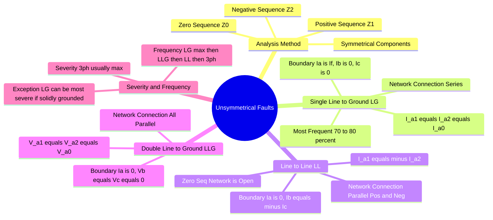

---
tags:
  - power-system
  - fault-analysis
  - symmetrical-components
  - gate
created: 2026-07-08
aliases:
  - Asymmetrical Faults
  - LG Fault
  - LL Fault
  - LLG Fault
subject: "[[Power System]]"
parent:
  - "[[Fault Calculations|Fault Analysis]]"
modified: 2026-07-23T21:23:43
---
### Unsymmetrical Faults
#power-system/fault-analysis #symmetrical-components

> **Unsymmetrical Faults** (or Asymmetrical Faults) are short-circuit conditions that affect the three phases unequally, leading to unbalanced currents and voltages in the system. To analyze these faults, the power system is modeled using **Symmetrical Components** (Fortescue's Theorem), transforming the unbalanced system into three decoupled, balanced sequence networks (Positive, Negative, and Zero).

| Fault Type | Boundary Condition | Sequence Network Connection | Fault Current ($I_f$) |
| :--- | :--- | :--- | :--- |
| **[[Analysis of Single Line-to-Ground (LG) Fault\|LG]]** | $I_b = I_c = 0$, $V_a = 0$ | $Z_1, Z_2, Z_0$ in **Series** | $I_f = 3I_{a1}$ |
| **[[Analysis of Line-to-Line (LL) Fault\|LL]]** | $I_a = 0$, $I_b = -I_c$, $V_b = V_c$ | $Z_1, Z_2$ in **Series** ($Z_0$ open) | $I_f = \sqrt{3}I_{a1}$ |
| **[[Analysis of Double Line-to-Ground (LLG) Fault\|LLG]]** | $I_a = 0$, $V_b = V_c = 0$ | $Z_1, Z_2, Z_0$ in **Parallel** | $I_f = 3I_{a0}$ |

---
#### 1. Single Line-to-Ground (LG) Fault
#fault-analysis/lg-fault
This is the most common type of fault (70%-80% of occurrences), often caused by lightning or falling trees.

![[Analysis of Single Line-to-Ground (LG) Fault#Fault Current Calculation]]

---
#### 2. Line-to-Line (LL) Fault
#fault-analysis/ll-fault
A short circuit between two phases.

![[Analysis of Line-to-Line (LL) Fault#Fault Current Calculation]]

---
#### 3. Double Line-to-Ground (LLG) Fault
#fault-analysis/llg-fault
A short circuit between two phases and the ground.

![[Analysis of Double Line-to-Ground (LLG) Fault#Fault Current Calculation]]

---
#### Frequency and Severity Comparison (GATE High-Yield)
#gate/comparison

1.  **Frequency of Occurrence:**
    **LG Fault** ($70\%-80\%$) > **LLG Fault** ($10\%$) > **LL Fault** ($5\%$) > **3-Phase Symmetrical Fault** ($2\%-3\%$).
2.  **Severity (Magnitude of Fault Current):**
    * Generally, the 3-Phase fault is the most severe (used for sizing Circuit Breakers).
    * **Typical Order:** **3-Phase > LLG > LL > LG**.
    
    ![[Analysis of Single Line-to-Ground (LG) Fault#^exam-trap-severity]]

---
### Related Concepts
#topic/related-concepts

> [[Concept of Symmetrical Components]]

[[Analysis of Symmetrical Faults]]
[[Sequence Impedances and Networks of Transformers]]
[[Sequence Impedances and Networks of Synchronous Machines]]
[[Sequence Impedances and Networks of Transmission Lines]]
[[Neutral Grounding]]
[[Parallel Sources in Fault Analysis]]