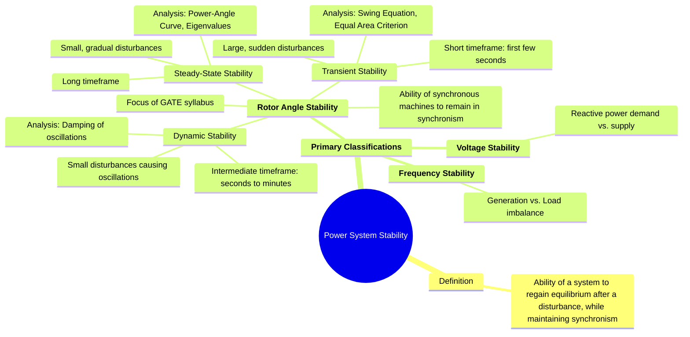

---
tags:
  - power-systems
  - stability
  - stability-classification
  - power-system-dynamics
created: 2025-10-12
aliases:
  - Power System Stability
  - Stability Classification
  - Rotor Angle Stability
  - Classification of Power System Stability (Steady-State, Transient, Dynamic)
subject: "[[Power System]]"
parent: Power System Stability
modified: 2026-07-23T21:23:54
---
### Classification of Power System Stability
#power-systems/stability #stability-classification

> **Power System Stability** is the ability of an electric power system, for a given initial operating condition, to regain a state of operating equilibrium after being subjected to a physical disturbance, with most system variables bounded so that practically the entire system remains intact. The primary concern is the ability of the [[Synchronous Machines]] to remain in synchronism with one another.

---

#### Primary Classifications
The stability of a power system is a single, unified problem. However, for the purpose of analysis, it is categorized based on the nature of the disturbance, the system variables involved, and the timeframe of interest. The three main categories are:

1.  **[[#Rotor Angle Stability]]:** The ability of interconnected synchronous machines to remain in synchronism.
2.  **Frequency Stability:** The ability of the power system to maintain a steady frequency following a severe imbalance between generation and load.
3.  **Voltage Stability:** The ability of the power system to maintain steady voltages at all buses after being subjected to a disturbance.

For the GATE syllabus, the focus is almost exclusively on **Rotor Angle Stability**.

---
#### Rotor Angle Stability
#rotor-angle-stability

This is the most well-understood form of power system stability and is further subdivided based on the size of the disturbance.

##### 1. Steady-State Stability
#steady-state-stability

This refers to the system's ability to maintain synchronism following **small and slow** disturbances, such as gradual changes in load or generation.

*   **Disturbance:** Small magnitude, slow rate of change.
*   **Timeframe:** A long period.
*   **Analysis:** Involves linearizing the system's dynamic equations around an operating point. The stability limit is determined by the peak of the [[Power-Angle Curve]].
*   **Key Concept:** The existence of sufficient **synchronizing torque** to counteract any small rotor angle deviations.
*   **[[Steady-State Stability Limit]]:** The maximum power that can be transferred through the system without losing synchronism following a slow disturbance. For a simple system:
    $$\boxed{\quad P_{max} = \frac{|E||V|}{|X|} \quad}$$

---
##### 2. Transient Stability
#transient-stability

This refers to the system's ability to maintain synchronism following a **large and sudden** disturbance (e.g., short circuit, line switching). 
1. **Timeframe:** Short period (first few seconds, focusing on the "first swing").
2. **Governing Dynamics**

![[Swing Equation#The Swing Equation in Per-Unit (The Standard Form)]]

3. **Stability Assessment**

![[Equal Area Criterion for Stability Analysis#The Criterion Explained]]

---
##### 3. Dynamic Stability (or Small-Signal Stability)
#dynamic-stability

This refers to the ability of the system to maintain synchronism under small disturbances, with a specific focus on the **damping of system oscillations**. It can be considered a refinement of [[#1. Steady-State Stability|steady-state stability]].

*   **Disturbance:** Small magnitude (e.g., minor load fluctuations).
*   **Timeframe:** Intermediate, typically from a few seconds to tens of seconds.
*   **Analysis:** The focus is on whether low-frequency electromechanical oscillations have sufficient damping. If damping is negative or insufficient, the oscillations will grow in magnitude, eventually leading to loss of synchronism.
*   **Key Concept:** The existence of sufficient **damping torque**. Control systems like Power System Stabilizers (PSS) are often used to provide this damping.

---
#### Comparison Summary
#comparison/ps/steady-state-stability-with-transient-stability

| Feature                 | Steady-State Stability                                         | Transient Stability                                                            |
| ----------------------- | -------------------------------------------------------------- | ------------------------------------------------------------------------------ |
| **Type of Disturbance** | Small, slow, gradual                                           | Large, sudden                                                                  |
| **Timeframe**           | Long-term                                                      | Short-term (first swing, 1-3 seconds)                                          |
| **Analysis Method**     | Linearized equations, [[Power-Angle Curve\|Power-Angle Curve]] | Non-linear [[Swing Equation]], [[Equal Area Criterion for Stability Analysis]] |
| **Key Question**        | "What is the maximum power limit?"                             | "Will the system survive a major fault?"                                       |

---
### Related Concepts
#power-systems/related-concepts

> [[Power-Angle Curve]]

[[Swing Equation]]
[[Equal Area Criterion for Stability Analysis]]
[[Fault Analysis]]
[[Power System Control]]