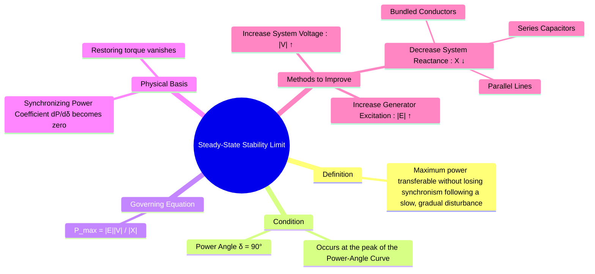

---
tags:
  - power-systems
  - stability
  - steady-state-stability
  - power-angle-curve
created: 2025-10-12
aliases:
  - Steady State Stability Limit
  - SSSL
  - Pull-Out Power
  - Static Stability Limit
subject: "[[Power System]]"
parent:
  - Power System Stability
formula:
  - "Power-Angle Curve : $$P = \\frac{|V_S||V_R|}{X}\\sin(\\delta) = P_{max} \\sin(\\delta)$$"
  - "Steady-State Stability Limit (SSSL) : $$P_{max} = SSSL = \\frac{|V_S||V_R|}{X}$$"
  - "Steady-State Stability Limit (SSSL) (single-machine-infinite-bus (SMIB)) : $$P_{max} = SSSL = \\frac{|E||V|}{X}$$"
  - "Steady-State / Static Stability Limit (SSSL) of Synchronous Motors : $$P_{max} = \\frac{V E_f}{|Z_s|} - \\frac{E_f^2 R_a}{|Z_s|^2}$$ (if synchronous impedance is $$Z_s = R_a + jX_s$$)"
  - "Steady-State Stability Margin (SSSM) : $$SSSM = \\frac{P_{max} - P_{operating}}{P_{max}} \\times 100\\%$$"
modified: 2026-07-23T21:24:14
---
### Steady-State Stability Limit
#power-systems/stability #steady-state-stability-limit

> The **Steady-State Stability Limit (SSSL)** is defined as ==the maximum power that can be transferred through a power system from one point to another without the loss of synchronism, following a **small and slow** disturbance==. It corresponds to the theoretical peak of the [[Power-Angle Curve|power-angle curve]].

This limit is a crucial parameter in power system operation, as it defines the upper bound of power transfer under normal, gradually changing conditions. It is also referred to as the **pull-out power**.

---

#### Determining the Stability Limit
#steady-state-stability-limit/determination

For a simple two-machine system (or a generator connected to an infinite bus), the electrical power $P$ transferred is given by the [[Power Flow through a Transmission Line#Simplified Model (Short Lossless Line)|simplified power-angle equation]] (==assuming a short lossless line where resistance $R=0$==):
$$P = \frac{|V_S||V_R|}{X}\sin(\delta)$$

> [!memory]- General Power Flow Equations (Using ABCD Parameters)
> ![[Power Flow through a Transmission Line#^general-power-equation]]

The maximum power transfer occurs when the system can supply the maximum possible load under steady-state conditions, which corresponds to the peak of the sine function. To find this peak, we set the derivative of power with respect to the power angle to zero:
$$\frac{dP}{d\delta} = \frac{|V_S||V_R|}{X} \cos(\delta) = 0 \implies \cos(\delta) = 0$$  

This occurs when the power angle is $\delta = 90^\circ$. Substituting this back into the power equation yields the theoretical maximum power:
$$\boxed{\quad P_{max} = SSSL = \frac{|V_S||V_R|}{X} \quad}$$

> [!important]- Important Exam Clarification — Effect of Armature Resistance  
> The above expression assumes **negligible resistance** in the transfer path.  
> This is valid for **long transmission lines** and **simplified generator–infinite bus models**.
> 
> However, **for synchronous machines**, if armature resistance $R_a$ is NOT negligible (i.e., synchronous impedance $Z_s = R_a + jX_s$ is given), the simplified formula **must NOT be used**.

> [!pyq] Static Stability Limit of a Synchronous Motor (General Case)
> See [[ee_2023#^q47]]
> 
> When synchronous impedance is given as $Z_s = R_a + jX_s$, the static stability limit is:  
> $$\boxed{\quad P_{max} = \frac{V E_f}{|Z_s|} - \frac{E_f^2 R_a}{|Z_s|^2} \quad}$$  
>  where:
> - $E_f$ = excitation (internal emf)
> - $V$ = terminal voltage
> 
> ✔ Maximum power occurs when $\delta = \tan^{-1}(X_s/R_a)$  
> ✔ Leads to a **quadratic equation in $E_f$**

> [!memory] One-Line GATE Memory Rule
> - Only $X$ given → use $P_{max} = \frac{VE}{X}$
> - $R_a + jX_s$ given → use **quadratic stability formula**

---
#### Methods to Improve the Stability Limit
#steady-state-stability-limit/improvement

To enhance the steady-state stability of a power system, the value of $P_{max}$ must be increased. Based on the formula, this can be achieved in three ways:

1.  **Increase Generator Internal Voltage $|E|$:**
    * This is achieved by **increasing the field excitation** of the synchronous generator. Modern generators use [[Automatic Voltage Regulator (AVR)|Automatic Voltage Regulators (AVRs)]] to quickly boost excitation during system disturbances, thereby increasing the stability limit.

2.  **Increase System Voltage $|V|$:**
    *   Operating the transmission network at a higher voltage level significantly increases the power transfer capability and stability. This is why EHV (Extra High Voltage) and UHV (Ultra High Voltage) lines are used for bulk power transfer.

3.  **Decrease System Reactance $X$:**
	> See also [[Power Flow through a Transmission Line#Factors Affecting Power Flow|Factors affecting power transfer capability]]
		
    *   This is often the most practical and effective method. Reactance can be reduced by:
        *   **Using Parallel Transmission Lines:** Adding a second line in parallel reduces the total equivalent reactance.
        *   **Using Series Capacitor Compensation:** A capacitor is placed in series with the line to cancel a portion of the line's inductive reactance ($X_{net} = X_L - X_C$).
        *   **Using Bundled Conductors:** This reduces the overall series reactance of the transmission line.
        *   Employing transformers with lower leakage reactance.

---
#### Steady-State Stability Margin (SSSM)

#power-system/stability-margin

In practice, a system is never operated at its theoretical limit of $\delta = 90^\circ$.  
A safety margin is always maintained:  
$$SSSM = \frac{P_{max} - P_{operating}}{P_{max}} \times 100\%$$  
Typical operating range: $\delta = 30^\circ$–$45^\circ$

---
### Related Concepts
#power-systems/related-concepts

> [[Classification of Power System Stability]]

[[Power-Angle Curve]]
[[Power-Angle Curve#Analysis of the Curve|Synchronizing Power Coefficient]] (for the derivation of the Synchronizing Power Coefficient)
[[Power Flow through a Transmission Line]]
[[Transient Stability]]
[[Methods to Improve Transient Stability]]
[[Equal Area Criterion for Stability Analysis]]
[[Internal EMF]]
[[Synchronous Machines]]
