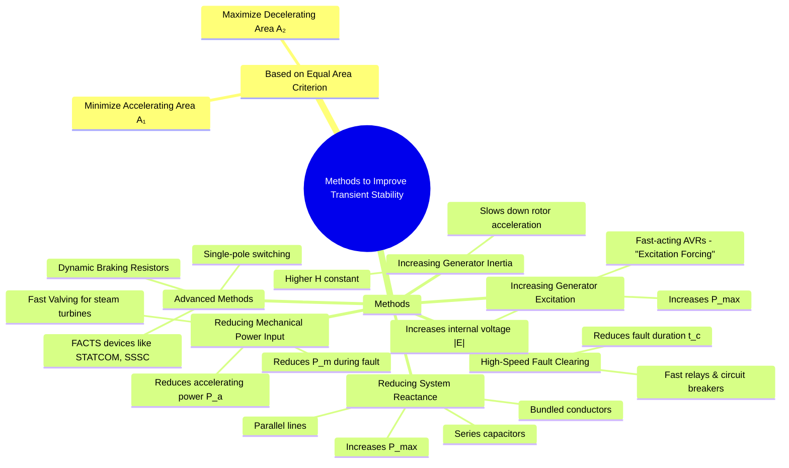

---
tags:
  - power-systems
  - stability
  - transient-stability
  - stability-improvement
created: 2025-10-12
aliases:
  - Transient Stability Improvement
  - Enhancing Transient Stability
subject: "[[Power System]]"
parent:
  - Power System Stability
modified: 2026-07-23T21:24:56
---
### Methods to Improve Transient Stability
#power-systems/stability #transient-stability #stability-improvement

> Improving transient stability means enhancing a power system's ability to withstand large, sudden disturbances (like short circuits) and remain in synchronism. The goal is to either reduce the amount of accelerating energy gained by a generator's rotor during a fault or to increase the system's capacity to absorb that energy after the fault is cleared. These methods are best understood through their effect on the [[Equal Area Criterion for Stability Analysis|Equal Area Criterion]] (minimizing $A_1$ and maximizing $A_2$) and the [[Swing Equation]].

The core stability equations are:
$$\boxed{\quad \frac{d^2\delta}{dt^2} = \frac{\omega_s}{2H} (P_m - P_e) \quad \text{and} \quad P_e = \frac{|E||V|}{X}\sin\delta \quad}$$
All improvement methods aim to manipulate the terms in these equations favorably.

---
#### 1. High-Speed Fault Clearing
#high-speed-clearing

This is the **single most effective** method for improving transient stability.
*   **How it works:** By using high-speed protective relays and fast-acting circuit breakers, the duration of the fault ($t_c$) is minimized. This reduces the time the rotor has to accelerate.
*   **Effect on EAC:** A shorter fault duration means the fault is cleared at a smaller clearing angle ($\delta_c$). This directly **minimizes the accelerating area ($A_1$)**, leaving a much larger margin for the decelerating area ($A_2$) to restore synchronism.

---
#### 2. Reduction of System Reactance (Increasing $P_{max}$)
#reactance-reduction

Lowering the overall reactance between the generators and the rest of the system strengthens the electrical connection.
*   **How it works:** A lower reactance ($X$) increases the peak of the power-angle curve ($P_{max} = |E||V|/X$).
*   **Effect on EAC:** A higher $P_{max}$ raises the post-fault power-angle curve. This **increases the available decelerating area (A₂)**, making it easier for the system to absorb the kinetic energy gained during the fault.
*   **Methods:**
    *   **Parallel Transmission Lines:** Adding lines in parallel reduces the overall equivalent reactance.
    *   **Series Capacitor Compensation:** Placing capacitors in series with the line cancels a portion of the inductive reactance.
    *   **Bundled Conductors:** This is a line design technique that lowers the line's inherent reactance.

---
#### 3. High-Speed Excitation Systems (AVR)
#fast-excitation

Using modern, fast-acting [[Automatic Voltage Regulator (AVR)|Automatic Voltage Regulators (AVRs)]] to control the generator's field excitation.
*   **How it works:** When a fault occurs, the AVR rapidly boosts the field current (a technique called "excitation forcing"). This increases the generator's internal voltage ($|E|$).
*   **Effect on EAC:** A higher $|E|$ increases $P_{max}$, which raises the post-fault power-angle curve. Similar to reducing reactance, this **increases the decelerating area ($A_2$)** and improves the stability margin.

---
#### 4. Reduction of Mechanical Power Input
#fast-valving

This method aims to reduce the source of the acceleration—the mechanical input power ($P_m$).
*   **How it works:** For steam turbines, a technique called **fast valving** is used. Upon fault detection, the steam inlet valves are rapidly closed and then reopened after a short delay. This momentarily reduces the mechanical torque/power ($P_m$) applied to the rotor.
*   **Effect on Swing Equation:** Reducing $P_m$ directly **reduces the accelerating power ($P_a = P_m - P_e$)** during the fault, leading to a slower rate of rotor acceleration and a smaller accelerating area A₁.

---
#### 5. Increasing Generator Inertia (H)
#generator-inertia

This is a design-stage consideration.
*   **How it works:** Using generators with a higher moment of inertia, which corresponds to a larger inertia constant (H).
*   **Effect on Swing Equation:** From the equation, a larger H results in a smaller rotor acceleration ($\frac{d^2\delta}{dt^2}$) for the same power imbalance. The rotor's angle changes more slowly, providing more time for the protection system to clear the fault before the angle reaches the critical limit. This effectively **increases the Critical Clearing Time**.

---
#### 6. Advanced and Special Methods
#stability-enhancement/advanced-methods

*   **Single-Pole Switching:** For a single line-to-ground fault, only the breaker pole of the faulted phase is opened. The other two healthy phases remain connected and can transmit a reduced amount of power. This keeps the electrical power output ($P_e$) from dropping to zero during the fault, reducing $A_1$.
*   **Dynamic Braking:** A large resistor bank is switched on and connected to the generator terminals during the fault. This provides an artificial electrical load, increasing $P_e$ and absorbing some of the accelerating power, thus reducing $A_1$.
*   **FACTS Devices:** Flexible AC Transmission System devices like STATCOMs and SSSCs can rapidly control voltage and reactance to improve stability margins.

---
### Related Concepts
#power-systems/related-concepts

> [[Transient Stability]]

[[Equal Area Criterion for Stability Analysis]]
[[Swing Equation]]
[[Power-Angle Curve]]
[[Power System Protection]]
[[Circuit Breakers]]