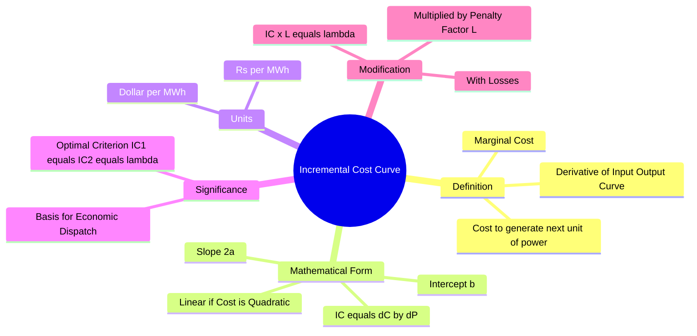

---
tags:
  - power-system
  - economic-load-dispatch
  - optimization
  - gate
created: 2026-07-22T21:05:47
aliases:
  - IC Curve
  - Marginal Cost Curve
  - dC/dP
subject: "[[Power System]]"
parent:
  - Economic Operation of Power Systems
modified: 2026-07-22T21:05:47
---
### Incremental Cost Curve (IC)
#power-system/economic-dispatch #optimization

> The **Incremental Cost Curve** represents the additional cost incurred to generate an infinitesimally small amount of additional power. ==Mathematically, it is the first derivative of the generator's Input-Output (Cost vs. Power) curve.== In economics, this is synonymous with **Marginal Cost**.

---
#### Derivation from Cost Function
#eld/derivation

The fuel cost of a thermal generating unit is typically approximated by a quadratic function of the active power output $P_i$:
$$C_i(P_i) = \alpha_i P_i^2 + \beta_i P_i + \gamma_i \quad (\text{Rs/hr})$$

The **Incremental Cost ($IC_i$)** is the slope of this curve:
$$\boxed{\quad IC_i = \frac{dC_i}{dP_i} = 2\alpha_i P_i + \beta_i \quad}$$

*   **Nature of Curve:** Since the Cost function is a parabola (quadratic), the Incremental Cost curve is a **Straight Line** with a positive slope.
*   **Intercept:** $\beta_i$.
*   **Slope:** $2\alpha_i$.
*   **Units:** Currency per Energy unit (e.g., **Rs/MWh**).

---
#### Significance in Economic Load Dispatch (ELD)
#eld/criterion

The Incremental Cost curve is the fundamental tool used to distribute a total load demand ($P_D$) among various generator units ($P_1, P_2, \dots$) to minimize the total operating cost.

**Criterion for Optimality (Neglecting Losses):**
For maximum economy, the load should be shared among the generators such that their incremental costs are **equal**.
$$\boxed{\quad \frac{dC_1}{dP_1} = \frac{dC_2}{dP_2} = \dots = \frac{dC_n}{dP_n} = \lambda \quad}$$

* **$\lambda$ (System Lambda):** This is the **Lagrange Multiplier**. It represents the cost of the next MWh of power produced by the *entire system*.

> [!refer]
> [[Economic Load Dispatch (ELD) neglecting losses]]

---
#### Effect of Transmission Losses
#eld/losses

> [!refer]
> [[Economic Load Dispatch (ELD) including losses]]

When power is transmitted over long distances, transmission losses ($P_L$) occur. The incremental cost at the generator bus is not the same as the cost at the load bus.
To account for this, the IC curve is modified by a **Penalty Factor ($L_i$)**.

**Coordination Equation with Losses:**
$$\boxed{\quad IC_i \times L_i = \lambda \quad}$$

Where:
*   $IC_i = \frac{dC_i}{dP_i}$ (Incremental Fuel Cost).
*   $L_i = \frac{1}{1 - \frac{\partial P_L}{\partial P_i}}$ (Penalty Factor).
*   $IC_i \times L_i$: Often called the **Incremental Cost of Received Power**.

---
#### Heat Rate and Incremental Fuel Cost
#eld/heat-rate

Sometimes the input is given in terms of heat energy (kCal/hr or Btu/hr) rather than money.
1.  **Incremental Heat Rate (IHR):** $\frac{dH}{dP}$ (kCal/MWh).
2.  **Fuel Cost ($K$):** Cost of fuel per unit heat (Rs/kCal).

$$IC = \frac{dC}{dP} = \frac{dC}{dH} \times \frac{dH}{dP} = K \times \text{IHR}$$
$$\boxed{\quad \text{Incremental Cost} = \text{Fuel Cost} \times \text{Incremental Heat Rate} \quad}$$

---
### Related Concepts
#topic/related-concepts

> [[Economic Load Dispatch (ELD) neglecting losses]]
> [[Economic Load Dispatch (ELD) including losses]]

[[Penalty Factors and B-coefficients]]
[[Input-Output Characteristics of Thermal Plant]]
[[Lagrange Multipliers]] (Mathematical basis for $\lambda$)
