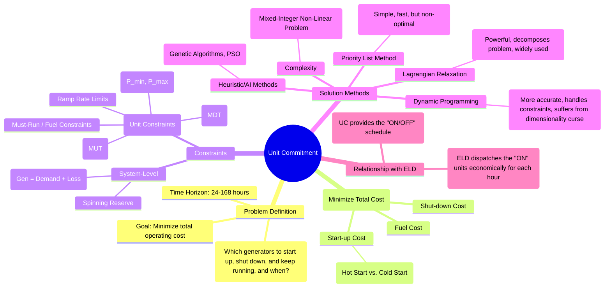

---
tags:
  - power-systems
  - economic-operation
  - unit-commitment
  - optimization
created: 2025-10-14
aliases:
  - Unit Commitment Problem
  - UCP
subject: "[[Power System]]"
parent:
  - Economic Operation of Power Systems
modified: 2026-07-23T21:25:51
---
### Unit Commitment
#unit-commitment #optimization #power-system-operation

> The **Unit Commitment (UC)** problem is the process of determining the start-up and shut-down schedule for a set of generating units over a future time horizon (typically 24 to 168 hours) to meet the forecasted load demand at the minimum possible cost, while satisfying a large number of system and operational constraints. It answers the question: "Which units should be ON and when?"

The UC problem is solved *before* the [[Economic Load Dispatch (ELD) including losses|Economic Load Dispatch (ELD)]]. UC provides the list of committed (online) units for each hour, and then ELD determines the precise power output for those online units.

---
#### Objective Function
#unit-commitment/objective-function

The goal of UC is to minimize the total operating cost over the scheduling period $T$. This cost is the sum of three main components:
$$\boxed{\quad \text{Total Cost} = \sum_{t=1}^{T} \left( \text{Fuel Cost}_t + \text{Start-up Cost}_t + \text{Shut-down Cost}_t \right) \quad}$$
1.  **Fuel Cost**: The cost of fuel consumed by all committed generators. It is the sum of the production costs from the ELD problem over the entire time horizon.
2.  **Start-up Cost**: The cost incurred to bring a unit online (e.g., fuel for warming up a boiler). This cost is highly dependent on the time the unit has been offline.
    *   **Cold Start Cost**: Higher cost, when the unit has been off for a long time.
    *   **Hot Start Cost**: Lower cost, when the unit has been off for a short time.
3.  **Shut-down Cost**: The cost associated with taking a unit offline. This is often a fixed small value and is sometimes neglected.

---
#### Unit Commitment Constraints
#unit-commitment/constraints

The UC optimization is subject to numerous constraints that model the physical limitations of the power system and individual generators.

##### System Constraints
#system-constraints

1.  **Load Balance Constraint**: For each hour $t$, the total power generated by all online units must equal the system load demand ($P_{D,t}$) plus the system losses ($P_{L,t}$).
    $$ \sum_{i=1}^{N} P_{Gi,t} = P_{D,t} + P_{L,t} \quad \text{for each hour } t $$
2.  **Spinning Reserve Constraint**: The total available generating capacity from online units must be greater than the load demand by a certain margin, called spinning reserve ($R_t$). This ensures the system can handle sudden load increases or the unexpected failure of a generator.
    $$ \sum_{i \in \text{Online Units}} P_{Gi,max} \ge P_{D,t} + R_t \quad \text{for each hour } t $$

##### Unit Constraints
#generator-constraints

These apply to each individual generating unit `i`:
1.  **Generation Limits**: Each committed unit must operate between its minimum and maximum power output levels.
    $$ P_{Gi,min} \le P_{Gi,t} \le P_{Gi,max} $$
2.  **Minimum Up Time (MUT)**: Once a unit is turned on, it must remain online for a specified minimum period before it can be shut down. This is due to thermal stress considerations in thermal units.
3.  **Minimum Down Time (MDT)**: Once a unit is shut down, it must remain offline for a specified minimum period before it can be restarted. This is related to the time needed for the boiler to cool down safely.
4.  **Ramp Rate Limits**: The change in a generator's output from one period to the next is limited. A unit cannot instantaneously change its power output.
    *   Ramp-up limit: $P_{Gi,t} - P_{Gi,t-1} \le \text{UR}_i$
    *   Ramp-down limit: $P_{Gi,t-1} - P_{Gi,t} \le \text{DR}_i$
5.  **Other Constraints**: These can include `must-run` constraints (for voltage support or grid stability), fuel limitations, and crew constraints.

---
#### Solution Methods
#unit-commitment/solution-methods

The UC problem is a large-scale, mixed-integer non-linear programming (MINLP) problem due to the binary on/off decision variables and the non-linear cost functions.

1.  **Priority List Method**:
    *   **Method**: Units are ranked in a list based on their average full-load production cost (cheapest first). To meet the load for a given hour, units are turned on from the top of the list until the load and reserve requirements are met.
    *   **Pros**: Extremely simple and fast.
    *   **Cons**: Heuristic method that does not guarantee an optimal solution. It largely ignores start-up costs and time-dependent constraints like MUT/MDT.

2.  **Dynamic Programming (DP)**:
    *   **Method**: The scheduling period is broken down into hourly stages. DP finds the optimal commitment schedule by building a forward path from the start to the end of the period, finding the minimum cost path that satisfies all constraints.
    *   **Pros**: Can find the optimal solution and can handle most constraints.
    *   **Cons**: Suffers from the "curse of dimensionality." The number of possible states (combinations of on/off units) grows exponentially with the number of generators, making it computationally infeasible for large systems.

3.  **Lagrangian Relaxation (LR)**:
    *   **Method**: A powerful mathematical optimization technique. It relaxes the "coupling" system constraints (like load balance and reserve) by adding them to the objective function with Lagrange multipliers. This decomposes the complex system-wide problem into simpler subproblems for each individual generator, which can be solved independently and efficiently (often using DP). The multipliers are then updated iteratively to find the optimal solution.
    *   **Pros**: Computationally efficient for large systems, provides a good-quality solution and a lower bound on the optimal cost. It is a widely used method in industry.

---
### Related Concepts
#unit-commitment/related-concepts

> [[Economic Load Dispatch (ELD) including losses]]

[[Penalty Factors and B-coefficients]]
[[Load Frequency Control (LFC)]]
[[Optimization Techniques]]