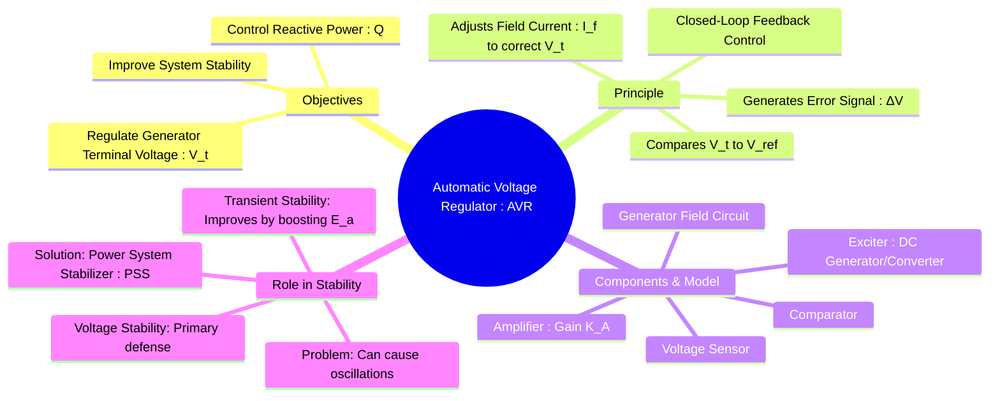

---
tags:
  - power-systems
  - avr
  - generator-control
  - excitation-system
  - voltage-control
  - stability
created: 2025-09-08
aliases:
  - AVR
  - Excitation System Control
subject: "[[Power System]]"
parent:
  - Power System Stability
modified: 2026-07-23T21:33:31
---
### Automatic Voltage Regulator (AVR)
#automatic-voltage-regulator #excitation-system

> An **Automatic Voltage Regulator (AVR)** is a [[Open-Loop and Closed-Loop (Feedback) Control Systems|closed-loop feedback control system]] that automatically maintains the terminal voltage ($V_t$) of a [[Principle of Operation as a Generator (Alternator)|synchronous generator]] at a predetermined set value. ==It is the primary means of voltage and reactive power control for a generator and plays a critical role in maintaining overall power system stability.==

==The AVR achieves this control by adjusting the DC current supplied to the generator's field winding.==

---
#### Objectives of an AVR
#avr/objectives #automatic-voltage-regulator/objectives 

1.  **Voltage Regulation**: To maintain the generator's terminal voltage within acceptable limits (typically $\pm 5\%$) under varying load conditions.
2.  **Reactive Power Control**: By controlling the terminal voltage, which is closely linked to the [[Internal EMF]] ($E_a$), the AVR indirectly controls the reactive power supplied or absorbed by the generator.
3.  **Stability Enhancement**: To improve the transient stability of the power system following a major disturbance.

---
#### Principle of Operation and Block Diagram
#avr/principle #avr/block-diagram

The AVR operates as a classic feedback control system.
1.  **Sensing**: The generator's terminal voltage is stepped down using a [[Instrument Transformers (CT and PT)|potential transformer]] (PT) and rectified to a DC signal.
2.  **Comparison**: This DC signal is compared with a stable DC reference voltage ($V_{ref}$).
3.  **Error Signal**: The difference between the reference and the measured voltage is the error signal ($\Delta V = V_{ref} - V_t$).
4.  **Amplification**: The error signal is amplified by an amplifier.
5.  **Excitation**: The amplified signal controls the output of the **exciter**. The exciter is a DC power source (either a DC generator or a power electronic converter) that provides the main field current ($I_f$) to the synchronous generator's rotor.
6.  **Control Action**: If $V_t$ drops, $\Delta V$ is positive, the exciter output increases, $I_f$ increases, the main flux increases, the internal EMF $E_a$ increases, and $V_t$ is restored towards its set value.

A simplified transfer function model of the AVR loop is:
*   **Amplifier**: $G_A(s) = \frac{K_A}{1+sT_A}$
*   **Exciter**: $G_E(s) = \frac{K_E}{1+sT_E}$
*   **Generator Field**: $G_F(s) = \frac{1}{K_F+sT_F}$
*   **Sensor**: $G_S(s) = \frac{K_R}{1+sT_R}$

---
#### Role in Power System Stability
#avr/stability #power-system-stabilizer

*   **Voltage Stability**: The AVR is the first and most important line of defense against voltage instability. By quickly responding to voltage drops, it prevents a potential voltage collapse.
*   **Transient (Rotor Angle) Stability**: A modern, fast-acting AVR significantly improves transient stability. During a fault, the terminal voltage drops. The AVR responds by rapidly increasing the field current ("field forcing"), which boosts the internal generated EMF ($E_a$). A higher $E_a$ increases the peak of the power-angle curve ($P_{max} = \frac{E_a V}{X}$), thereby increasing the synchronizing torque and helping the generator to remain in synchronism.

##### The Need for a Power System Stabilizer (PSS)

A high-gain, fast-acting AVR, while beneficial for transient stability, can sometimes have a negative side effect: it can reduce the damping of the generator's rotor oscillations, potentially leading to low-frequency electromechanical oscillations that can grow and cause instability.
To counteract this, a supplementary control loop called the **Power System Stabilizer (PSS)** is added to the AVR.

> [!concept] Purpose of PSS
> A **Power System Stabilizer (PSS)** provides a supplementary signal to the AVR to **add positive damping** to the generator's rotor oscillations, improving the overall dynamic stability of the system. It typically uses inputs like shaft speed deviation, frequency, or accelerating power.

---
### Related Concepts
#related-concepts

> [[Classification of Power System Stability|Power System Stability]]

[[Load Frequency Control (LFC)]]
[[Principle of Operation as a Generator (Alternator)|Synchronous Generator Principle]] (The machine being controlled)
[[Excitation Systems]] (The AVR is the controller for the exciter)
[[Power System Stabilizer (PSS)]] (A crucial addition to the AVR)
[[Methods of Voltage Control|Reactive Power Control]] (A primary function of the AVR)
[[Control Systems]]
