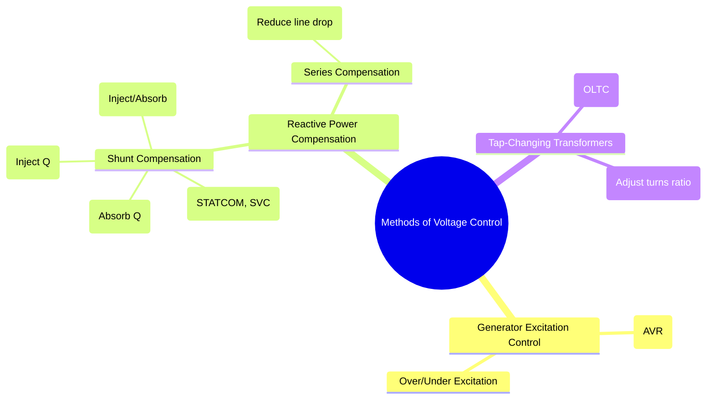

---
tags:
  - power-systems
  - voltage-control
  - reactive-power-compensation
  - power-quality
created: 2025-10-14
aliases:
  - Voltage Control Methods
  - Reactive Power Control
subject: "[[Power System]]"
parent:
  - Voltage and Reactive Power Control
modified: 2026-07-23T21:26:54
---
### Methods of Voltage Control
#voltage-control #reactive-power-compensation

> **Voltage Control** in a power system is the process of maintaining the voltage magnitudes at all buses within prescribed limits (typically $\pm 5\%$ of nominal). Since voltage magnitude is strongly linked to reactive power, most voltage control methods involve managing the generation, absorption, and flow of reactive power (Q) in the network, as established in the [[Relationship between Voltage, Power, and Reactive Power]].

---
#### 1. Generator Excitation Control
#generator-excitation #avr

The most fundamental method of voltage control is adjusting the reactive power output of synchronous generators.
-   **Mechanism**: An **Automatic Voltage Regulator (AVR)** continuously monitors the generator's terminal voltage. It compares this voltage to a reference value and automatically adjusts the DC excitation current in the generator's field winding to correct any error.
-   **Over-Excitation**: Increasing the field current makes the generator **over-excited**. It produces and injects reactive power (Q) into the system, which raises the terminal voltage.
-   **Under-Excitation**: Decreasing the field current makes the generator **under-excited**. It absorbs reactive power (Q) from the system, which lowers the terminal voltage.

---
#### 2. Shunt Reactive Power Compensation
#shunt-compensation

This involves connecting reactive power devices in parallel (shunt) with the transmission line, typically at substations.

-   **Shunt Capacitors**:
    #shunt-capacitor
    -   **Function**: Inject reactive power into the system.
    -   **Application**: Used to correct low voltage conditions, typically seen during heavy load periods, and to improve the power factor. They are often installed in switched banks (Mechanically Switched Capacitors - MSC).
    -   **Reactive Power Injected**: $Q_C = V^2 / X_C = \omega C V^2$. Note that their effect is proportional to the square of the voltage.

-   **Shunt Reactors**:
    #shunt-reactor
    -   **Function**: Absorb reactive power from the system.
    -   **Application**: Used to mitigate high voltage conditions, which often occur on long transmission lines under light load or no-load due to the [[Ferranti Effect]].

-   **Synchronous Condensers**:
    #synchronous-condenser
    -   **Function**: A synchronous motor running at no-load. It can provide smooth, continuous, and dynamic voltage control.
        -   **Over-excited**: Behaves like a capacitor (injects Q).
        -   **Under-excited**: Behaves like a reactor (absorbs Q).
    -   **Advantages**: Flexible and dynamic control.
    -   **Disadvantages**: Higher cost, maintenance, and losses compared to static compensators.

-   **Static VAR Compensators (SVC & STATCOM)**:
    #facts #svc #statcom
    -   These are modern power electronic devices from the [[FACTS Devices|FACTS]] family that provide fast and dynamic reactive power control.
    -   **SVC**: Uses thyristors to switch capacitors and reactors.
    -   **STATCOM**: Uses a Voltage Source Converter (VSC) to act as a controllable voltage source, providing superior performance, especially at low system voltages.

---
#### 3. Series Compensation
#series-compensation

-   **Series Capacitors**:
    #series-capacitor
    -   **Function**: A capacitor bank is connected in series with the transmission line.
    -   **Mechanism**: It reduces the net series reactance of the line ($X_{net} = X_L - X_C$). This leads to:
        1.  A smaller voltage drop along the line ($I \cdot X_{net}$).
        2.  Increased power transfer capability ($P_{max} = \frac{|V_s||V_r|}{X_{net}}$).
        3.  Improved system stability.
    -   This is an *indirect* but highly effective method of voltage regulation.

---
#### 4. Tap-Changing Transformers
#tap-changing-transformer #oltc

-   **Function**: Transformers equipped with tap changers can adjust their turns ratio to regulate the voltage on the secondary side.
-   **Mechanism**: By changing the number of turns on one of the windings, the voltage transformation ratio is altered.
    $$ \frac{V_2}{V_1} \approx \frac{N_2}{N_1} = n $$
-   **On-Load Tap Changer (OLTC)**: This is the most important type for voltage control, as it allows the turns ratio to be changed while the transformer is energized and carrying load, enabling active voltage regulation. They are a common and effective method used in substations.

---
### Related Concepts
#voltage-control/related-concepts

> [[Relationship between Voltage, Power, and Reactive Power]]

[[Reactive Power Compensation]]
[[Ferranti Effect]]
[[Tap-Changing Transformers]]
[[Power System Stability]]
[[FACTS Devices]]