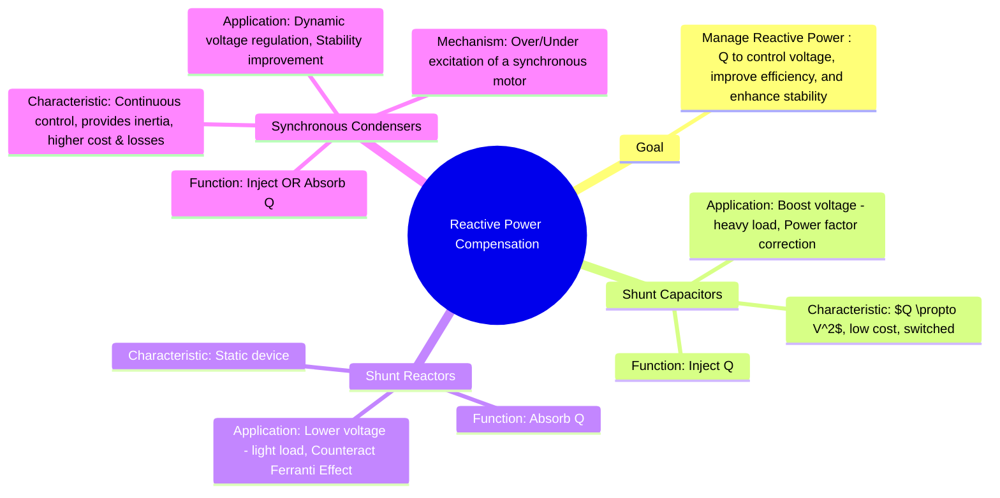

---
tags:
  - power-systems
  - voltage-control
  - reactive-power-compensation
  - power-quality
  - facts
created: 2025-10-14
aliases:
  - Shunt Compensation
  - VAR Compensation
  - Reactive Power Compensation (Shunt Capacitors, Shunt Reactors, Synchronous Condensers)
subject: "[[Power System]]"
parent: "[[Methods of Voltage Control]]"
modified: 2026-07-21T08:50:19
---
### Reactive Power Compensation
#reactive-power-compensation #voltage-control #power-factor

> **Reactive Power Compensation** is the management of reactive power to improve the performance of an AC power system. Since reactive power flow is strongly linked to voltage magnitude, compensation is a primary method of **[[Methods of Voltage Control|voltage control]]**. The goal is to balance the reactive power demand and supply to maintain voltages within desired limits, reduce transmission losses, and improve [[Classification of Power System Stability|power system stability]]. Shunt compensation involves connecting devices in parallel with the line.

---
#### Shunt Capacitors
#shunt-capacitor

- **Function**: Shunt capacitors are a source of reactive power. They **inject reactive power (Q)** into the point of connection.
- **Mechanism**: The current through a capacitor leads the voltage across it by 90°. This leading current provides the reactive power required by inductive loads, reducing the reactive power that needs to be supplied from the source.
- **Reactive Power Supplied**: The reactive power injected is proportional to the square of the terminal voltage.
    $$\boxed{\quad Q_C = \frac{V^2}{X_C} = \omega C V^2 \quad}$$
- **Applications**:
    1. **Voltage Support**: Used to raise voltage levels at buses during heavy load conditions, when the inductive load demand causes a voltage drop.
    2. **Power Factor Correction**: Connected in parallel with inductive loads to improve the overall power factor, which reduces current drawn from the source and minimizes $I^2R$ losses.
- **Characteristics**:
    - **Pros**: Low cost, low losses, easy to install.
    - **Cons**: Provide switched (step-wise) control, not continuous. Their reactive power output decreases with the square of the voltage, making them less effective during low-voltage events when they are needed most.

---
#### Shunt Reactors
#shunt-reactor

- **Function**: Shunt reactors are a sink of reactive power. They **absorb reactive power (Q)** from the point of connection.
- **Mechanism**: The current through an inductor lags the voltage across it by 90°.
- **Reactive Power Absorbed**:
    $$\boxed{\quad Q_L = \frac{V^2}{X_L} = \frac{V^2}{\omega L} \quad}$$
- **Applications**:
    1. **High Voltage Mitigation**: Used to lower voltage levels during light load or no-load conditions on long EHV/UHV transmission lines.
    2. **Counteracting Ferranti Effect**: They absorb the excess reactive power generated by the line capacitance, thus preventing overvoltage.
- **Characteristics**: Simple, robust, and reliable static devices.

---
#### Synchronous Condensers
#synchronous-condenser

- **Function**: A [[synchronous condenser]] is a synchronous motor running without a mechanical load. It can be controlled to either **inject or absorb reactive power**, providing dynamic and continuous voltage regulation.
- **Mechanism**: Its reactive power output is controlled by adjusting the DC field excitation current.
    - **Over-excited** (field current increased): It generates and **injects** reactive power, behaving like a capacitor.
    - **Under-excited** (field current decreased): It **absorbs** reactive power, behaving like a reactor.
- **Applications**:
    1. **Dynamic Voltage Regulation**: Provides smooth, continuous voltage control at critical nodes in the power system.
    2. **Stability Improvement**: Its rotating mass provides inertia to the system. It can also supply large amounts of reactive power during faults, which helps support the voltage and improves transient stability.
- **Characteristics**:
    - **Pros**: Flexible, continuous, and rapid control of reactive power. Its reactive power capability is less sensitive to system voltage changes compared to static capacitors.
    - **Cons**: Higher initial cost, higher operational losses (mechanical, electrical), and requires more maintenance than static compensators.

---
#### Comparison of Shunt Compensators

| Feature                | Shunt Capacitor                 | Shunt Reactor                | Synchronous Condenser               |
| ---------------------- | ------------------------------- | ---------------------------- | ----------------------------------- |
| **Function**           | Injects Q                       | Absorbs Q                    | Injects or Absorbs Q                |
| **Control**            | Switched (step-wise)            | Fixed or Switched            | Continuous & Dynamic                |
| **Primary Use**        | Low Voltage (Heavy Load)        | High Voltage (Light Load)    | Dynamic Voltage Regulation          |
| **Cost**               | Low                             | Low                          | High                                |
| **Losses**             | Very Low                        | Low                          | Higher (Mechanical & Electrical)    |
| **Key Characteristic** | $Q \propto V^2$                 | Counteracts Ferranti Effect  | Provides Inertia, Flexible Control  |

---
### Related Concepts
#reactive-power/related-concepts

> [[Methods of Voltage Control]]

[[Synchronous Condenser]]
[[Relationship between Voltage, Power, and Reactive Power]]
[[Ferranti Effect]]
[[FACTS Devices]] (e.g., SVC, STATCOM which are modern alternatives)
[[Power Factor]]
[[Classification of Power System Stability|Power System Stability]]