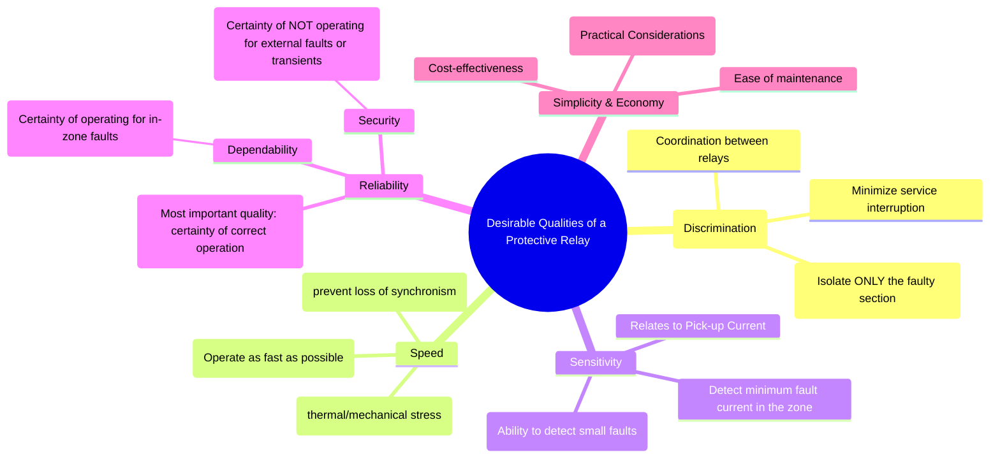

---
tags:
  - power-systems
  - power-system-protection
  - relaying
  - relay-characteristics
created: 2025-10-14
aliases:
  - Relay Qualities
  - Characteristics of Protective Relays
  - Desirable Qualities of a Protective Relay (Selectivity, Speed, Sensitivity, Reliability)
subject: "[[Power System]]"
parent:
  - Power System Protection
modified: 2026-07-23T21:27:45
---
### Desirable Qualities of a Protective Relay
#power-system-protection #relaying #relay-characteristics

> The effectiveness of a protection system is judged by how well it meets a set of fundamental requirements. These desirable qualities—Selectivity, Speed, Sensitivity, and Reliability—are the core principles guiding the design and application of any protective scheme.

---
#### 1. Selectivity (or Discrimination)
#selectivity #discrimination

Selectivity is the ability of a protective system to identify the precise location of a fault and isolate **only** the faulty section of the power system, without disturbing any healthy sections.

*   **Importance**: It is the most crucial quality for ensuring continuity of supply. A non-selective system would cause widespread outages for a single, localized fault.
*   **How it's achieved**:
    *   Properly defined [[Zones of Protection]].
    *   **Time Grading**: Relays closer to the fault operate faster than those further away.
    *   **Current Grading**: Relays are set to pick up at different current levels.
    *   Use of directional relays and differential schemes.

For example, for a fault on a distribution feeder, only the circuit breaker for that specific feeder should trip. The breakers on the main transmission line feeding the substation should remain closed.

#### 2. Speed
#relay-speed

Speed refers to the time elapsed from the moment a fault occurs to the instant the fault is cleared by the circuit breaker. The protection system, especially the relay, must operate as quickly as possible.

*   **Importance**:
    *   **Minimize Equipment Damage**: The longer a fault persists, the greater the thermal ($I^2t$) and mechanical damage to equipment like transformers and generators.
    *   **Maintain System Stability**: Fast fault clearing is essential for maintaining the synchronism of generators. A delayed fault can lead to [[Transient Stability|transient instability]] and system collapse.
    *   **Reduce Hazard**: Quickly clearing a fault minimizes the risk of fire and danger to personnel.

Typical operating times for modern relays are in the range of 1 to 3 cycles (20 to 60 ms on a 50 Hz system).

#### 3. Sensitivity
#sensitivity #pick-up-current

Sensitivity refers to the ability of a relay to detect even the smallest faults within its designated zone of protection.

*   **Measurement**: It is determined by the **pick-up current**, which is the minimum value of actuating quantity (current, voltage, etc.) at which the relay initiates operation.
*   **Relationship**: A relay is considered more sensitive if it can operate on a lower value of pick-up current.
    $$\boxed{\quad \text{Sensitivity} \propto \frac{1}{\text{Pick-up Value}} \quad}$$
*   **Importance**: The relay must be sensitive enough to detect not only severe short circuits but also high-impedance faults (e.g., a conductor falling on dry ground) which result in smaller fault currents.

#### 4. Reliability
#reliability #dependability #security

Reliability is the ability of the protection system to perform its function correctly and consistently. It is arguably the **most important quality** of a protective relay. Reliability consists of two main components:

1.  **Dependability**: The certainty that the relay will **operate correctly** for any fault within its protective zone.
    *   A lack of dependability means the protection system fails to clear a fault, requiring the [[Primary and Backup Protection|backup protection]] to operate.

2.  **Security**: The certainty that the relay will **not operate incorrectly** for any fault outside its zone or for any non-fault condition (e.g., power swings, switching surges).
    *   A lack of security leads to false or nuisance tripping of a healthy circuit, causing unnecessary supply interruption.

There is often a trade-off: making a relay extremely dependable (very sensitive) can sometimes compromise its security (making it prone to false trips), and vice-versa. A well-designed system balances both.

#### 5. Simplicity and Economy
#relaying/practical-aspects

*   **Simplicity**: The protection scheme should be as simple and straightforward as possible. A simple system is easier to design, install, maintain, and is generally more reliable.
*   **Economy**: The cost of the protection should not be excessive in relation to the cost and importance of the equipment it is protecting. For example, a multi-million dollar generator warrants a more sophisticated and expensive protection scheme than a small distribution transformer.

---
### Related Concepts
#power-system-protection/related-concepts

> [[Principles and Need for Protective Schemes]]

[[Zones of Protection]]
[[Primary and Backup Protection]]
[[Instrument Transformers (CT and PT)]]
[[Circuit Breakers]]