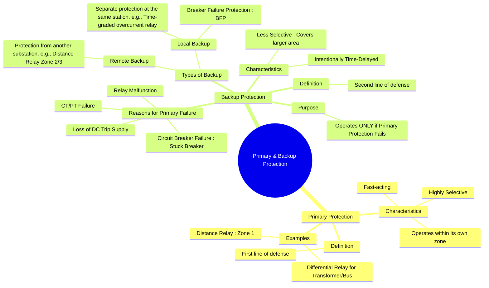

---
tags:
  - power-systems
  - power-system-protection
  - relaying
  - reliability
  - protection-coordination
created: 2025-10-14
aliases:
  - Primary Protection
  - Backup Protection
  - Protection Redundancy
subject: "[[Power System]]"
parent:
  - Power System Protection
modified: 2026-07-23T21:28:17
---
### Primary and Backup Protection
#power-system-protection #reliability #protection-coordination

> **Primary and Backup Protection** is a fundamental design philosophy that ensures the reliability of a power system's protective scheme. It involves having a main, fast-acting **primary** system and a secondary, time-delayed **backup** system that operates only in the event of the primary system's failure. This redundancy is crucial for preventing catastrophic damage and widespread outages.

---
#### Primary Protection
#primary-protection

**Primary Protection** is the first line of defense for a component within its designated [[Zones of Protection|zone of protection]]. It is designed to be the main protection and is expected to operate first.

*   **Characteristics**:
    *   **High Speed**: It clears the fault as quickly as possible (typically within milliseconds to a few cycles) to minimize damage and maintain system stability.
    *   **Selectivity**: It is highly selective, meaning it isolates *only* the faulty element.
*   **Examples**:
    *   A [[Differential Relays|percentage differential relay]] for a transformer or a busbar.
    *   Zone 1 of a [[Distance Relays|distance relay]] for a transmission line, which provides instantaneous protection for about 80-90% of the line length.

---
#### Backup Protection
#backup-protection

**Backup Protection** is a secondary system that operates to clear a fault if the primary protection fails to do so. Its operation is intentionally delayed to give the primary system sufficient time to act first.

*   **Reasons for Primary System Failure**: Backup is necessary because any component of the primary protection system can fail, including:
    1.  **Protective Relay Failure**: The relay itself might malfunction.
    2.  **[[Circuit Breakers|Circuit Breaker]] Failure**: The breaker may fail to open ("stuck breaker") after receiving a trip command.
    3.  **[[Instrument Transformers (CT and PT)|Instrument Transformer]] Failure**: Failure of a CT or PT can prevent the relay from seeing the fault correctly.
    4.  **DC Trip Supply Failure**: Most relays and breaker trip coils operate on a DC supply. Loss of this supply renders the system inoperative.
    5.  **Wiring Issues**: An open circuit in the relay trip coil or its wiring.

*   **Characteristics**:
    *   **Time-Delayed**: There is an intentional time delay to ensure it only operates after the primary protection has failed.
    *   **Less Selective**: Backup protection often clears a larger section of the power system than the primary protection would have. For example, if a line's primary protection fails, the backup protection might have to trip the entire bus feeding that line.

#### Types of Backup Protection
#backup-protection/types

1.  **Remote Backup**: The backup is provided by relays and circuit breakers at a different station, usually the next station [[upstream]].
    *   **Example**: The Zone 2 and Zone 3 protection of a [[Distance Relays|distance relay]] on Line A provides time-delayed backup protection for faults on the adjacent Line B.

2.  **Local Backup**: The backup is provided by a separate and additional protection system at the same location as the primary protection.
    *   **Example**: A time-graded [[Overcurrent Relays|inverse time overcurrent relay]] installed on the same circuit breaker as a primary differential relay.
    *   **Breaker Failure Protection (BFP)**: A specific and crucial type of local backup. If a primary relay issues a trip signal but the breaker fails to open (detected by persistent current flow), the BFP scheme sends a trip signal to *all other breakers* connected to the same bus to isolate the fault.

$$\boxed{\quad \text{Reliability (Dependability) is achieved through redundant protection schemes.} \quad}$$

---
### Related Concepts
#power-system-protection/related-concepts

> [[Principles and Need for Protective Schemes]]

[[Zones of Protection]]
[[Desirable Qualities of a Protective Relay|Desirable Qualities of a Protective Relay]]
[[Distance Relays]]
[[Overcurrent Relays]]
[[Circuit Breakers]]