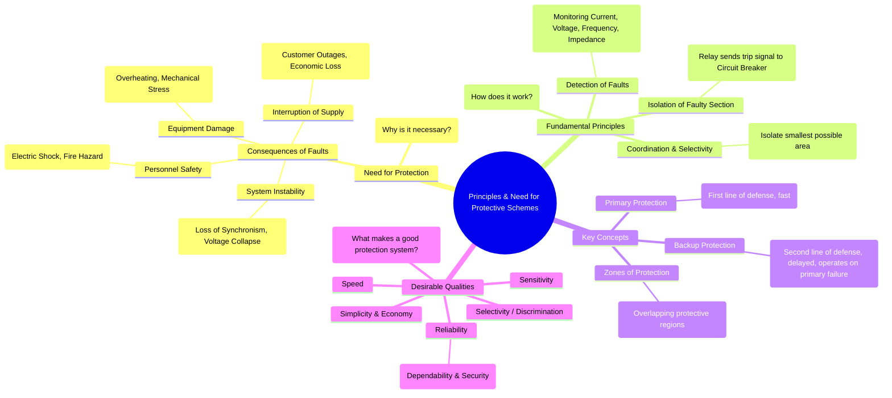

---
tags:
  - power-systems
  - power-system-protection
  - relaying
  - fault-analysis
created: 2025-10-14
aliases:
  - Protective Schemes
  - Need for Power System Protection
  - Principles of Protection
subject: "[[Power System]]"
parent:
  - Power System Protection
modified: 2026-07-23T21:28:48
---
### Principles and Need for Protective Schemes
#power-system-protection #relaying #fault-management

> A protection system is designed to detect faults or abnormal operating conditions in a power system and to initiate the rapid and selective isolation of the faulty element. Its primary goal is to ensure the safety of personnel, minimize damage to equipment, and maintain the continuity and stability of the power supply.

---
#### Need for Protective Schemes
#power-system-protection/need

An unprotected power system is unviable. Faults (like short circuits) are inevitable due to factors like lightning, insulation failure, falling trees, or human error. Without protective schemes, these faults would lead to catastrophic consequences:

*   **Damage to Equipment**: Enormous fault currents ($I_{fault}$) can be tens or hundreds of times the normal load current. This leads to:
    *   **Thermal Stress**: Extreme overheating ($I^2R$ losses) can melt conductors and destroy insulation.
    *   **Mechanical Stress**: Large electromagnetic forces can deform and damage windings of transformers and generators.
*   **Danger to Personnel**: Uncontrolled faults can cause explosions, fires, and lethal step-and-touch potentials, posing a severe risk to human life.
*   **System Instability**: A sustained fault can cause generators to lose synchronism, leading to cascading failures and widespread blackouts (system collapse).
*   **Interruption of Supply**: Damage to any component leads to prolonged outages for consumers, resulting in significant economic losses.

$$\boxed{\quad \text{Protection is not a luxury; it is a fundamental necessity for a safe and reliable power system.} \quad}$$

---
#### Key Concepts in Protection
#zones-of-protection #primary-protection #backup-protection

1.  **Zones of Protection**: The power system is divided into several distinct zones, each covered by a protective scheme (e.g., generator zone, transformer zone, busbar zone, transmission line zone).
    *   Zones are defined by the location of [[Instrument Transformers (CT and PT)|Current Transformers (CTs)]].
    *   Adjacent zones are made to **overlap** to ensure there are no unprotected areas or "blind spots." A fault in the overlap region will cause both protective schemes to operate.

2.  **Primary Protection**: This is the **first line of defense** for a component. It is designed to detect and clear a fault within its own zone of protection as quickly as possible. For example, a differential relay for a transformer provides primary protection.

3.  **Backup Protection**: This system operates only if the **primary protection fails**. The failure could be due to the relay, the circuit breaker, the DC trip supply, or instrument transformers.
    *   Backup protection is essential for reliability.
    *   It is typically slower and less selective than primary protection, often located on the adjacent line sections or at the remote end of the line.

---
#### Desirable Qualities of a Protective Relay
#relaying/qualities #selectivity #sensitivity #speed #reliability

A good protective scheme must exhibit the following fundamental characteristics:

1.  **Selectivity (or Discrimination)**
    *   The ability of the protection system to identify and isolate *only* the faulty component, leaving the rest of the healthy system in service.
    *   It ensures minimum disruption to the power system. Poor selectivity can lead to tripping healthy sections and widening the impact of a fault.

2.  **Speed**
    *   The protection system must operate as fast as possible. Rapid fault clearing is critical to:
        *   Minimize equipment damage.
        *   Prevent the fault from spreading.
        *   Maintain [[Power System Stability|power system stability]].
    *   Typical operating times range from a few milliseconds to a few cycles.

3.  **Sensitivity**
    *   The ability to detect even the smallest fault currents in its protective zone. The relay must be sensitive enough to operate reliably under minimum fault conditions.
    *   Sensitivity is related to the **pick-up current** – the minimum current at which the relay starts to operate. A lower pick-up value means higher sensitivity.

4.  **Reliability**
    *   The ability of the relay system to operate correctly when required. It is the most important quality. Reliability has two key aspects:
        *   **Dependability**: The certainty that the relay will operate correctly for faults it is designed to protect against.
        *   **Security**: The certainty that the relay will *not* operate incorrectly for conditions for which it is not supposed to operate (e.g., external faults or normal switching operations). This prevents nuisance or false tripping.

5.  **Simplicity & Economy**
    *   The protection scheme should be as simple as possible for ease of maintenance.
    *   It must be economical, providing maximum protection at minimum cost.

---
### Related Concepts
#power-system-protection/related-concepts

> [[Zones of Protection]]

[[Primary and Backup Protection]]
[[Desirable Qualities of a Protective Relay]]
[[Instrument Transformers (CT and PT)]]
[[Circuit Breakers]]
[[Fault Analysis]]