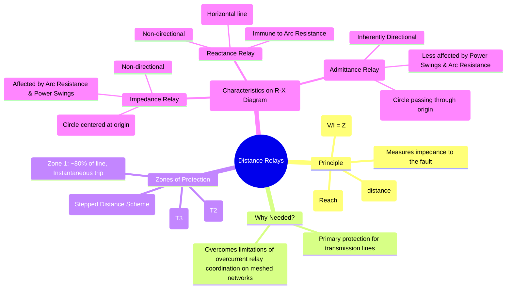

---
tags:
  - power-systems
  - power-system-protection
  - distance-protection
  - relaying
  - transmission-line-protection
created: 2025-10-14
aliases:
  - Distance Protection
  - Impedance Relay
  - Mho Relay
  - Reactance Relay
  - Distance Relays (Impedance, Reactance, Mho)
subject: "[[Power System]]"
parent:
  - Protective Relays
modified: 2026-07-23T21:29:39
---
### Distance Relays (Impedance, Reactance, Mho)
#distance-protection #impedance-relay #transmission-line-protection

> ==A **Distance Relay** is a type of protective relay whose operation is based on the ratio of voltage to current ($V/I$) at its location.== This ratio is the impedance of the line from the relay to the fault. Since the impedance of a uniform transmission line is proportional to its length, the relay effectively measures the "distance" to the fault. They are the primary protection for AC transmission lines.

---
#### Principle of Operation
#distance-protection/principle

During a fault, the relay at a substation measures the local voltage ($V_f$) and fault current ($I_f$). It then calculates the impedance to the fault:
$$Z_{fault} = \frac{V_f}{I_f}$$
The relay has a pre-set impedance setting, known as its **reach** ($Z_{set}$). If the measured impedance is less than its reach setting, the relay concludes the fault is within its protective zone and issues a trip signal.

$$\boxed{\quad \text{Trip if} \quad |Z_{fault}| < |Z_{set}| \quad}$$

> [!pyq]- PYQ : 2020
> ![[ee_2020#^q8]]

---
#### Stepped Distance Protection (Zones)
#zones-of-protection #distance-zones

To provide both fast primary protection and time-delayed backup protection, distance relays use a stepped-time distance scheme with multiple zones of protection:

*   **Zone 1**: This is an instantaneous zone set to cover about **80-90%** of the protected line's length. It is intentionally set to *underreach* to avoid tripping for faults on the adjacent bus or line, ensuring selectivity.
*   **Zone 2**: This zone is time-delayed (e.g., 0.3 - 0.5 s). It is set to cover **100%** of the protected line plus about **50%** of the shortest adjacent line. It provides primary protection for the last 10-20% of the line (the "end zone") and backup protection for the adjacent line.
*   **Zone 3**: This is a further time-delayed zone (e.g., 0.6 - 1.2 s). It is set to *overreach* and cover the protected line, 100% of the longest adjacent line, and provide remote backup protection.

---
#### Types of Distance Relays (R-X Diagram Characteristics)
#relay-characteristics #r-x-diagram

The operating characteristics of distance relays are best visualized on an **R-X impedance diagram**. The relay trips for any fault impedance that falls *inside* its characteristic shape.

##### 1. Impedance Relay
#impedance-relay
*   **Characteristic**: A circle centered at the origin of the R-X diagram with a radius equal to its reach setting, $Z_{set}$.
*   **Operation**: Trips if the magnitude of the measured impedance $|Z|$ is less than its setting, regardless of the phase angle.
*   **Drawbacks**:
    *   **Non-directional**: The circular characteristic means it will trip for faults behind it as well as in front. It requires a separate [[Directional Relays|directional unit]] to be effective.
    *   **Affected by Arc Resistance**: The resistance of the fault arc ($R_{arc}$) adds to the line resistance. This can move the measured impedance point outside the circle, causing the relay to *underreach* (fail to see a fault within its zone).
    *   **Affected by Power Swings**: During power swings, the impedance trajectory can enter the large circular characteristic, causing an unwanted trip.

---
##### 2. Reactance Relay
#reactance-relay
*   **Characteristic**: A horizontal line parallel to the R-axis, defined by $X < X_{set}$.
*   **Operation**: It measures only the reactance component of the line impedance.
*   **Key Advantage**: It is practically **immune to fault arc resistance**, as the arc is almost purely resistive. This makes it much more reliable than an impedance relay for detecting faults with high arc resistance (e.g., ground faults).
*   **Drawback**: It is also **non-directional** and requires a directional unit for supervision.

---
##### 3. Mho Relay (or Admittance Relay)
#mho-relay
*   **Characteristic**: A circle that passes through the origin of the R-X diagram. The diameter of the circle is its reach, $Z_{set}$.
*   **Operation**: It is a voltage-restrained directional relay.
*   **Key Advantages**:
    *   **Inherently Directional**: Because the characteristic passes through the origin, it only "sees" faults in the forward direction. It does not require a separate directional unit.
    *   **Less Affected by Power Swings**: Its characteristic area on the R-X diagram is much smaller than that of an impedance relay, making it less susceptible to tripping on power swings. This makes it the preferred choice for protecting long, high-voltage transmission lines.
    *   **Less Affected by Arc Resistance**: While still affected, the shape of the characteristic is more tolerant to arc resistance than a plain impedance relay.

---
##### Comparison Summary
#comparison/distance-relays 

| Relay Type        | Characteristic on R-X Diagram | Directional?            | Effect of Arc Resistance | Primary Application                               |
| ----------------- | ----------------------------- | ----------------------- | ------------------------ | ------------------------------------------------- |
| **Impedance**     | Circle centered at origin     | No (Needs separate unit) | High (can underreach)    | Medium lines (less common now)                    |
| **Reactance**     | Horizontal line               | No (Needs separate unit) | **Negligible**           | Short, highly loaded lines; ground fault protection |
| **Mho**           | Circle through the origin     | **Yes (Inherently)**    | Moderate                 | Long transmission lines; phase fault protection |

---
### Related Concepts
#distance-protection/related-concepts

> [[Protective Relays]]

[[Transmission Line Protection]]
[[Instrument Transformers (CT and PT)]]
[[Zones of Protection]]
[[Fault Calculations|Fault Analysis]]