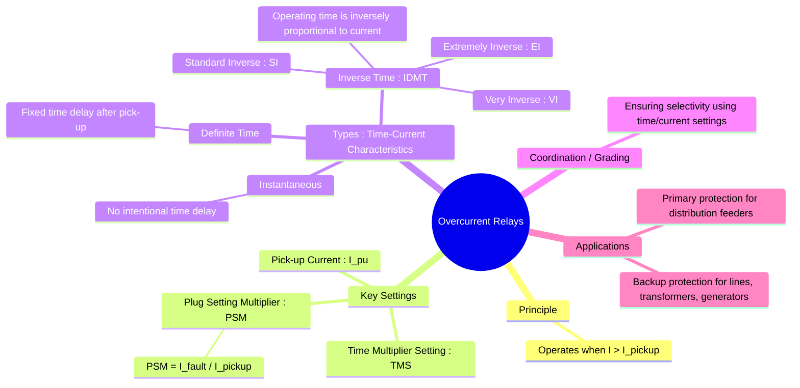

---
tags:
  - power-systems
  - power-system-protection
  - overcurrent-protection
  - relaying
  - IDMT
created: 2025-10-14
aliases:
  - Overcurrent Protection
  - OC Relay
  - Definite Time Overcurrent Relay
  - "Example : Pick-up Current"
  - Overcurrent Relays (Instantaneous, Definite Time, Inverse Time)
  - Pick-up Current
  - Plug Setting Multiplier (PSM)
  - Time Multiplier Setting (TMS)
  - Instantaneous Overcurrent Relay
  - Inverse Time Overcurrent Relays (IDMT)
subject: "[[Power System]]"
parent:
  - Protective Relays
modified: 2026-07-23T21:29:42
---
### Overcurrent Relays
#overcurrent-protection #relaying

> An **Overcurrent Relay** is a type of protective relay that operates when the magnitude of the current flowing through it exceeds a predetermined value (the pick-up value). It is the most fundamental, cheapest, and widely used form of protection, especially in distribution systems and as backup protection for other power system elements.

![[Overcurrent Relay.png]]

---
#### Key Settings and Terminology
#relay-settings #psm #tms

The operation of an overcurrent relay is governed by two primary settings: the current setting and the time setting.

1.  **Pick-up Current ($I_{pickup}$)**: This is the minimum current at which the relay starts to operate. It is set by adjusting the **Plug Setting (PS)** on the relay.
    $$\boxed{\quad I_{pickup} = (\text{Plug Setting}) \times (\text{Rated CT Secondary Current}) \quad}$$
    For example, for a relay connected to a 100/5 A CT, with a plug setting of 125% (or 1.25), the pick-up current is $I_{pickup} = 1.25 \times 5 A = 6.25 A$ (in the secondary).

2.  **Plug Setting Multiplier (PSM)**: This is a normalized value that indicates the severity of the fault current relative to the pick-up setting. It is used to determine the operating time from the relay's characteristic curve.
    $$\boxed{\quad \text{PSM} = \frac{\text{Fault Current in Relay Coil (Secondary)}}{\text{Pick-up Current } (I_{pickup})} \quad}$$

3.  **Time Multiplier Setting (TMS)**: This is an adjustable setting (typically from 0.1 to 1.0) that controls the operating time. It effectively moves the time-current curve up or down without changing its shape. A lower TMS results in a faster operating time.

---
#### Types of Overcurrent Relays
#relay-characteristics

Overcurrent relays are classified based on their time-current characteristics:

#### 1. Instantaneous Overcurrent Relay
#instantaneous-relay

This relay has no intentional time delay. It operates in a very short time (typically less than 0.1 seconds) as soon as the current reaches the pick-up value.
*   **Setting**: Only has a pick-up current setting.
*   **Characteristic**: A horizontal line on a Time-Current graph.
*   **Application**: Used for very high levels of fault current where instantaneous tripping is required, such as the high-set element in a feeder protection scheme.

#### 2. Definite Time Overcurrent Relay
#definite-time-relay

This relay operates after a fixed, pre-set time delay once the current exceeds the pick-up value. The operating time is constant and independent of the magnitude of the fault current.
*   **Settings**: Pick-up current and Time delay.
*   **Characteristic**: A step function on a Time-Current graph.
*   **Application**: Used where time coordination is required, but its application is limited as it doesn't clear more severe faults any faster.

#### 3. Inverse Time Overcurrent Relays (IDMT)
#inverse-time-relay #idmt

This is the most common type of overcurrent relay. Its operating time is inversely proportional to the fault current. This is a highly desirable characteristic: the larger the fault current, the faster the relay operates.
*   **IDMT**: The name stands for **Inverse Definite Minimum Time**, because the operating time becomes nearly constant (a definite minimum) at very high fault currents.
*   **Operating Time Equation**: The time of operation ($T_{op}$) is given by a standard formula:
    $$\boxed{\quad T_{op} = \frac{k \times (\text{TMS})}{(\text{PSM})^n - 1} \quad}$$
    where the constants `k` and `n` define the steepness of the characteristic curve.

*   **Standard IEC Curves**:
    1.  **Standard Inverse (SI)**: ($k=0.14, n=0.02$). The most common characteristic, used for coordinating relays in distribution and transmission systems.
    2.  **Very Inverse (VI)**: ($k=13.5, n=1.0$). Has a steeper slope. Useful on feeders where fault current drops significantly as the fault moves away from the source.
    3.  **Extremely Inverse (EI)**: ($k=80, n=2.0$). Has the steepest slope. Ideal for protecting equipment that is sensitive to overheating from overcurrents, such as cables, motors, and transformers. Its characteristic is close to an $I^2t$ curve.

---
### Related Concepts
#power-system-protection/related-concepts

> [[Protective Relays]]

[[Instrument Transformers (CT and PT)]]
[[Circuit Breakers]]
[[Fault Analysis]]
[[Directional Relays]]
[[Primary and Backup Protection]]
