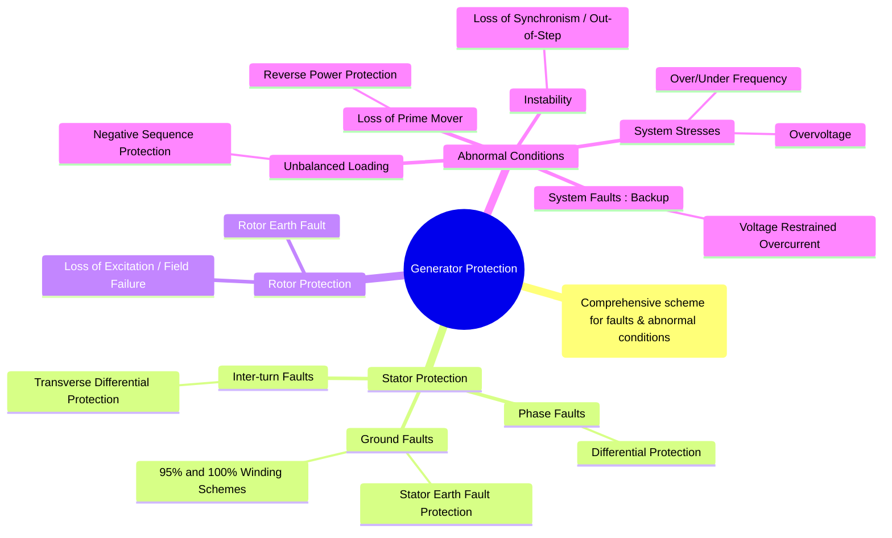

---
tags:
  - power-systems
  - power-system-protection
  - generator
  - protection-schemes
created: 2025-10-14
aliases:
  - Alternator Protection
  - Synchronous Generator Protection
subject: "[[Power System]]"
parent:
  - Protection Schemes
modified: 2026-07-23T21:30:14
---
### Generator Protection
#generator-protection #protection-schemes

> Generator protection is a comprehensive and sophisticated scheme designed to protect a generator from internal faults, external faults, and abnormal operating conditions. Due to the high cost and critical importance of generators, their protection systems must be highly sensitive, fast, selective, and reliable, employing multiple specialized relays to cover all possible contingencies.

---
#### Stator Protection
#stator-protection

The stator winding is susceptible to phase-to-phase, phase-to-ground, and inter-turn faults.

1.  **Longitudinal Differential Protection (ANSI 87G)**
    *   **Purpose**: This is the primary protection for stator phase-to-phase and multi-phase-to-ground faults. It provides fast and selective protection for the entire stator winding.
    *   **Principle**: It uses a [[Differential Relays|percentage biased differential relay]] that compares the currents at the neutral and terminal ends of each phase winding. A difference in current indicates an internal fault. It is highly sensitive and operates instantaneously.

2.  **Stator Earth Fault Protection**
    *   **Challenge**: Most large generators are high-impedance grounded (usually via a resistor or distribution transformer) to limit ground fault current and damage. This low fault current makes standard differential or overcurrent relays insensitive to ground faults.
    *   **95% Winding Protection**: The most common scheme involves a distribution transformer with its primary connected across the neutral grounding resistor. The secondary is connected to a voltage relay. Under normal conditions or phase faults, no current flows through the grounding resistor, and the voltage is zero. For a ground fault, a voltage appears, and the relay operates. This scheme effectively protects about 95% of the winding from the terminals but leaves a 5% "dead zone" near the neutral.
    *   **100% Winding Protection**: To cover the dead zone near the neutral, special schemes are used, often based on measuring the **third harmonic voltage** at the generator's neutral and terminals.

---
#### Rotor Protection
#rotor-protection

The rotor circuit is a DC system, so the main faults are ground faults and loss of the field supply.

1.  **Rotor Earth Fault Protection (ANSI 64F)**
    *   **Problem**: A single ground fault on the DC field winding does not draw a fault current, as there is no return path. However, a second ground fault will short-circuit a portion of the field winding, creating a magnetic imbalance that can lead to catastrophic mechanical vibrations.
    *   **Protection**: The scheme detects the *first* ground fault to provide an alarm, allowing the operator to shut down the unit safely before a second fault occurs. This is often done by injecting a small AC or DC voltage into the field circuit and monitoring for leakage current.

2.  **Loss of Excitation / Field Failure (ANSI 40)**
    *   **Problem**: If the DC field supply is lost, the generator loses its synchronizing torque. It speeds up slightly, acts as an induction generator, and starts drawing a large amount of reactive power from the grid. This can damage the rotor end-rings due to induced currents and can cause system voltage instability.
    *   **Protection**: Detected by a [[Distance Relays|Mho relay]] (offset mho characteristic) looking into the generator terminals from the grid. When excitation is lost, the impedance trajectory moves into the relay's characteristic in the 3rd and 4th quadrants of the R-X diagram.

---
#### Protection against Abnormal Operating Conditions
#generator-protection/abnormal-conditions

1.  **Unbalanced Loading (Negative Sequence Protection - ANSI 46)**
    *   **Problem**: Unbalanced loads or unsymmetrical faults create negative sequence currents. These currents produce a magnetic field rotating in the *opposite* direction to the rotor, inducing currents in the rotor body at **double the system frequency (100/120 Hz)**. This causes rapid and severe overheating of the rotor.
    *   **Protection**: A negative sequence current relay with an inverse time characteristic is used, which models the thermal withstand capability of the rotor ($I_2^2t = K$).

2.  **Loss of Prime Mover (Reverse Power Protection - ANSI 32)**
    *   **Problem**: If the input to the prime mover (e.g., steam to a turbine) is lost, the generator stops supplying power to the grid and instead starts drawing power *from* the grid, acting as a synchronous motor to drive the turbine. This is called **motoring**. Motoring can severely damage turbine blades due to overheating.
    *   **Protection**: A sensitive directional power relay is used to detect the small reverse flow of real power ($kW$) into the machine.

3.  **Backup Protection for System Faults (Voltage-Restrained OC - ANSI 51V)**
    *   **Purpose**: To provide time-delayed backup protection for uncleared external faults on the grid.
    *   **Principle**: A simple overcurrent relay is not suitable because a generator's sustained fault current can be low. A **voltage-restrained** or **voltage-controlled** overcurrent relay is used. Its pick-up current setting decreases as the terminal voltage drops, making it more sensitive for nearby faults.

4.  **Loss of Synchronism (Out-of-Step Protection - ANSI 78)**
    *   **Problem**: Severe system disturbances can cause the generator to lose synchronism with the grid (pole slipping). This results in large current and power surges, which can cause mechanical damage and system instability.
    *   **Protection**: An impedance-based relay scheme is used to detect the rapid and wide oscillations in the impedance seen by the generator during out-of-step conditions.

---
### Related Concepts
#generator-protection/related-concepts

> [[Differential Relays]]

[[Distance Relays]]
[[Directional Relays]]
[[Overcurrent Relays]]
[[Concept of Symmetrical Components]]
[[Classification of Power System Stability|Power System Stability]]