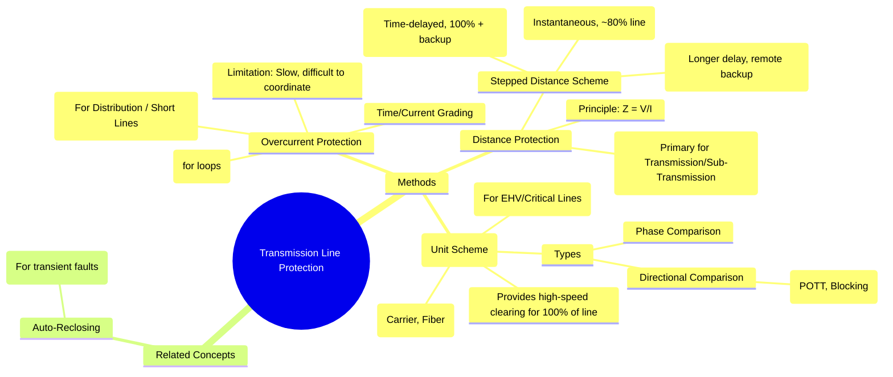

---
tags:
  - power-systems
  - power-system-protection
  - transmission-line
  - distance-protection
  - carrier-protection
created: 2025-10-14
aliases:
  - Line Protection
  - Transmission Line Relaying
  - Transmission Line Protection (Overcurrent, Distance, Carrier Current)
subject: "[[Power System]]"
parent:
  - Protection Schemes
modified: 2026-07-23T21:30:37
---
### Transmission Line Protection
#transmission-line-protection #protection-schemes

> ==**Transmission Line Protection** involves schemes designed to detect and isolate faults on transmission lines quickly and selectively.== The choice of protection depends on the line's voltage level, length, and importance in the power grid. The primary goals are to maintain system stability, minimize equipment damage, and ensure continuity of supply.

---
#### 1. Overcurrent Protection
#overcurrent-protection #line-protection

This is the simplest form of line protection, suitable for radial distribution feeders and some sub-transmission lines.
*   **Principle**: Uses [[Overcurrent Relays|overcurrent relays]] that trip when the current exceeds a set value.
*   **Coordination**: In a series network, selectivity is achieved by **time grading**, where relays further from the source have shorter operating times.
*   **Limitations in Networks**:
    *   For parallel or ring main systems, fault current can flow in both directions. Therefore, **[[Directional Relays|directional overcurrent relays]]** are essential to achieve selectivity.
    *   Coordination becomes very difficult and results in slow tripping times for faults near the source substations.
    *   It is not suitable for important high-voltage lines where fast fault clearing is critical for stability.

---
#### 2. Distance Protection
#distance-protection #line-protection

Distance protection is the primary method for protecting high-voltage transmission and sub-transmission lines. It is faster and more selective than overcurrent protection for meshed networks.
*   **Principle**: It uses a [[Distance Relays|distance relay]] that measures the impedance ($Z = V/I$) to the fault. Since line impedance is proportional to its length, the relay determines if a fault is inside its protected zone (its "reach").
*   **Stepped Distance Scheme**: To provide full coverage and backup, a time-stepped scheme with multiple zones is used:

    *   **Zone 1**: An instantaneous zone covering **80% to 90%** of the protected line's length.
        *   **Purpose**: Provides high-speed clearing for most internal faults. It is set to underreach to avoid interfering with the protection of the adjacent busbar or line.
        *   **Operating Time**: Instantaneous (no intentional delay).

    *   **Zone 2**: A time-delayed zone covering **100% of the protected line plus about 50%** of the shortest adjacent line.
        *   **Purpose**: Protects the remaining 10-20% of the line (the "end zone") not covered by Zone 1 and provides backup for the adjacent line.
        *   **Operating Time**: Delayed, typically $0.3 - 0.5$ seconds.

    *   **Zone 3**: A further time-delayed zone covering **100% of the protected line plus 100%** of the longest adjacent line.
        *   **Purpose**: Provides remote backup for faults on adjacent lines if their primary protection fails.
        *   **Operating Time**: Longer delay, typically $0.6 - 1.2$ seconds.

$$\boxed{\quad \text{Distance protection provides fast (Zone 1) and time-delayed backup (Zone 2/3) protection.} \quad}$$

---
#### 3. Pilot Protection (Carrier-Aided Distance Protection)
#pilot-protection #carrier-protection

For critical EHV (Extra High Voltage) lines, even the Zone 2 time delay (for end-zone faults) is too long and can jeopardize system stability. Pilot protection is a **unit scheme** that uses a high-speed communication channel (the "pilot") to send information between the relays at both ends of the line. This allows for **instantaneous tripping for faults anywhere on the 100% length of the line.**

The pilot channel can be Power Line Carrier (PLC), microwave radio, or fiber optic cable.

*   **Principle**: The relays at both ends communicate to jointly decide if a fault is internal or external.
*   **Common Schemes**:
    1.  **Directional Comparison Schemes**: Use the distance relay's directional element.
        *   **Permissive Overreach Transfer Trip (POTT)**: The Zone 2 element is used. If a relay sees a fault in its forward-looking Zone 2 (overreaching), it sends a "permissive" signal to the remote end. It will only trip instantaneously if it both sees the fault *and* receives a permissive signal from the remote end. This ensures that instantaneous tripping only occurs for internal faults.
        *   **Blocking Scheme**: The relay is set to trip instantaneously for any forward fault (overreaching Zone 2), *unless* it receives a "blocking" signal from the remote end. The remote relay sends a block signal if it sees the fault in its reverse direction (i.e., an external fault).

    2.  **Phase Comparison Scheme**: Compares the phase angle of the current at both ends of the line. For an internal fault, the currents are roughly in phase, while for an external fault, they are roughly 180° out of phase.

---
#### Auto-Reclosing
#auto-reclosing

A significant majority (over 80%) of faults on overhead transmission lines are transient (e.g., lightning flashover, temporary tree contact). An **auto-recloser** is a device that automatically recloses the circuit breaker after it has tripped for a fault.
*   If the fault was transient, the arc will have extinguished, and the line will be successfully re-energized.
*   If the fault is permanent, the protection will trip the breaker again, and it will lock out until manually reset. This greatly improves service continuity.

---
### Related Concepts
#transmission-line-protection/related-concepts

> [[Distance Relays]]

[[Overcurrent Relays]]
[[Directional Relays]]
[[Circuit Breakers]]
[[Classification of Power System Stability]]
