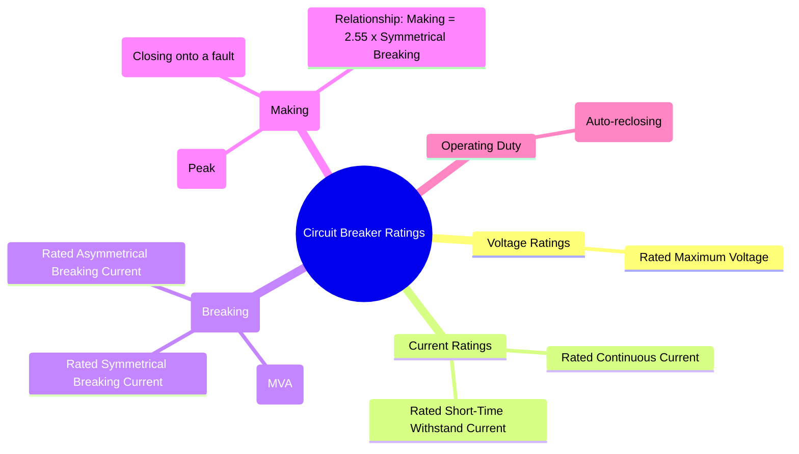

---
tags:
  - power-systems
  - power-system-protection
  - circuit-breaker
  - switchgear
  - ratings
created: 2025-10-14
aliases:
  - Circuit Breaker Ratings
  - Breaker Ratings
  - Circuit Breaker Ratings (Rated Voltage, Current, Breaking Capacity)
subject: "[[Power System]]"
parent:
  - Circuit Breakers
modified: 2026-07-23T21:30:44
---
### Circuit Breaker Ratings
#circuit-breaker #ratings #switchgear

> **Circuit Breaker Ratings** are a set of standardized specifications that define the operational limits and capabilities of a circuit breaker. These ratings are crucial for the proper selection and application of a breaker to ensure it can safely carry load current, withstand fault currents, and successfully interrupt fault currents without being damaged.

---
#### Rated Voltage
#breaker-rating/voltage

*   **Rated Maximum Voltage**: This is the highest RMS line-to-line voltage at which the breaker is designed to operate. It defines the insulation level of the breaker. A breaker can be used at any system voltage up to this maximum value.

---
#### Rated Current
#breaker-rating/current

*   **Rated Continuous Current**: The maximum RMS current that the breaker can carry continuously without exceeding the specified temperature rise limits for its components.
*   **Rated Short-Time Withstand Current**: The RMS value of the current that the breaker can carry for a specified short duration (typically 1 or 3 seconds) without suffering damage. This rating is determined by the breaker's ability to withstand the thermal ($I^2t$) and mechanical stresses of a through-fault.

---
#### Rated Breaking Capacity (Interrupting Capacity)
#breaking-capacity

This is the most critical rating of a circuit breaker. It specifies the maximum fault current that the breaker is capable of interrupting at its rated voltage. It is expressed in two ways:

1.  **Rated Symmetrical Breaking Current ($I_{symm}$)**: The maximum RMS value of the symmetrical AC component of the short-circuit current that the breaker can interrupt.

2.  **Rated Asymmetrical Breaking Current ($I_{asymm}$)**: The maximum RMS value of the total short-circuit current (including the DC offset) that the breaker can interrupt.
    $I_{asymm} = \sqrt{I_{symm}^2 + I_{DC}^2}$

The breaking capacity is often expressed in **MVA**:
$$\boxed{\quad \text{Symmetrical Breaking Capacity (MVA)} = \sqrt{3} \times V_L \times I_{symm} \quad}$$
where $V_L$ is the rated line voltage (in kV) and $I_{symm}$ is the rated symmetrical breaking current (in kA).

---
#### Rated Making Capacity
#making-capacity

This rating relates to the ability of the breaker to **close onto a pre-existing fault**. When closing, the breaker must withstand the enormous electromagnetic forces generated by the first peak of the fault current, which is highly asymmetrical due to the maximum possible DC offset.
*   **Rated Making Current**: This is defined as the **peak value** (not RMS) of the first cycle of the current wave that the breaker can safely close against.

The mechanical stresses are proportional to the square of the instantaneous current ($F \propto i^2$), so the peak value is the limiting factor.

*   **Relationship between Making and Breaking Current**:
    The making current is significantly higher than the breaking current due to the full asymmetry. For a standard power system, the relationship is:
    $$\boxed{\quad \text{Rated Making Current (Peak)} = 2.55 \times \text{Rated Symmetrical Breaking Current (RMS)} \quad}$$
    The factor 2.55 arises from:
    *   $\sqrt{2}$ to convert the RMS symmetrical current to its peak value.
    *   $1.8$ as a factor to account for the maximum possible DC offset at the instant of closing ([[doubling effect]]).
    *   Therefore, $1.8 \times \sqrt{2} \approx 2.55$.

---
#### Rated Operating Duty (Operating Sequence)
#operating-duty

This rating defines the sequence of opening and closing operations that the breaker can perform under specified conditions. It is related to the breaker's ability to handle multiple operations, especially in [[Transmission Line Protection|auto-reclosing]] schemes.
*   A typical duty cycle is specified as:
    **O - t - CO - t' - CO**
    where:
    *   **O** = Open operation
    *   **CO** = Close followed immediately by an Open operation
    *   **t, t'** = Time intervals (e.g., t = 0.3s, t' = 3 min)
    This means the breaker can perform an open, wait 0.3s, perform a close-open, wait 3 minutes, and perform another close-open, all while operating at its rated breaking capacity.

---
### Related Concepts
#circuit-breaker/related-concepts

> [[Circuit Breakers]]

[[Types of Circuit Breakers]]
[[Principle of Arc Extinction]]
[[Fault Analysis]]
[[Per-Unit System]]