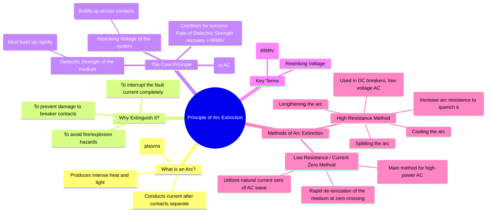

---
tags:
  - power-systems
  - power-system-protection
  - circuit-breaker
  - arc-phenomenon
  - fault-clearing
created: 2025-10-14
aliases:
  - Arc Quenching
  - Arc Interruption
subject: "[[Power System]]"
parent:
  - Circuit Breakers
modified: 2026-07-23T21:31:13
---
### Principle of Arc Extinction
#arc-extinction #circuit-breaker #fault-interruption

> The **Principle of Arc Extinction** is the process by which a circuit breaker stops the flow of current by de-ionizing the conducting plasma (the arc) that forms between its separating contacts. Successful arc extinction is a race between the recovery of the insulating properties of the medium and the voltage stress imposed by the power system across the contacts.

---
#### What is an Arc?
#arc 

When the contacts of a circuit breaker separate under a heavy fault current, the current continues to flow through a column of ionized gas, or plasma. This is the **electric arc**. The arc generates immense heat, which keeps the medium between the contacts ionized and conductive. To interrupt the circuit, this conductive path must be eliminated.

---
#### The Race at Current Zero (AC Circuits)
In AC circuits, the current naturally passes through zero twice per cycle. This **current zero** provides a critical opportunity to extinguish the arc. At this instant, the arc momentarily ceases, and heat generation stops. The goal is to prevent the arc from re-igniting in the next half-cycle.

This leads to a "race" between two competing phenomena:

1.  **Recovery of Dielectric Strength**: In the brief moment at current zero, the circuit breaker actively de-ionizes the medium in the contact gap (by cooling, sweeping away ions, etc.). The insulating capability, or **dielectric strength**, of the medium begins to recover rapidly.

2.  **Restriking Voltage**: Immediately after the current is interrupted, the power system's voltage reappears across the open contacts. This voltage, known as the **Transient Recovery Voltage (TRV)** or **Restriking Voltage**, is often oscillatory and rises very quickly.

The arc will be extinguished successfully only if the rate of recovery of the dielectric strength of the medium is faster than the rate at which the restriking voltage rises.

$$\boxed{\quad \text{Condition for Arc Extinction: } \frac{d(\text{Dielectric Strength})}{dt} > \frac{d(\text{Restriking Voltage})}{dt} \quad}$$

*   **Restriking Voltage**: This is the transient voltage appearing across the breaker contacts. For a simple lossless LC circuit, it is given by:
    $$\begin{align}
    v_r(t) = V_m (1 - \cos(\omega_n t))
    \end{align}$$
    where $V_m$ is the peak system voltage and $\omega_n = 1/\sqrt{LC}$ is the natural frequency of oscillation.

*   **Rate of Rise of Restriking Voltage (RRRV)**: This is the initial steepness of the restriking voltage. A high RRRV is more difficult for the breaker to handle.
    $$\boxed{\quad \text{RRRV} = \left. \frac{dv_r}{dt} \right|_{t=0^+} = V_m \omega_n \sin(\omega_n t)|_{t=0^+} \approx V_m \omega_n \quad}$$

---
#### Methods of Arc Extinction
There are two fundamental methods to ensure the dielectric strength wins the race.

#### 1. High Resistance Method
The principle here is to increase the resistance of the arc ($R_{arc}$) to such a high value that the current is reduced to a level too low to sustain it. The arc resistance is increased by:
*   **Lengthening the Arc**: Increasing the gap between contacts increases the resistance.
*   **Cooling the Arc**: Cooling helps the ionized particles recombine into neutral molecules, increasing resistance.
*   **Splitting the Arc**: Using "arc splitters" to break a single arc into multiple smaller arcs in series. The total arc voltage increases, and cooling is more effective.
*   **Constricting the Arc**: Reducing the cross-sectional area of the arc increases its resistance.
**Application**: This method is primarily used for interrupting low currents and in DC circuit breakers and low-voltage AC breakers (like MCBs).

#### 2. Low Resistance or Current Zero Method
This is the predominant method used in high-voltage AC circuit breakers. It focuses entirely on the events around the natural current zero. The arc resistance is kept low until the current zero instant to minimize the energy dissipated. Then, at current zero, de-ionization of the medium is forced by external means.
*   **Air-Blast Circuit Breaker**: A high-pressure blast of compressed air is directed at the arc to cool it and sweep away the ionized particles.
*   **Oil Circuit Breaker**: The heat of the arc decomposes the surrounding insulating oil, producing a turbulent flow of hydrogen gas, which has excellent cooling properties.
*   **Sulphur Hexafluoride (SF6) Circuit Breaker**: SF6 is a highly electronegative gas. It rapidly absorbs free electrons in the arc path, forming heavy, immobile negative ions, which quickly restores the dielectric strength.
*   **Vacuum Circuit Breaker**: The contacts separate in a high vacuum. At current zero, there are very few molecules to ionize, so the dielectric strength recovers almost instantaneously.

---
### Related Concepts
#arc-extinction/related-concepts

> [[Types of Circuit Breakers]]

[[Circuit Breaker Ratings]]
[[Fault Calculations|Fault Analysis]]