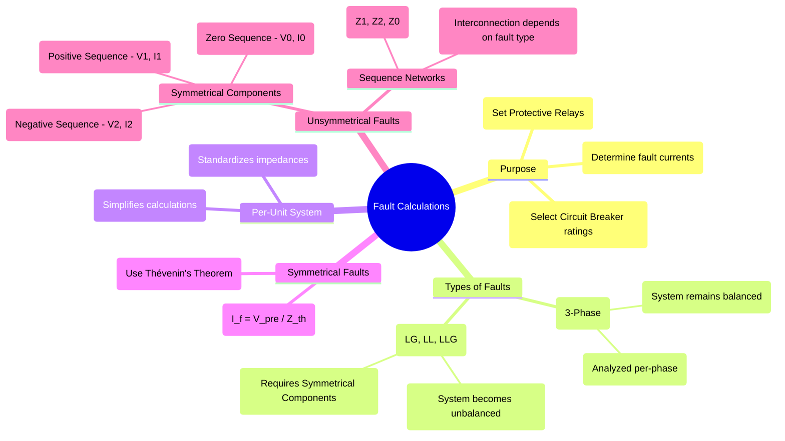

---
tags:
  - power-systems
  - fault-analysis
  - symmetrical-components
  - short-circuit
  - protection
created: 2025-09-14
aliases:
  - Fault Analysis
  - Short-Circuit Calculations
  - Short-Circuit Analysis
subject: "[[Power System]]"
parent:
  - Power System Analysis
modified: 2026-07-23T21:34:21
---
### Fault Calculations (Short-Circuit Analysis)
#fault-analysis #short-circuit

> **Fault Analysis** is the process of calculating the voltages and currents in a power system during abnormal (fault) conditions. ==A fault is any failure that interferes with the normal flow of current, most commonly a short circuit.== These calculations are critical for the safe and reliable design and operation of a power system.

---
#### Purpose of Fault Analysis
#protection-engineering #equipment-rating

The primary objectives of performing fault calculations are:
1. **To Determine Fault Currents**: To find the maximum and minimum short-circuit currents that can flow at various points in the system.
2. **To Rate Equipment**: To select appropriate ratings for equipment like **circuit breakers** (interrupting capacity), fuses, busbars, and switches, ensuring they can withstand the thermal and mechanical stresses of a fault.
3. **To Set Protective Relays**: To provide the necessary data for setting and coordinating protective devices like [[Distance Relays]] and [[Overcurrent Relays]] to ensure they operate selectively and quickly.

---
#### Types of Faults
#symmetrical-fault #unsymmetrical-fault

1. **[[Analysis of Symmetrical Faults|Symmetrical Faults]]**: A **three-phase fault (3-Φ)** is the only type of symmetrical fault. All three phases are short-circuited together. Although it is the least common fault type (~5% of faults), it is the most severe and is used to determine the maximum interrupting rating of circuit breakers. It can be analyzed using a simple per-phase equivalent circuit.
2. **[[Unsymmetrical Faults]]**: These faults cause the system to become unbalanced. They are analyzed using the method of **[[Concept of Symmetrical Components|symmetrical components]]**.
    * **[[Analysis of Single Line-to-Ground (LG) Fault|Single Line-to-Ground (LG)]]**: Most common fault type (~70%).
    * **[[Analysis of Double Line-to-Ground (LLG) Fault|Double Line-to-Ground (LLG)]]**: Second most common (~15%).
    * **[[Analysis of Line-to-Line (LL) Fault|Line-to-Line (LL)]]**: Less common (~10%).

---
#### Symmetrical Fault Analysis

> [!related]
> This analysis is performed using the [[Per-Unit System]] and [[Thevenin's Theorem]].

* **Procedure**:
    1. Draw the per-unit impedance diagram of the system.
    2. Determine the Thevenin equivalent impedance ($Z_{th}$ or $Z_{eq}$) as seen from the fault point.
    3. The pre-fault voltage is typically assumed to be 1.0 p.u.
* **Fault Current Calculation**: $$\boxed{\quad I_{fault} (p.u.) = \frac{V_{pre-fault} (p.u.)}{Z_{th} (p.u.)} \quad}$$
    The actual fault current in Amperes is $I_{fault} (Amps) = I_{fault} (p.u.) \times I_{base}$.
* **Short-Circuit MVA (SC MVA)**: $$\boxed{\quad \text{SC MVA} = \frac{\text{Base MVA}}{Z_{th} (p.u.)} = \sqrt{3} \times V_{L,pre-fault}(kV) \times I_{fault}(kA) \quad}$$

> [!refer]
> [[Short Circuit MVA]]

---
#### Unsymmetrical Fault Analysis: Symmetrical Components
#symmetrical-components #sequence-networks

> [!refer]
> [[Concept of Symmetrical Components]]

An unbalanced set of three-phase phasors ($V_a, V_b, V_c$) can be resolved into three balanced sets of phasors, called symmetrical components:
1. **Positive Sequence Components ($V_1, I_1$)**: A balanced three-phase set with the same phase sequence as the original system (a-b-c).
2. **Negative Sequence Components ($V_2, I_2$)**: A balanced three-phase set with the opposite phase sequence (a-c-b).
3. **Zero Sequence Components ($V_0, I_0$)**: Three phasors that are equal in magnitude and phase. Zero sequence currents can only flow if there is a path to ground.

##### Sequence Networks
#sequence-network 

For an unsymmetrical fault, the power system is resolved into three separate **sequence networks** (positive, negative, and zero), which are then interconnected at the fault point according to the fault type.
* **Positive Sequence Network (Z1)**: The standard per-phase impedance diagram, including generator EMFs.
* **Negative Sequence Network (Z2)**: Has impedances similar to Z1, but all EMF sources are shorted.
* **Zero Sequence Network (Z0)**: Its topology depends heavily on system grounding and transformer connections (e.g., a Delta winding blocks the flow of zero-sequence current).

---
##### Interconnection for Faults on Phase 'a'

(Assuming a pre-fault voltage $V_f$ and fault impedance $Z_f$)
* **[[Analysis of Single Line-to-Ground (LG) Fault|Single Line-to-Ground (LG) Fault]]**: The three sequence networks are connected in **series**.
    $$\boxed{\quad I_{a1} = I_{a2} = I_{a0} = \frac{V_{f}}{Z_1 + Z_2 + Z_0 + 3Z_f} \quad}$$
    The total fault current is $I_f = I_a = I_{a1} + I_{a2} + I_{a0} = 3I_{a0}$.
* **[[Analysis of Line-to-Line (LL) Fault|Line-to-Line (LL) Fault]]**: Positive and negative networks are in **parallel**.
    $$\boxed{\quad I_{a1} = -I_{a2} = \frac{V_{f}}{Z_1 + Z_2 + Z_f} \quad ; \quad I_{a0} = 0 \quad}$$
* **[[Analysis of Double Line-to-Ground (LLG) Fault|Double Line-to-Ground (LLG) Fault]]**: Positive network is in series with the parallel combination of negative and zero networks.
    $$\boxed{\quad I_{a1} = \frac{V_{f}}{Z_1 + \frac{Z_2(Z_0+3Z_f)}{Z_2+Z_0+3Z_f}} \quad}$$

---
### Related Concepts
#related-concepts

> [[Power System Protection]]

[[Per-Unit System]]
[[Synchronous Machines]] (Provides reactances $X_d'', X_d', X_d$ for fault studies)
[[Transformers]] (Their connections determine the zero-sequence network topology)
[[Network Theorems]] (Thevenin's theorem is fundamental to fault analysis)