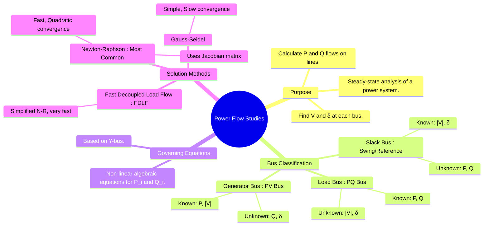

---
tags:
  - power-systems
  - power-flow
  - load-flow
  - newton-raphson
  - gauss-seidel
  - y-bus
created: 2025-09-08
aliases:
  - Load Flow Analysis
  - Power Flow Analysis
subject: "[[Power System]]"
parent:
  - Power System Analysis
trends:
  - "[[trends - Power Flow & Related]]"
modified: 2026-07-22T21:10:24
---
### Power Flow Studies (Load Flow Analysis)
#power-flow #load-flow-analysis

> A **Power Flow Study** (or Load Flow Analysis) is a fundamental and essential tool for the ==analysis of a power system in its **normal steady-state operating condition**==. It is ==used to determine the complete voltage profile (magnitude and phase angle) of the system, as well as the real and reactive power flowing through all transmission lines, transformers, and other components==.

==This analysis is crucial for power system planning, operation, [[Economic Load Dispatch (ELD) neglecting losses|economic dispatch]], and contingency analysis.==

---
#### Bus Classification
#slack-bus #pq-bus #pv-bus

> [!refer]
> [[Bus Classification (Slack, PQ, PV)]]

The power flow problem involves solving a set of non-linear algebraic equations. To set up a solvable problem, we must specify four quantities at each bus: $P, Q, |V|, \delta$. However, at any given bus, only two of these four quantities are known beforehand. The other two are the unknowns to be solved. Buses are classified based on which two quantities are specified.

1.  **Slack Bus (or Swing/Reference Bus)**:
    *   **Known**: $|V|$ and $\delta$. (Angle $\delta$ is typically set to $0^\circ$).
    *   **Unknown**: $P$ and $Q$.
    *   **Function**: There is only **one** slack bus in a system. It acts as the reference for all other bus angles. Physically, it is usually a large generator that compensates for the system's transmission losses ($P_{loss}, Q_{loss}$) by supplying the difference between the total scheduled generation and the total load.

2.  **Load Bus (or PQ Bus)**:
    *   **Known**: $P$ (real power demand) and $Q$ (reactive power demand).
    *   **Unknown**: $|V|$ and $\delta$.
    *   **Function**: These are the most common type of buses, representing points of consumption in the network.

3.  **Generator Bus (or PV Bus / Voltage-Controlled Bus)**:
    *   **Known**: $P$ (==scheduled real power generation==) and $|V|$ (desired voltage magnitude).
    *   **Unknown**: $Q$ (reactive power generation) and $\delta$.
    *   **Function**: These buses represent generators where the terminal voltage is maintained at a constant value by an [[Automatic Voltage Regulator (AVR)]]. The reactive power $Q$ is adjusted by the generator to maintain this voltage, but it has upper and lower limits ($Q_{min} \le Q \le Q_{max}$). If a limit is violated during the solution process, the bus is treated as a PQ bus.

> [!pyq]- PYQ : 2020
> ![[ee_2020#^q9]]

---
#### Power Flow Equations
#power-flow-equations

The governing equations are derived from the [[Bus Admittance Matrix|Y-bus matrix]] relationship, $\mathbf{I} = \mathbf{Y}\mathbf{V}$. The complex power injected at bus 'i' is:
$$S_i = P_i + jQ_i = V_i I_i^*$$
This leads to the non-linear real and reactive power equations for each bus 'i':
$$\boxed{\quad P_i = |V_i| \sum_{j=1}^{N} |V_j| (G_{ij} \cos(\delta_i - \delta_j) + B_{ij} \sin(\delta_i - \delta_j)) \quad}$$
$$\boxed{\quad Q_i = |V_i| \sum_{j=1}^{N} |V_j| (G_{ij} \sin(\delta_i - \delta_j) - B_{ij} \cos(\delta_i - \delta_j)) \quad}$$
These equations must be solved for the unknown $|V|$ and $\delta$ at each bus.

---
#### Numerical Solution Methods
#newton-raphson #gauss-seidel

Since the power flow equations are non-linear, they must be solved using iterative numerical techniques.

1.  **Gauss-Seidel (G-S) Method**:
    *   An iterative method that solves for the voltage at each bus using the most recently updated values from other buses.
    *   **Advantages**: Simple to program, requires less memory.
    *   **Disadvantages**: Slow convergence (linear), may not converge for large or heavily loaded systems.

2.  **Newton-Raphson (N-R) Method**:
    *   This is the industry standard due to its superior convergence characteristics.
    *   It is an iterative method based on a first-order Taylor series expansion of the power flow equations around an initial guess.
    *   At each iteration, it solves the linear matrix equation:
        $$\boxed{\quad
        \begin{bmatrix} \Delta P \\ \Delta Q \end{bmatrix} =
        \begin{bmatrix} J_1 & J_2 \\ J_3 & J_4 \end{bmatrix}
        \begin{bmatrix} \Delta \delta \\ \Delta |V| \end{bmatrix}
        \quad}$$
        where the matrix of partial derivatives is the [[Jacobian|Jacobian matrix]].
    *   **Advantages**: Very fast, quadratic convergence. Highly reliable.
    *   **Disadvantages**: More complex to program, requires more memory due to the Jacobian matrix.

3.  **Fast Decoupled Load Flow (FDLF)**:
    *   A simplified version of the N-R method that exploits the weak coupling between P-$\delta$ and Q-$|V|$ in high-voltage transmission systems.
    *   It assumes that the Jacobian sub-matrices $J_2$ and $J_3$ are zero and makes other approximations to create two separate, constant matrices for the P-$\delta$ and Q-$|V|$ updates.
    *   **Advantages**: Extremely fast, low memory requirement.
    *   **Disadvantages**: Less accurate than the full N-R method.

---
### Related Concepts
#related-concepts

> [[Bus Admittance Matrix (Y-bus) Formulation|Bus Admittance Matrix]] (The foundation of the power flow equations)

[[Sparsity]] (A property exploited by the N-R method)
[[Jacobian]] (The core matrix of the N-R method)
[[Economic Load Dispatch (ELD) including losses]]
[[Economic Load Dispatch (ELD) neglecting losses]]
[[Classification of Power System Stability|Power System Stability]]
[[Power System Analysis]]