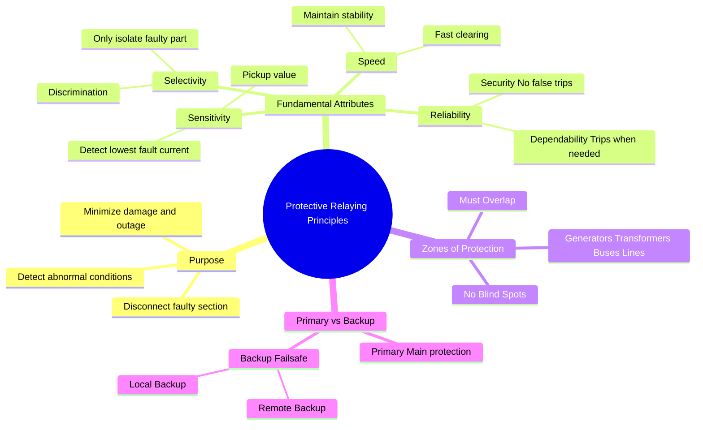

---
tags:
  - power-system
  - protection
  - gate
  - electrical-engineering
created: 2026-07-23T21:36:56
aliases:
  - Functional Requirements of Protection
  - Attributes of Protective Relaying
  - Primary and Backup Protection
subject: "[[Power System]]"
parent:
  - Fundamentals of Protection
modified: 2026-07-23T21:36:56
---
### Protective Relaying Principles
#power-system/protection #relays

> **Protective Relaying** is the branch of power systems concerned with the detection of abnormal power system conditions and the initiation of corrective action (usually the tripping of a Circuit Breaker) to return the system to its normal state or isolate the faulty region.

---
#### Fundamental Functional Requirements
#protection/attributes

For a protective scheme to be effective, it must satisfy four basic design criteria, often remembered as the "4 S's" (plus Reliability):

##### 1. Selectivity (Discrimination)

The ability of the protection system to identify the faulty section correctly and trip **only** the circuit breakers necessary to isolate that faulty section, leaving the rest of the healthy system intact.
* **Unit Protection:** inherently selective (e.g., Differential protection).
* **Non-Unit Protection:** requires time/current grading to achieve selectivity (e.g., Overcurrent relays).

##### 2. Speed

The relay must disconnect the fault as quickly as possible to:
* Prevent damage to equipment from heat and mechanical forces.
* Maintain [[Power System Stability]] (Transient Stability).
* **Total Clearing Time** = Relay Operating Time + Circuit Breaker Operating Time.

##### 3. Sensitivity

The ability to detect even the smallest fault condition (e.g., high-resistance ground faults) or abnormalities that just exceed the normal operating threshold.
* Defined by the **Pickup Value**.
* **Sensitivity Factor ($K_s$):**
    $$\boxed{\quad K_s = \frac{I_f}{I_p} \quad}$$
    Where $I_f$ is the minimum fault current and $I_p$ is the pickup current. $K_s$ should be $> 1$.

##### 4. Reliability

The assurance that the protection will perform correctly. It has two aspects:
* **Dependability:** The certainty that the relay **will trip** when a fault occurs within its zone. (Failure to trip is catastrophic).
* **Security:** The certainty that the relay **will NOT trip** when there is no fault or the fault is outside its zone. (False tripping causes nuisance outages).
    * *Trade-off:* Increasing sensitivity often increases dependability but decreases security.

---
#### Zones of Protection
#protection/zones

The power system is divided into overlapping regions called **Zones of Protection**.
* **Components:** Generator Zone, Transformer Zone, Busbar Zone, Transmission Line Zone.
* **Overlap:** Adjacent zones must overlap to ensure there are no **"Blind Spots"** or dead zones where a fault would remain undetected.
* **Location:** The overlap is usually achieved by the arrangement of Current Transformers (CTs). The Circuit Breaker (CB) is typically located within the overlap region.

---
#### Primary and Backup Protection
#protection/backup

Since no system is 100% reliable, a two-tiered approach is used:

##### A. Primary Protection (Main Protection)

*   The first line of defense.
*   Designed to operate as fast as possible (Instantaneous).
*   Clears faults in the specific protected element.

##### B. Backup Protection

* Operates only when the Primary Protection **fails** (due to relay failure, CT/PT failure, DC supply failure, or stuck breaker).
* Operates with a **Time Delay** to allow the primary protection to act first.
* **Types:**
    1. **Remote Backup:** Located at the next station [[upstream]]. It trips a larger section of the system (less selective) but is cheaper and independent of the local station's DC supply/battery.
    2. **Local Backup:** Located at the same station (e.g., Breaker Failure Relay). Safer but costs more.

---
#### Basic Operation Loop

1. **Measurement:** Instrument transformers ([[Instrument Transformers (CT and PT)]]) step down high voltages/currents.
2. **Processing:** The **Relay** compares the measured value against a "Set Point" (Pickup).
3. **Action:** If the threshold is exceeded, the relay closes its contacts to energize the **Trip Coil** of the **Circuit Breaker**.
4. **Isolation:** The Circuit Breaker opens the main contacts to extinguish the arc and isolate the fault.

---
### Related Concepts
#topic/related-concepts

> [[Zones of Protection]]

[[Overcurrent Relays]]
[[Differential Relays]]
[[Distance Relays]]
[[Instrument Transformers (CT and PT)]]
[[Circuit Breakers]]
