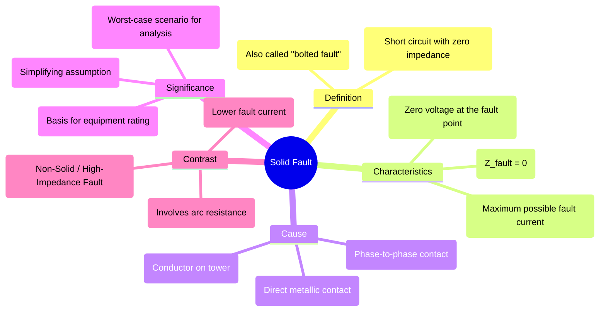

---
tags:
  - power-systems
  - fault-analysis
  - protection
  - short-circuit
  - fault-impedance
created: 2025-09-14
aliases:
  - Bolted Fault
  - Solidly Earthed Fault
subject: "[[Power System]]"
parent:
  - Fault Analysis
modified: 2026-07-23T21:37:39
---
### Solid Fault
#fault-analysis #short-circuit #bolted-fault

> A **Solid Fault**, also known as a **bolted fault**, is a short-circuit fault that has zero (or negligible) fault impedance. It represents a direct, firm metallic contact between conductors or between a conductor and ground, offering no opposition to the flow of fault current.

This condition results in the **maximum possible fault current** for a given fault location and is therefore a critical consideration in power system design and protection.

---
#### Characteristics of a Solid Fault
#fault-characteristics

1. **Zero Fault Impedance**: The defining characteristic is that the impedance at the point of the fault, $Z_f$, is considered to be zero.
    $$\boxed{\quad Z_f = R_f + jX_f \approx 0 \quad}$$
    This implies there is no arc resistance and a perfect electrical connection has been made.

2. **Maximum Fault Current**: According to Ohm's law, the fault current ($I_f$) is limited only by the system impedance ($Z_{sys}$) up to the point of the fault ($I_f = V_{pre-fault} / Z_{sys}$). Since a solid fault adds no extra impedance, it represents the lowest possible total fault impedance and thus the highest possible fault current.

3. **Zero Voltage at Fault Location**: In an ideal solid fault, the voltage at the precise point of the fault drops to zero, as there is a perfect short circuit.

---
#### Significance in Power System Analysis
#worst-case-scenario #equipment-rating

The concept of a solid fault is extremely important for several reasons:

1. **Worst-Case Scenario Analysis**: It represents the most severe type of short circuit in terms of current magnitude. Power systems are designed and protected to handle this worst-case scenario.

2. **Equipment Rating and Selection**: The maximum current that equipment must withstand or interrupt is determined by assuming a solid fault at its terminals. This includes:
    * **[[Circuit Breakers]]**: Their interrupting capability (kA rating) must be higher than the maximum solid fault current they might have to clear.
    * **Busbars, Switches, and Conductors**: They must have the mechanical and thermal strength to withstand the forces and heat generated by a solid fault current.
    * **[[Instrument Transformers]]**: Must be designed to avoid saturation under maximum fault current conditions to ensure protective relays operate correctly.

3. **Simplifying Assumption**: In many [[Short Circuit Studies]] and academic problems, faults are assumed to be solid to simplify the calculations and establish a baseline for the system's fault levels.

---
#### Comparison with Non-Solid (High Impedance) Faults

| Feature | Solid Fault | Non-Solid Fault |
| :--- | :--- | :--- |
| **Fault Impedance ($Z_f$)** | $Z_f \approx 0$ | $Z_f > 0$ (often resistive) |
| **Cause** | Direct metallic contact | [[Arc Resistance]], contact with a tree, broken conductor on ground |
| **Fault Current Magnitude** | Maximum possible value | Lower than a solid fault |
| **Voltage at Fault Point** | Near zero | Non-zero |
| **Protection Challenge** | Withstanding/interrupting huge currents | Detecting a low-level fault current (sensitivity issue) |

---
### Related Concepts
#related-concepts

> [[Fault Analysis]] (Parent Concept)

[[Power System Protection]]
[[Symmetrical Components]] (Method used to analyze faults)
[[Short Circuit Studies]]
[[Circuit Breakers]]
[[Arc Resistance]] (The primary component of impedance in non-solid faults)