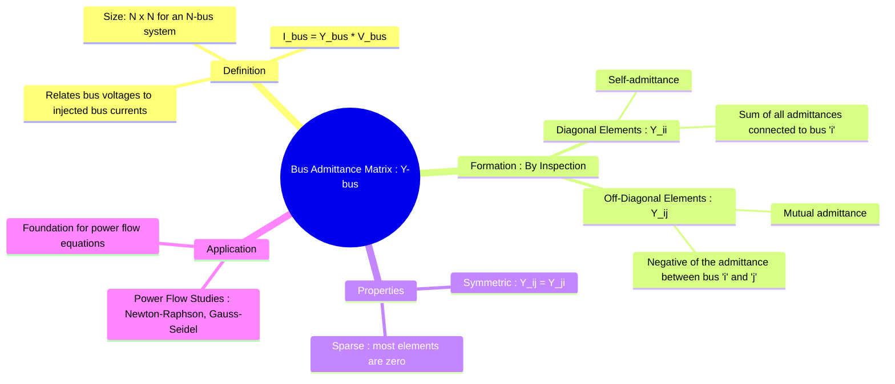

---
tags:
  - power-systems
  - y-bus
  - admittance-matrix
  - power-flow
  - network-modeling
created: 2025-09-08
aliases:
  - Y-bus
  - Admittance Matrix
subject: "[[Power System]]"
parent:
  - Power System Analysis
modified: 2026-07-23T21:38:29
---
### Bus Admittance Matrix
#y-bus #admittance-matrix #power-flow

> The bus admittance matrix, commonly known as the **Y-bus**, is a fundamental tool in power system analysis. ==It is an $N \times N$ matrix for an N-bus system that relates the vector of injected bus currents to the vector of bus voltages.== It provides a complete description of the passive network topology and its admittances.

The primary relationship is given by Ohm's law in matrix form:
$$\boxed{\quad \mathbf{I_{bus}} = \mathbf{Y_{bus}} \mathbf{V_{bus}} \quad}$$
Where:
*   $\mathbf{I_{bus}}$ is the column vector of currents injected into each bus.
*   $\mathbf{Y_{bus}}$ is the $N \times N$ bus admittance matrix.
*   $\mathbf{V_{bus}}$ is the column vector of bus voltages (with respect to the reference bus).

In expanded form for a system with $n$ buses:
$$
\begin{bmatrix}
I_1 \\
I_2 \\
\vdots \\
I_n
\end{bmatrix}
=
\begin{bmatrix}
Y_{11} & Y_{12} & \cdots & Y_{1n} \\
Y_{21} & Y_{22} & \cdots & Y_{2n} \\
\vdots & \vdots & \ddots & \vdots \\
Y_{n1} & Y_{n2} & \cdots & Y_{nn}
\end{bmatrix}
\begin{bmatrix}
V_1 \\
V_2 \\
\vdots \\
V_n
\end{bmatrix}
$$

The Y-bus is essential for formulating the equations used in [[Power Flow Studies (Load Flow Analysis)|Power Flow Analysis]].

---
#### Formation of the Y-bus Matrix
#y-bus/formation

The Y-bus matrix can be formed by inspection using two simple rules. Let $y_{ij}$ be the admittance of the line connecting bus 'i' and bus 'j', and let $y_{i0}$ be the shunt admittance at bus 'i'.

##### Diagonal Elements ($Y_{ii}$)
The diagonal element $Y_{ii}$ is the **self-admittance** of bus 'i'. It is the sum of all admittances connected to bus 'i'.
$$\boxed{\quad Y_{ii} = \sum_{j=0, j \neq i}^{N} y_{ij} = (\text{Sum of all line admittances connected to bus 'i'}) + (\text{Shunt admittance at bus 'i'}) \quad}$$

##### Off-Diagonal Elements ($Y_{ij}$)
The off-diagonal element $Y_{ij}$ is the **mutual admittance** between bus 'i' and bus 'j'. It is the negative of the sum of all admittances directly connecting the two buses. For a single connecting line, this is:
$$\boxed{\quad Y_{ij} = -y_{ij} \quad}$$
> [!memory]
> If there is no direct connection between bus 'i' and bus 'j', then $y_{ij} = 0$ and therefore $\mathbf{Y_{ij} = 0}$. This fact is the reason for the [[Sparsity#Sparsity in Power Systems The Y-bus Matrix|sparsity]] of the Y-bus matrix.

---
#### Properties of the Y-bus Matrix
#y-bus/properties

1.  **Symmetry**: The matrix is symmetric, meaning $Y_{ij} = Y_{ji}$. This is true for any network composed of bilateral elements (like transmission lines and standard transformers). This property is violated if the network contains non-bilateral components like [[Phase-Shifting Transformer Modeling|phase-shifting transformers]].
2.  **[[Sparsity]]**: The Y-bus matrix is highly **sparse**. In a large power system, each bus is connected to only a few neighboring buses. Therefore, the vast majority of the off-diagonal elements are zero. This sparsity is a critical property that is exploited to make power system computations highly efficient.
3.  **Singularity**: If the reference node (ground) is not included in the summation for the diagonal elements, the sum of all elements in any row is zero ($\sum_{j=1}^N Y_{ij} = y_{i0}$). This implies the matrix is singular (its determinant is zero) before the reference bus voltage is set to zero.

---
#### Application in Power Flow Equations
#power-flow-equations

The Y-bus matrix is the foundation for the non-linear power flow equations. The complex power injected at bus 'i' is:
$$S_i = P_i + jQ_i = V_i I_i^* = V_i \left( \sum_{j=1}^{N} Y_{ij}V_j \right)^*$$
Expressing this in terms of real and reactive power, where $V_k = |V_k|\angle\delta_k$ and $Y_{ij} = G_{ij} + jB_{ij}$:
$$\boxed{\quad P_i = |V_i| \sum_{j=1}^{N} |V_j| (G_{ij} \cos(\delta_i - \delta_j) + B_{ij} \sin(\delta_i - \delta_j)) \quad}$$
$$\boxed{\quad Q_i = |V_i| \sum_{j=1}^{N} |V_j| (G_{ij} \sin(\delta_i - \delta_j) - B_{ij} \cos(\delta_i - \delta_j)) \quad}$$

---
### Related Concepts
#related-concepts

> [[Sparsity]] (The most important property of the Y-bus)

[[Z-bus Matrix]] (The inverse of the Y-bus, which is a dense matrix)
[[Power Flow Studies (Load Flow Analysis)|Power Flow Analysis]] (The primary application of the Y-bus)
[[Newton-Raphson Method for Load Flow]] (An algorithm that uses the Y-bus to build the Jacobian matrix)
[[Transmission Line Parameters]] (The source of the admittance values)
[[Power System]]
[[Bus Admittance Matrix (Y-bus) Formulation]]
