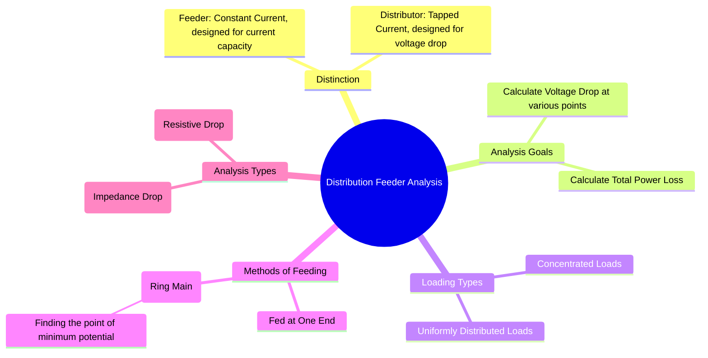

---
tags:
  - power-distribution
  - power-systems
  - feeders
  - voltage-drop
  - power-loss
created: 2025-09-08
aliases:
  - Feeder Calculations
  - Distributor Analysis
subject: "[[Power System]]"
parent:
  - Power Distribution Systems
modified: 2026-07-23T21:33:38
---
### Distribution Feeder and Distributor Analysis
#feeder-analysis #voltage-drop #power-loss

> The primary goal of distribution feeder and distributor analysis is to calculate the voltage at various points along the line and the total power loss in the conductor. While a **feeder** has constant current and is designed based on its current-carrying capacity, a **distributor** has tapped loads, making voltage drop the primary design constraint.

---
#### DC Distributor Analysis

This is the simplest case, where only resistance is considered.

##### 1. Fed at One End with Concentrated Loads

The voltage drop is calculated section by section, starting from the supply point. The total voltage drop at the farthest point is the sum of the drops in all sections.
*   Voltage drop in section AC = $I_{AC} R_{AC}$
*   Voltage drop at point D = Drop in AC + Drop in CD = $I_{AC} R_{AC} + I_{CD} R_{CD}$

##### 2. Fed at One End with Uniform Loading

Consider a distributor of length $L$ with a uniform current tapping of $i$ amperes per meter. Let the total resistance be $R_{total}$.
*   The total current supplied is $I_{total} = i \cdot L$.
*   The total voltage drop from the supply end to the farthest point is:
    $$\boxed{\quad \Delta V = \frac{1}{2} (iL)(rL) = \frac{1}{2} I_{total} R_{total} \quad}$$
    > [!NOTE]
    > The total voltage drop in a uniformly loaded distributor is equivalent to the drop produced by concentrating the entire load at its **midpoint**.

*   The total power loss is:
    $$\boxed{\quad P_{loss} = \frac{1}{3} (iL)^2(rL) = \frac{1}{3} I_{total}^2 R_{total} \quad}$$
    > [!NOTE]
    > The total power loss is equivalent to the loss produced by concentrating the entire load at **one-third** of the length from the feeding point.

##### 3. Fed at Both Ends (Ring Main)

If a distributor is fed at both ends (A and B) with equal voltages, the analysis involves finding the **point of minimum potential**.
1.  Assume a current $I_A$ is supplied from end A. The current in each section can be expressed in terms of $I_A$ and the tapped loads.
2.  The current supplied from end B, $I_B$, will be the total load current minus $I_A$.
3.  Apply KVL: The voltage drop from A to B must be zero since they are at the same potential. Sum the voltage drops in all sections and set to zero to solve for $I_A$.
4.  Once all section currents are known, find the point where the current changes direction (or is zero). This is the point of minimum potential.

---
#### AC Distributor Analysis
#ac-distributor-analysis

For AC distributors, the impedance of the line and the power factor of the loads must be considered. Calculations are done using **phasors**. However, a common and useful approximation is used for calculating the magnitude of the voltage drop.

For a current $I$ flowing through a section with impedance $Z=R+jX$ at a power factor of $\cos\phi$:
*   **Voltage Drop for Lagging Power Factor**:
    $$\boxed{\quad \Delta V \approx I(R\cos\phi + X\sin\phi) \quad}$$
*   **Voltage Drop for Leading Power Factor**:
    $$\boxed{\quad \Delta V \approx I(R\cos\phi - X\sin\phi) \quad}$$

The analysis of concentrated or uniform loads follows the same principles as the DC case, but these drop formulas are used for each section. Power loss is still calculated as the sum of $I^2R$ losses in each section.

---
### Related Concepts
#related-concepts

> [[Power Distribution Systems]] (Parent topic)

[[Voltage Regulation]] (A measure of voltage drop)
[[Power Factor]] (Crucial for AC analysis)
[[Transmission Lines]]
[[AC Circuit Analysis]]