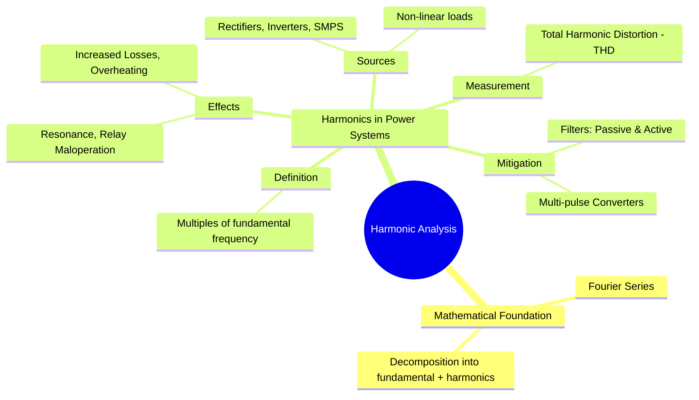

---
tags:
  - harmonics
  - power-quality
  - fourier-analysis
  - signals
  - power-systems
  - power-electronics
created: 2025-09-18
aliases:
  - Harmonics
  - Harmonic Distortion
  - Fourier Analysis in Power Systems
  - Effects of Harmonics
  - Harmonics Effects
subject: "[[Power System]]"
parent: "[[Power Quality]]"
modified: 2026-07-23T21:34:25
---
### Harmonic Analysis
#harmonics #fourier-analysis #power-quality

> **Harmonic Analysis** is the process of decomposing a distorted periodic waveform into a sum of sinusoids of different frequencies: a fundamental frequency component and a series of harmonic components at integer multiples of the fundamental. In power systems, this analysis is crucial for understanding and mitigating the adverse effects of **harmonic distortion**, a major power quality issue.

---

#### Mathematical Foundation: Fourier Series
#fourier-series

Any non-sinusoidal but periodic waveform, such as a distorted current $i(t)$, can be represented by a [[Fourier Series]] as the sum of a DC component, a fundamental component, and a series of harmonic components.
$$i(t) = I_{dc} + \sum_{n=1}^{\infty} I_{n,max} \sin(n\omega_0 t + \phi_n)$$
* **Fundamental Component ($n=1$)**: The desired component at the system's nominal frequency (e.g., 50 or 60 Hz).
* **Harmonic Components ($n=2, 3, 4, \dots$)**: Sinusoidal components at frequencies that are integer multiples of the fundamental frequency ($f_n = n \cdot f_1$).

---
#### Harmonics in Power Systems
#power-system-harmonics

In power systems, harmonics are undesirable currents and voltages caused by **non-linear loads**. A non-linear load is a device that draws a non-sinusoidal current when supplied with a sinusoidal voltage.

##### Sources of Harmonics
#non-linear-load

The primary sources are power electronic devices:
* **[[Uncontrolled Rectifiers]]** and **[[Phase-Controlled Rectifiers|Controlled Rectifiers]]**: Widely used in DC power supplies and DC drives. A standard 6-pulse bridge converter characteristically generates harmonics of the order $h = 6k \pm 1$ (i.e., 5th, 7th, 11th, 13th...).
* **[[Inverters]]**: Used in variable frequency drives (VFDs) and grid-tied renewable energy systems.
* **[[Choppers]]** and Switched-Mode Power Supplies (SMPS).
* Other sources include arc furnaces, fluorescent lighting, and saturated transformers.

##### Effects of Harmonics
#harmonic-effects

Harmonics are detrimental to the power system and can cause:
1. **Increased Losses and Overheating**: The total RMS current of a distorted waveform is higher than the fundamental current ($I_{rms} = \sqrt{I_1^2 + I_2^2 + I_3^2 + \dots}$). This leads to increased $I^2R$ losses in transformers, conductors, and motors. High-frequency harmonic currents also cause increased eddy current and skin effect losses.
2. **Equipment Malfunction**: Can cause erroneous operation of protective relays, electronic controllers, and metering equipment.
3. **Resonance**: Harmonic frequencies can excite series or parallel resonance conditions between the system's inductance and capacitance (e.g., power factor correction capacitors), leading to dangerously high voltages and currents.
4. **Neutral Conductor Overloading**: In three-phase, four-wire systems, **triplen harmonics** (multiples of 3: 3rd, 9th, etc.) are zero-sequence components. They do not cancel out in the neutral conductor but add up, potentially causing severe overheating.

---
#### Total Harmonic Distortion (THD)
#thd

**Total Harmonic Distortion (THD)** is the standard metric used to quantify the level of harmonic distortion in a waveform. It is the ratio of the RMS value of all harmonic components to the RMS value of the fundamental component.

For current, it is given by:
$$\boxed{\quad THD_I = \frac{\sqrt{\sum_{n=2}^{\infty} I_{n,rms}^2}}{I_{1,rms}} \times 100\% \quad}$$
A low THD value indicates a waveform close to a pure sinusoid. Standards like IEEE 519 specify the acceptable limits for THD in a power system.

---
#### Harmonic Mitigation Techniques
#harmonic-mitigation

1. **Passive Filters**: L-C circuits configured as shunt filters, tuned to a specific harmonic frequency to provide a low-impedance path to ground, thereby diverting the harmonic current. They are simple but can have issues with resonance.
2. **Active Power Filters (APF)**: Power electronic converters that actively inject a compensating current that is equal in magnitude but opposite in phase to the harmonic current drawn by the load, effectively canceling it out.
3. **Multi-pulse Converters**: Increasing the pulse number of a converter (e.g., using a 12-pulse or 18-pulse converter instead of a 6-pulse) eliminates lower-order, more dominant harmonics.
4. **Isolation Transformers**: Using a delta-wye transformer can block the path of zero-sequence triplen harmonics.

---
### Related Concepts
#related-concepts

> [[Power Quality]] (The parent topic)

[[Fourier Series]] (The mathematical foundation)
[[Power Electronics]] (The primary source of harmonics)
[[Power Factor]] (Harmonics lead to a poor *true* power factor)
[[Uncontrolled Rectifiers]]
[[Inverters]]
[[Resonance]]
[[Fourier Series]]